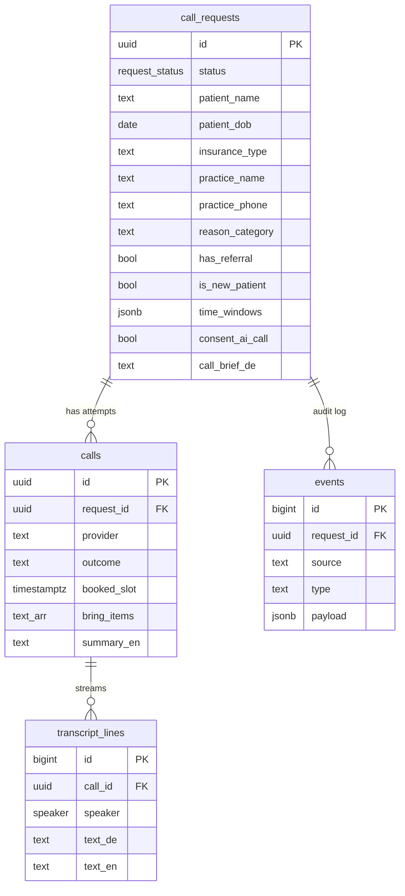
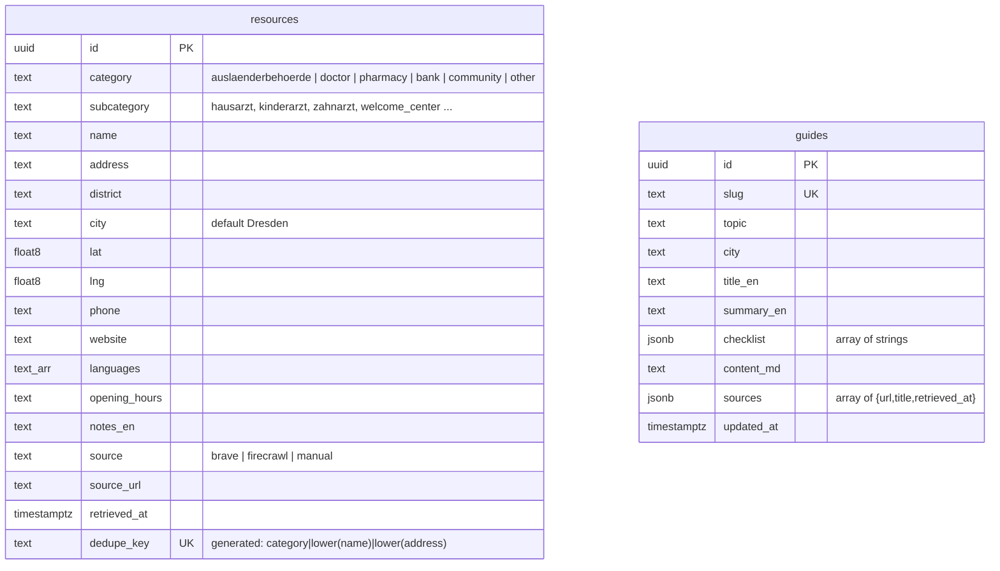

# Data Model (Supabase / Postgres)

Source of truth: `supabase/migrations/20260925190000_init_schema.sql` (repo root). Demo data: `supabase/seed.sql`.
Worked example is HalloTermin; the pattern **request → job → live log → outcome** fits most "app + n8n + AI" ideas, so it should survive the merge with Idea B.



## Newcomer resources (added 26.09, migration `20260926090000_newcomer_resources.sql`)
Idea-independent reference data for Dresden newcomers, filled by n8n workflow 02. Details: [[Newcomer Resources - Crawler]].



- No foreign keys to the call tables, so these tables survive any merge.
- Upsert keys: `resources?on_conflict=dedupe_key`, `guides?on_conflict=slug` (PostgREST header `Prefer: resolution=merge-duplicates`).
- Also a unique index on `(category, lower(name), coalesce(lower(address),''))`.
- Not in the Realtime publication (static reference data).


## v2: generic tasks + multilingual (26.09, migrations `20260926180000_status_completed.sql`, `20260926180100_generic_tasks_multilingual.sql`)
Source: [[Frontend and UX Plan v2]] section H. We **extended** `call_requests` (UI calls it a "task") instead of renaming it — cheap to adapt when Idea B is merged.

| Table | New columns / rules |
|---|---|
| call_requests | `task_type` (doctor_appointment, authority_appointment, landlord_request, contract_question, bank_enquiry, pharmacy_question, restaurant_booking, other_call) · `goal_user` (≤200 chars, user language) · `goal_de` (n8n only) · `organisation_category` · `resource_id` → resources · `constraints` jsonb object · `allowed_facts` jsonb array `[{key,label,value}]` · `user_language` ∈ en, ar, tr, uk, ru, fa, prs, hi, es, fr, pl, vi, zh, de · `reason_category` required only for doctor tasks · `user_email` optional |
| request_status | + `completed` (information tasks that end without a booking) |
| calls | `result` jsonb (structured answer) · `summary_user` · `bring_items_user` jsonb · `disclosure_variant` · outcome + `completed`, `rejected` |
| transcript_lines | `text_user` (subtitle in the user's language) |

**RLS insert** now also requires `goal_de is null` (plus `status='submitted'`, `call_brief_de is null`, consent) → no prompt injection from the browser.
**New triggers (pg_net → n8n, Vault URL pattern, no-op if URL missing):** `transcript_lines` insert → `n8n_translate_line_url` (workflow 05); `calls.outcome` change → `n8n_call_result_url` (workflow 06). Shared helper `public.notify_n8n(url_secret_name, body)`.
**Demo data:** request `…0001` (Priya, doctor, EN) now has task fields; new request `…0002` (Amina Haddad, **Arabic**, pharmacy stock question, `completed`, result `{in_stock, pickup_until, price_eur}`, 4 subtitled transcript lines).

## Status lifecycle (`request_status`)
`submitted` → (n8n) `briefed` → `calling` → `booked` | `completed` | `needs_user` | `rejected` | `failed`

## Who writes what
| Table | Browser (anon key) | n8n / voice webhooks (service_role) |
|---|---|---|
| call_requests | insert (only with consent), read | update status, call_brief_de |
| calls | read | insert/update |
| transcript_lines | read (Realtime) | insert per utterance |
| events | read | insert every automation step |
| resources | read only (RLS select; insert/update/delete revoked) | upsert (workflow 02) |
| guides | read only (RLS select; insert/update/delete revoked) | upsert (workflow 02) |

## Guardrails built into the schema
- `consent_ai_call` must be true (check + RLS) → [[AI Disclosure]]
- `reason_category` is an enum-like check, no symptom field → [[Data minimisation - no symptoms]]
- Transcripts are text only → [[Never store call audio]]
- **Demo-mode RLS: anon can read all rows.** Fine for the event with fake data; must add auth + owner policies before real users (Monday-morning item).

## Realtime
All four tables are in the `supabase_realtime` publication → UI subscribes to `transcript_lines` (filter `call_id=eq.<id>`) and `call_requests` (filter `id=eq.<id>`).

## Local dev
```bash
npx supabase start          # Docker; Studio at http://127.0.0.1:54323
npx supabase db reset       # re-apply migrations + seed
npx supabase status         # URLs + local keys
```
Pushing to a cloud project: `npx supabase link --project-ref <ref>` then `npx supabase db push`. If we use Lovable Cloud instead, paste the migration SQL into Lovable's SQL/backend chat. See [[DEC-002 Backend and integration pattern (proposed)]].
