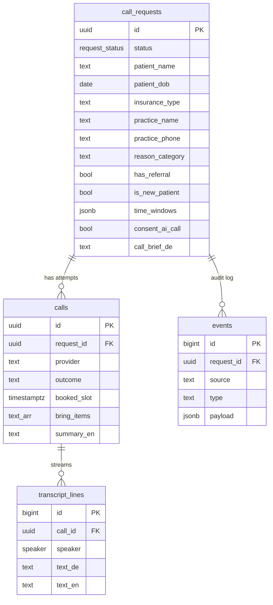

# Data Model (Supabase / Postgres)

Source of truth: `supabase/migrations/20260925190000_init_schema.sql` (repo root). Demo data: `supabase/seed.sql`.
Worked example is HalloTermin; the pattern **request → job → live log → outcome** fits most "app + n8n + AI" ideas, so it should survive the merge with Idea B.



## Status lifecycle (`request_status`)
`submitted` → (n8n) `briefed` → `calling` → `booked` | `needs_user` | `rejected` | `failed`

## Who writes what
| Table | Browser (anon key) | n8n / voice webhooks (service_role) |
|---|---|---|
| call_requests | insert (only with consent), read | update status, call_brief_de |
| calls | read | insert/update |
| transcript_lines | read (Realtime) | insert per utterance |
| events | read | insert every automation step |

## Guardrails built into the schema
- `consent_ai_call` must be true (check + RLS) → [[AI Disclosure]]
- `reason_category` is an enum-like check, no symptom field → [[Data minimisation - no symptoms]]
- Transcripts are text only → [[Never store call audio]]
- **Demo-mode RLS: anon can read all rows.** Fine for the event with fake data; must add auth + owner policies before real users (Monday-morning item).

## Realtime
All four tables are in the `supabase_realtime` publication → UI subscribes to `transcript_lines` (filter `call_id=eq.<id>`) and `call_requests` (filter `id=eq.<id>`).

## Local dev
```bash
npx supabase start          # Docker; Studio at http://127.0.0.1:54323
npx supabase db reset       # re-apply migrations + seed
npx supabase status         # URLs + local keys
```
Pushing to a cloud project: `npx supabase link --project-ref <ref>` then `npx supabase db push`. If we use Lovable Cloud instead, paste the migration SQL into Lovable's SQL/backend chat. See [[DEC-002 Backend and integration pattern (proposed)]].
