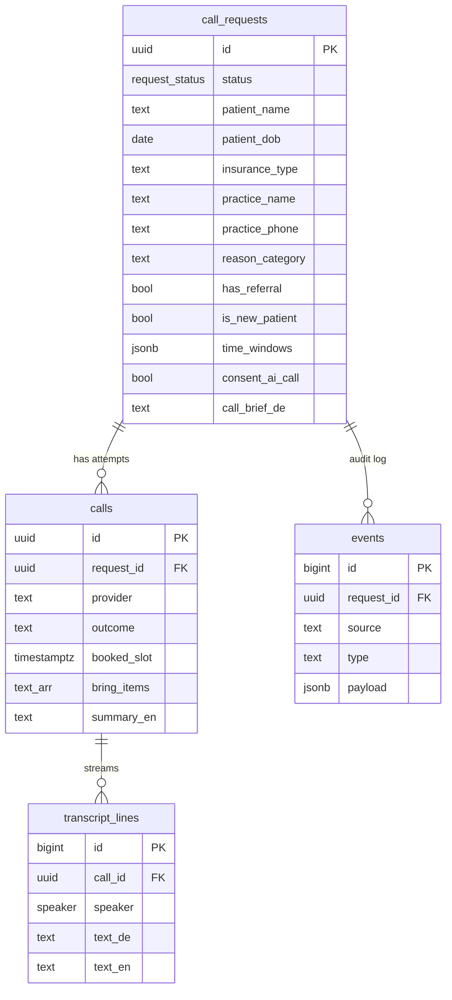
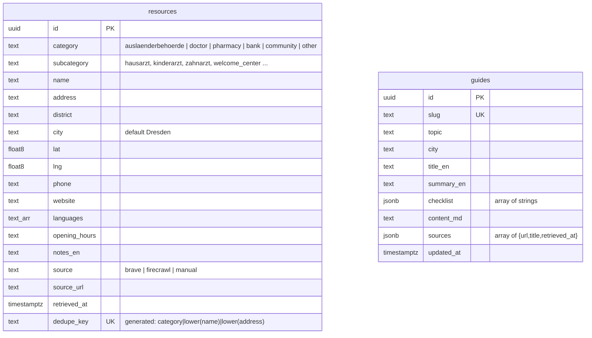
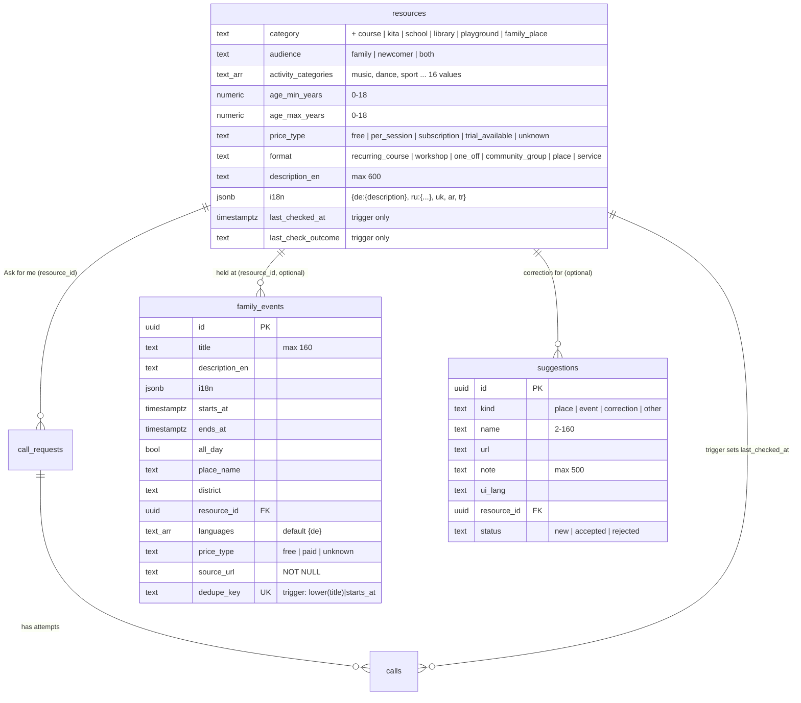

# Data Model (Supabase / Postgres)

Source of truth: `supabase/migrations/20260925190000_init_schema.sql` (repo root). Demo data: `supabase/seed.sql`.
Worked example is HalloTermin; the pattern **request → job → live log → outcome** fits most "app + n8n + AI" ideas, so it should survive the merge with Idea B.



## Newcomer resources (added 26.09, migration `20260926090000_newcomer_resources.sql`)
Idea-independent reference data for Dresden newcomers, filled by n8n workflow 02. Details: [[Newcomer Resources - Crawler]].



- No foreign keys to the call tables, so these tables survive any merge.
- Upsert keys: `resources?on_conflict=dedupe_key`, `guides?on_conflict=slug` (PostgREST header `Prefer: resolution=merge-duplicates`).
- Also a unique index on `(category, lower(name), coalesce(lower(address),''))`.
- Not in the Realtime publication (static reference data).


## v2: generic tasks + multilingual (26.09, migrations `20260926180000_status_completed.sql`, `20260926180100_generic_tasks_multilingual.sql`)
Source: [[Frontend and UX Plan v2]] section H. We **extended** `call_requests` (UI calls it a "task") instead of renaming it — cheap to adapt when Idea B is merged.

| Table | New columns / rules |
|---|---|
| call_requests | `task_type` (doctor_appointment, authority_appointment, landlord_request, contract_question, bank_enquiry, pharmacy_question, restaurant_booking, other_call) · `goal_user` (≤200 chars, user language) · `goal_de` (n8n only) · `organisation_category` · `resource_id` → resources · `constraints` jsonb object · `allowed_facts` jsonb array `[{key,label,value}]` · `user_language` ∈ en, ar, tr, uk, ru, fa, prs, hi, es, fr, pl, vi, zh, de · `reason_category` required only for doctor tasks · `user_email` optional |
| request_status | + `completed` (information tasks that end without a booking) |
| calls | `result` jsonb (structured answer) · `summary_user` · `bring_items_user` jsonb · `disclosure_variant` · outcome + `completed`, `rejected` |
| transcript_lines | `text_user` (subtitle in the user's language) |

**RLS insert** now also requires `goal_de is null` (plus `status='submitted'`, `call_brief_de is null`, consent) → no prompt injection from the browser.
**New triggers (pg_net → n8n, Vault URL pattern, no-op if URL missing):** `transcript_lines` insert → `n8n_translate_line_url` (workflow 05); `calls.outcome` change → `n8n_call_result_url` (workflow 06). Shared helper `public.notify_n8n(url_secret_name, body)`.
**Demo data:** request `…0001` (Priya, doctor, EN) now has task fields; new request `…0002` (Amina Haddad, **Arabic**, pharmacy stock question, `completed`, result `{in_stock, pickup_until, price_eur}`, 4 subtitled transcript lines).

## Merge (DEC-003): family hub + "Ask for me" (26.09, migrations `20260926200000_merged_family_hub.sql`, `20260926210000_credits_translate_practice_only.sql`)
Source: [[DEC-003 Merged concept]], [[Merged Concept]]. We again **extended** the existing tables so the working call pipeline keeps running. What is in these tables: [[Family Hub Data]]. How the UI reads them: [[Frontend and UX Plan v3 (merged)]] section F.



| Table | Change |
|---|---|
| `resources` | `category` + `course`, `kita`, `school`, `library`, `playground`, `family_place` · `source` + `web_research`, `suggestion` · new columns `audience` (default `newcomer`), `activity_categories` text[] (subset of music, dance, sport, yoga, art, languages, stem, swimming, theatre, nature, parent_baby, parent_meetup, library, school_kita, family_cafe, playground), `age_min_years` / `age_max_years` numeric(4,1) 0–18 (min ≤ max), `price_type` (default `unknown`), `format`, `description_en` ≤ 600 chars, `i18n` jsonb object (`{"de":{"description":"…"},"ru":{…},"uk":{…},"ar":{…},"tr":{…}}`), `last_checked_at`, `last_check_outcome` · paediatricians and gynaecologists set to `audience = both` · GIN indexes on `activity_categories` and `languages`, index on `(audience, category)`. `languages` = languages spoken / of instruction (ISO codes). Upsert key unchanged: generated `dedupe_key` = `category|lower(name)|lower(address)` → `on conflict (dedupe_key) do update` |
| `family_events` (new) | Family events, read-only for the browser (RLS select for anon/authenticated; insert/update/delete revoked). Named `family_events` because `public.events` is the automation audit log. `dedupe_key` is filled by a trigger (`lower(trim(title))|starts_at`) → upsert `on conflict (dedupe_key)`. The key renders `starts_at` in the session time zone, so run event upserts only from UTC sessions (the default of `npx supabase db query --linked`, which the content-kit script uses) until the fix in [[DEF-039 family_events dedupe_key depends on session TimeZone]] is applied |
| `suggestions` (new) | "Suggest a place / event / correction". Browser **insert only** (`with check (status = 'new')`); select/update/delete revoked, so never `.select()` after the insert (use `Prefer: return=minimal`). No personal data fields |
| `guides` | + `category` (documents, health, kita_school, money, everyday), `audience` (family, newcomer, both; default both), `ask_task_type` (the task the guide's "Ask for me" button prefills). `i18n` (migration `20260926190000_guides_i18n.sql`): `{"de":{"title","summary","checklist":[…]},"ru":…,"uk":…,"ar":…,"tr":…}` — 8 guides, all five languages |
| `call_requests` | `task_type` + **`course_enquiry`** (free spot / trial lesson / waiting list / schedule / price / language at a course provider) and **`kita_enquiry`** (Kita place from a start month / waiting list / how to apply / visit). `resource_id` (column since v2) is now filled from the intake prefill of the "Ask for me" button. Typical `allowed_facts` keys: `child_age`, `child_birth_month`, `start_month`, `preferred_days`, `language_preference` (`child_first_name` only if the parent volunteers it). Contract: [[Task Types - How to extend]] |
| `calls.result` shapes (no schema change) | `course_availability`: `{free_spot, trial_lesson, trial_slot_text, waiting_list, schedule_text, price_text, language_of_instruction, next_steps}` · `kita_availability`: `{places_available, from_month, waiting_list_possible, how_to_apply, visit_possible, visit_text, languages, next_steps}` · bookings from the relay carry `booking_kind` `trial_lesson` / `kita_visit` plus the same detail keys |

**Trigger "checked by phone":** `calls_mark_resource_checked` (after update of `calls.outcome`) → `public.mark_resource_checked()` sets `resources.last_checked_at = now()` and `last_check_outcome` when the outcome becomes `booked`, `completed`, `rejected` or `rejected_no_new_patients` and the request has a `resource_id`. Outcome only, never personal data. It does not look at `calls.provider`, so role-play calls mark real listings too ([[DEF-047 Role-play calls mark real providers as checked by phone]], open): reset the two columns after every test on a real listing.

**Trigger change for credits** (`20260926210000_credits_translate_practice_only.sql`, [[RUN-024 n8n credit optimisation]]): `on_transcript_line()` now sends only `speaker = 'practice'` lines (≥ 2 chars) to n8n 05 for live subtitles. Assistant lines are translated in one batch by n8n 06 when `calls.outcome` changes. Lines spoken after that moment stay without subtitle ([[DEF-049 Closing assistant lines after the outcome get no subtitle]]).

## Status lifecycle (`request_status`)
`submitted` → (n8n) `briefed` → `calling` → `booked` | `completed` | `needs_user` | `rejected` | `failed`

## Who writes what
| Table | Browser (anon key) | n8n / voice webhooks (service_role) |
|---|---|---|
| call_requests | insert (only with consent), read | update status, call_brief_de |
| calls | read | insert/update |
| transcript_lines | read (Realtime) | insert per utterance |
| events | read | insert every automation step |
| resources | read only (RLS select; insert/update/delete revoked) | upsert (workflow 02, seed runs, `scripts/import_content.py`); `last_checked_at` / `last_check_outcome` only via the calls trigger |
| guides | read only (RLS select; insert/update/delete revoked) | upsert (workflow 02, guide runs) |
| family_events | read only (RLS select; insert/update/delete revoked) | upsert on `dedupe_key` (seed runs, `scripts/import_content.py`) |
| suggestions | **insert only** (`status = 'new'`), no select | read + set `status` (review queue) |

## Guardrails built into the schema
- `consent_ai_call` must be true (check + RLS) → [[AI Disclosure]]
- `reason_category` is an enum-like check, no symptom field → [[Data minimisation - no symptoms]]
- Transcripts are text only → [[Never store call audio]]
- **Demo-mode RLS: anon can read all rows.** Fine for the event with fake data; must add auth + owner policies before real users (Monday-morning item).

## Realtime
All four tables are in the `supabase_realtime` publication → UI subscribes to `transcript_lines` (filter `call_id=eq.<id>`) and `call_requests` (filter `id=eq.<id>`). The reference tables (`resources`, `guides`, `family_events`, `suggestions`) are not in the publication; the provider page reads the "Checked by phone" columns on load.

## Local dev
```bash
npx supabase start          # Docker; Studio at http://127.0.0.1:54323
npx supabase db reset       # re-apply migrations + seed
npx supabase status         # URLs + local keys
```
Pushing to a cloud project: `npx supabase link --project-ref <ref>` then `npx supabase db push`. If we use Lovable Cloud instead, paste the migration SQL into Lovable's SQL/backend chat. See [[DEC-002 Backend and integration pattern (proposed)]].
