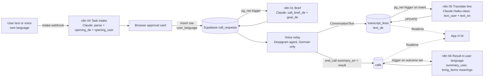

# Frontend and UX Plan v2 (HalloTermin: "tell us what you need, we call in German")

**What this is:** the design plan for the next version of the Lovable app. It replaces prompts P2–P7 of [[Lovable Prompt Pack]] (P1, the shell, is already built). It is a plan only. The backend changes in section H are a list for the Orchestrator and are **not** implemented yet.

**Why it matters for us:** user feedback today said three things. (1) It feels doctor-only. (2) It must work in the user's own language. (3) The call should feel very real. This plan answers all three and keeps our hard rules: the assistant says it is an AI, no audio, no symptoms, only inside approved limits.

**Related:** [[Lovable Prompt Pack]] · [[Data Model]] · [[Personas]] · [[AI Disclosure]] · [[Moment of Truth - First 15 Seconds]] · [[Newcomer Resources - Crawler]] · [[Pitch Kit]] · [[Voice Pipeline - Architecture]] · [[Receptionist Test Scripts]] · [[AI discloses itself in first sentence]] · [[Data minimisation - no symptoms]] · [[Never store call audio]] · [[Never impersonate the user]] · [[Only book inside pre-approved windows]] · [[Read-back before booking]]

---

## A. Product framing and the core loop

**One paragraph.** HalloTermin is a phone assistant for newcomers in Germany. You tell it, in your own language and in your own words, what you need done by phone: book a doctor, get a Bürgeramt or Ausländerbehörde slot, ask your landlord about a broken heater, ask a pharmacy if a medicine is in stock, ask a bank what you need to open an account, reserve a table, or ask how to cancel a contract. The assistant turns your words into a clear task, asks you only what is missing, and shows you exactly what it will say. When you approve, it calls in German, says in its first sentence that it is an AI calling for you, and stays inside the limits you set. You follow the call live with subtitles in your language and get the result in your language. Doctor booking stays the flagship demo, because the pain is sharpest there.

### Core loop: Tell → Check → Call → Result

| Step | User does | System does | Screen |
|---|---|---|---|
| **1 Tell** | Types or speaks in their language: "I need a children's doctor for my son, mornings next week" | Intake (Claude via n8n, stateless) turns it into a task draft: type, organisation, goal, limits, facts it may share | `/new` |
| **2 Check** | Answers 0–3 short questions, reviews "Here's what I'll say", unticks facts it should not share, gives consent | Nothing is stored until the user presses "Yes, call now" | `/new` (approval card) |
| **3 Call** | Watches | Row inserted → n8n writes German brief → relay calls with Deepgram German voice agent → transcript lines stream in, subtitled | `/r/:id` |
| **4 Result** | Reads the result, adds to calendar, opens a linked guide | Outcome + summary in the user's language | `/r/:id` (result state) |

### What changes vs v1

| v1 ("Book a doctor's appointment") | v2 ("What do you need done?") |
|---|---|
| One long English form, doctor fields only | One free-text box (or voice), then only the missing fields |
| English UI only | UI in EN, AR (RTL), TR, UK; content (questions, subtitles, result) in 13 user languages |
| German brief shown after submit | "Here's what I'll say" shown **before** anything is stored, in German + user language |
| Transcript German + English | German + user's language (English kept for the jury view) |
| Resources/guides not in the UI | `/find` directory and guide cards linked to tasks |
| Disclosure as a legal note | Honesty shown as a trust feature ("It always says it's an AI. Receptionists stay on the line.") |
| Realism not specified | Voice, pacing, latency targets and turn-taking specified (section F) |

---

## B. Information architecture and routes

| Route | Purpose | Data |
|---|---|---|
| `/` | Landing: what it does, one live-looking transcript excerpt, trust rules, language picker visible | static |
| `/new` | Conversational intake: Tell → questions → approval card → consent → insert | intake webhook (stateless), insert `call_requests` |
| `/new?org=<resource_id>` | Same, with the organisation pre-filled from `/find` | `resources` |
| `/new?task=<task_type>` | Same, with the task type pre-selected (from a guide) | — |
| `/r/:id` | Live call (status, call card, bilingual transcript) and, once finished, the result | `call_requests`, `calls`, `transcript_lines`, `events` (Realtime) |
| `/find` | Organisation directory: search our Dresden resources, "Ask the assistant to call" | `resources` |
| `/guides/:slug` | Guide: summary, checklist, sources, "check before you go", linked tasks | `guides` |
| `/demo` | Redirect to the finished demo request `/r/00000000-0000-0000-0000-000000000001` | — |
| `*` | Friendly 404 | — |

`/r/:id` is one route with two states (live, result), so a refresh always lands on the right view (state derived from `call_requests.status`).

### User flow

```mermaid
flowchart TD
  L[Landing /] -->|"Tell us what you need"| N1
  F[Find /find] -->|"Ask the assistant to call"| N1
  G[Guide /guides/:slug] -->|"Ask the assistant to call about this"| N1
  subgraph NEW["/new - intake"]
    N1[Tell: free text or voice\nin own language] --> P{Intake parse\nClaude via n8n}
    P -->|fields missing| Q[Up to 3 short questions\nchips + text]
    Q --> P
    P -->|out of scope / emergency| X[Explain + point to 112 / 116117\nor a guide]
    P -->|complete| A[Approval card\n"Here's what I'll say"\nDE + own language]
    A -->|"Change something"| Q
    A --> C[Consent checkbox]
    C -->|"Yes, call now"| I[(insert call_requests)]
  end
  I --> R1
  subgraph R["/r/:id"]
    R1[Preparing: brief being written] --> R2[Calling: live call card\n+ bilingual transcript]
    R2 -->|booked / completed| R3[Result: what was agreed\ncalendar file, linked guide]
    R2 -->|needs_user| R4[Needs your answer\n+ start follow-up task]
    R2 -->|rejected / no answer / failed| R5[What happened + next step\ntry another organisation via /find]
  end
  R3 --> G
  R5 --> F
```

Navigation: a solid header with the wordmark, three text links ("New call", "Find a place", "Guides") and the language picker at the end. On mobile the links go into a simple menu sheet (not a bottom tab bar; this is not a daily-use app).

---

## C. Screen-by-screen spec

Common to all screens: mobile-first (design at 375px, then 768px and 1280px), one H1 per page, `<main>`, skip link, focus ring pine 3px, 44px targets, logical CSS properties for RTL, colour never the only signal (icon + text), Latin digits everywhere. Component names below refer to the patterns in `component-reference-design` (`references/components.md`, `layouts.md`, `animation.md`).

### C1. Landing `/`

- **Purpose:** in one scroll, the jury and a newcomer understand "you say it in your language, it calls in German, honestly".
- **Layout:** asymmetric split hero (text 7/12, product excerpt 5/12), then a narrow text column, then a horizontal numbered process (not cards), then one full-bleed `paper-deep` band with "What it never does" as a two-column definition list, then a small left-aligned closing CTA. Section padding varies (hero large, others smaller). (Anti-monotony rules 1–7.)
- **Components:** hero split (layouts: asymmetric split), static transcript excerpt (the real transcript row component, not a mockup image), ordered-list process with thin connector line, `<dl>` trust list, one primary button + one text link per section.
- **Hero copy (EN):** H1 "Tell us what you need. We make the call in German." Subline: "Write or speak in your language. Our AI assistant phones the practice, office or landlord, says it is an AI, and shows you the whole call with subtitles in your language." Primary "Tell us what you need" → `/new`. Text link "Watch a finished call" → `/demo`.
- **Hero excerpt:** 3 transcript rows from the demo call, German serif line + the viewer's language under it (switches with the language picker, a nice live proof of multilinguality).
- **"What people use it for"** (a plain list with lucide icons, not cards; each is a link to `/new?task=`): See a doctor · Get an appointment at the Bürgeramt or Ausländerbehörde · Ask your landlord about a repair · Ask a pharmacy about a medicine · Ask a bank what you need for an account · Reserve a table · Ask how to cancel a contract.
- **Trust band ("What it never does"):** "Pretend to be human — It says it is an AI in the first sentence. Receptionists tell us that honesty keeps them on the line." (only say the second sentence if RUN notes support it; otherwise "Honesty is the rule, not an option.") · "Record the call — Text only, no audio." · "Ask about your health details — The practice only needs the type of appointment." · "Agree to something you didn't approve — Anything outside your limits comes back to you first."
- **States:** static page; language switch re-renders text; no loading states.
- **A11y/RTL:** hero columns swap sides in RTL automatically (grid order by logical flow); the transcript excerpt keeps German lines `dir="ltr"`.

### C2. Intake `/new` (see section D for logic)

- **Purpose:** get from "my own words" to an approved task in under 2 minutes.
- **Layout:** single column, max 40rem, left(start)-aligned. It reads like a short written exchange, **not** a chat app: the assistant's questions are plain text blocks with a small bot icon, the user's answers show as quiet quoted blocks. No bubbles, no typing dots, no avatars.
- **Sections in order:**
  1. H1 "What do you need done?" + helper "Write it in your own words, in any language. For example: *I need a children's doctor for my son, any morning next week.*"
  2. **Tell box:** `<textarea>` (label visible, 4 rows, max 600 chars with a counter), language auto-detected but shown ("Writing in: العربية · change"), a microphone button "Speak instead" (only if voice is available for that language, section E), and 6 example chips ("See a doctor", "Bürgeramt appointment", "Ask my landlord", "Pharmacy: is it in stock?", "Bank account", "Reserve a table") that insert a starter sentence in the user's language.
  3. **Primary button:** "Continue". Text link: "Find the phone number first" → `/find`.
  4. **Questions (0–3 per round):** each one a fieldset with a legend in the user's language, quick-reply chips (radio group) where the answer set is small, otherwise one input. Button "Continue".
  5. **Organisation step** (only if missing): combobox "Which place should we call?" searching `resources` by name/category (component: combobox/autocomplete, W3C APG pattern), plus "Type a name and number instead".
  6. **Approval card** (section D4), then consent, then "Yes, call now".
- **States:**
  - *Empty:* the Tell box with examples; the Continue button is enabled; pressing it with an empty box shows an inline error "Please write what you need, in a sentence or two."
  - *Loading (parse):* button shows spinner + "Reading your request…"; after 6 s add muted line "This can take up to 15 seconds."; after 15 s fall back (error state).
  - *Error (parse failed / offline):* brick-tint panel "We couldn't read your request just now." + two actions: "Try again" and "Fill in the details myself" (opens a short form for the detected task type; the text stays in the box).
  - *Needs your answer:* the questions block (amber is not used here; it is not "live").
  - *Out of scope:* calm panel, e.g. emergency words → "This sounds urgent. Please call 112 now. For a doctor outside opening hours, call 116117." No call is offered. For tasks we can't do (e.g. sign a contract) → "We can't do this by phone. Here is what we can do instead: …" with a guide link.
  - *Success (inserted):* navigate to `/r/:id`; clear the free text from memory.
  - *Insert error:* brick panel "We couldn't start the call. Your answers are still here. Please try again." (never show raw SQL errors; show a short code in muted text).
- **Microcopy rule:** every assistant question is one sentence, max ~12 words, in the user's language; the English source strings live in `src/i18n/en.json`.
- **A11y:** questions area is `aria-live="polite"`; focus moves to the first new question after each round; the approval card gets focus with its heading when it appears.

### C3. Live call `/r/:id` (status = submitted | briefed | calling)

- **Purpose:** show that a real, careful, person-like call is happening for you, and let you follow every sentence.
- **Layout:** desktop two columns (narrow start column ~20rem, sticky; wide main column max 42rem); mobile one column with the call card first.
- **Start column:** status stepper (`<ol>`, 4 steps: "Request received", "Call prepared", "On the phone", "Result"), derived only from `call_requests.status`; below it "Your task" as a `<dl>` (task, place + phone in `<bdi dir="ltr">`, your limits, facts it may share).
- **Main column, top: the call card** (the one strong element of the page):
  - Place name (Fraunces 26), phone number, a running timer `mm:ss` (tabular), and a call phase line: "Preparing…" → "Dialling…" → "Connected" → "Wrapping up" → "Call ended, 1:12".
  - **Who is speaking now:** two labelled rows, "Assistant" and "Practice" (or "Office", "Landlord"…), each with a small 3-bar speaking indicator that animates only while that side is speaking (driven by transcript/agent events, not by audio). Under reduced motion: static text "speaking" instead of bars.
  - The amber live dot + "Live" is the only amber on the page.
  - A one-line trust note with a shield icon: "The assistant said it is an AI at the start of the call." This line appears only after the first agent transcript line containing "KI" arrives (so it is true, not decorative). Before that: "The assistant will say it is an AI in its first sentence."
- **Main column, below: bilingual transcript** (a script, not bubbles): `role="log"`, rows with speaker label at the start side, German line (Fraunces 19, `lang="de" dir="ltr"`), user-language line under it (sans 16, muted, `lang` = user language, `dir` auto), optional English third line only if the user language is not English and "Show English too" is on (jury toggle, off by default). Assistant rows on pine-tint. "Translating…" placeholder until `text_user` arrives by UPDATE. If a barge-in event arrives, the interrupted agent line gets a small muted "(interrupted)" tag in the user language.
- **"Behind the scenes"** `<details>` (closed): events timeline (for the jury: n8n brief written, call started, translation, email).
- **States:** *loading* skeleton (no shimmer on real content); *not found* "We can't find this call." + link to `/new`; *submitted* "Preparing your call…" (brief being written, target ≤ 15 s); *briefed* "Call prepared. Dialling soon."; *calling, 0 lines* "Connecting…"; *Realtime lost* thin amber-text bar "Live updates paused. Reconnecting…" that clears on `SUBSCRIBED`; *error* handled by result state `failed`.
- **Copy:** status sentence in Fraunces 26 (user language): "Our assistant is on the phone with Kinderarztpraxis Dr. Sommer." Below the transcript, lock icon: "Text only. No audio is recorded."
- **RTL:** in AR/FA the start column sits on the right; the speaker label sits on the right; German lines stay LTR and left-aligned inside their row (bidi-isolated), user lines right-aligned.

### C4. Result `/r/:id` (status = booked | completed | needs_user | rejected | failed)

- **Purpose:** one clear answer, in the user's language, and the next step.
- **Layout:** the result card moves to the top of the main column; the call card collapses to a one-line summary ("Call ended, 1:12 · Show the full call"); transcript stays below, collapsed on mobile.
- **Variants** (result card, the only card with the soft shadow when successful):
  - *booked* (appointments): big date/time (Fraunces 33, user locale, Latin digits), place + phone, "Bring with you" list (German word in serif + meaning in user language), `summary_user`, primary "Add to my calendar" (.ics), text link "Start another call".
  - *completed* (information tasks: pharmacy stock, bank documents, landlord repair date, how to cancel): heading "Here is what they said" + `result` rendered as a short `<dl>` (e.g. "In stock: Yes", "Price: 12.50 €", "Pick up: today until 18:30") + `summary_user`. Primary action depends on task: "Add to my calendar" (repair visit) or "Open the guide: bank account documents".
  - *needs_user:* amber-tint panel, heading "They asked something only you can answer" + the question in the user's language + primary "Answer and call again" (starts `/new` pre-filled with the same task and the question as the first clarifying question).
  - *rejected:* brick-tint panel, e.g. "This practice is not taking new patients." + "Find another practice" → `/find?category=doctor&subcategory=…`.
  - *failed / no_answer / voicemail:* brick-tint, "Nobody answered." / "We reached the voicemail. We did not leave a message." / "The call didn't go through." + "Try again" + "Find another place".
- **Linked guide card** (below the result, when relevant): e.g. after a bank enquiry → "Bank account: documents you need" (from `guides`, with sources + retrieved date).
- **A11y:** result heading gets focus once when the status changes to a final state (announce via `aria-live`).

### C5. Find `/find` (organisation directory)

- **Purpose:** "I don't know whom to call." Search our Dresden resources and start a task from a place.
- **Layout:** H1 "Find a place to call"; a search input + segmented control for category (Doctor · Pharmacy · Bank · Ausländerbehörde · Community help), a district select; results as a **list** (not a card grid): name (600), subcategory in plain words ("Family doctor (Hausarzt)"), address + district, phone in `<bdi>`, opening hours if present, small source line "Source: brave · checked 26 Sep" and a muted note "Languages, hours and phone are not verified. Check before you go." Each row: primary text button "Ask the assistant to call" → `/new?org=<id>`; secondary "Website".
- **Components:** search field, segmented control (Radix ToggleGroup), select, list rows with dividers (data-display: list), empty state.
- **States:** *loading* 6 skeleton rows; *empty result* "No places match. Try another district or category." + "Type a name and number yourself" → `/new`; *no phone* row shows "No phone number found" and the button becomes "Search their website" (we never invent numbers); *error* "We couldn't load places." + retry.
- **Data minimisation:** search runs client-side over `resources` (small table); nothing is logged.
- **RTL:** list rows mirror; phone and addresses stay LTR in `<bdi>`.

### C6. Guide `/guides/:slug`

- **Purpose:** the paperwork around a call (what to bring, how the office works).
- **Layout:** narrow column (max 44rem): H1 title, summary, **checklist** as a real checklist (checkboxes stored only in localStorage, label "Tick what you already have"), then `content_md` rendered, then "Sources" list with retrieved dates and the "check before you go" note. A start-side box (or top on mobile) "The assistant can call for you" with 1–2 task buttons mapped from the slug.
- **Slug → task mapping:** `auslaenderbehoerde-dresden-appointment` → authority_appointment (and a note: "Dresden books most appointments online. The assistant can call to ask a question or check your options."); `bank-account-documents` → bank_enquiry; `anmeldung-dresden` → authority_appointment (Bürgeramt); `health-insurance-registration` → other_call ("Ask an insurance company what they need").
- **Language:** guides exist in English. In non-English UI show a notice "This guide is in English." + button "Show a summary in [language]" (only if we add translated summaries, see H; otherwise hide the button).
- **States:** loading, not found ("We don't have this guide yet." + list of guides), error.

### C7. Demo `/demo`

Redirect to the finished demo request. The landing and result pages link to it. For the live Sunday demo we use a fresh request, see section J.

---

## D. Conversational intake design

### D1. Where the parsing happens (and why)

The browser cannot hold an LLM key, and v1 said "the browser never calls n8n". v2 needs one exception: a **stateless intake webhook** (n8n workflow 04 "Task intake").

```
Browser  --POST {text, ui_lang, draft?, answers?}-->  n8n webhook /task-intake (production URL)
                                                     -> Claude (Gateway credits): strict JSON task draft
Browser  <--JSON draft (task_type, fields, missing[], opening_de, opening_user, sensitive_removed)--
(nothing is written to Supabase; n8n "save execution data" is OFF for this workflow)
```

- The draft lives only in React state (and sessionStorage for refresh safety, cleared on insert).
- The webhook URL is public by nature (`VITE_INTAKE_URL`), so protect it: origin check against our Lovable domain, max 600 chars text, max 5 rounds per draft, n8n rate limit (simple counter per IP per minute in a Code node or a Data Table), and no tools/side effects in that workflow.
- **Fallback (demo safety):** if the webhook fails or `VITE_INTAKE_URL` is missing, the app uses a small built-in parser for the 6 example chips and the "Fill in the details myself" form. The demo still works without the LLM.

### D2. Task schema (what the draft contains)

| Field | Type | Needed for | Notes |
|---|---|---|---|
| `task_type` | enum | all | doctor_appointment, authority_appointment, landlord_request, contract_question, bank_enquiry, pharmacy_question, restaurant_booking, other_call |
| `user_language` | ISO code | all | detected, user can change |
| `person.name` | text | all | whose behalf; for a child: parent is the caller's principal, child named in facts |
| `organisation` | {name, phone, category, resource_id?} | all | phone validated `^(\+49\|0)\d{6,14}$` after stripping spaces, `/`, `-` |
| `goal_user` | 1 sentence | all | restated in user language, no health details |
| `goal_de` | 1 sentence | all | German goal for the approval card (n8n rewrites the final brief) |
| `time_windows` | [{date, from, to}] | appointments, repairs, tables | 1–3 windows, ≥ 30 min, within 60 days |
| `constraints` | {budget_max_eur?, party_size?, deadline?, notes_de?} | per type | e.g. party_size for restaurant |
| `allowed_facts` | [{key, label, value}] | all | only what the other side will likely ask: DOB, insurance, address, tenant since, customer number (last 4 only), booking name |
| doctor fields | reason_category, is_new_patient, has_referral, insurance_type, insurance_name | doctor only | category, never symptoms |
| `missing` | [{field, question_user, options?}] | — | max 3 per round, most important first |
| `opening_de` / `opening_user` | text | approval card | the exact first sentences incl. AI disclosure |
| `sensitive_removed` | bool | UI notice | true if health or other special-category details were in the text and dropped |
| `refuse_reason` | null \| emergency \| not_by_phone \| unsafe | out-of-scope panel | |

**Required per task type (the "essentials")**

| Task type | Essentials (ask if missing) | What the assistant may agree to |
|---|---|---|
| doctor_appointment | place + phone, person name, reason category, new patient?, insurance type, ≥ 1 time window | a slot inside the windows, after read-back |
| authority_appointment | office + phone, person name, what for (Anmeldung, residence permit…), ≥ 1 window | a slot inside the windows; otherwise collect "how to book" info |
| landlord_request | landlord/Hausverwaltung + phone, address + flat, the problem in one line (e.g. "heating not working"), when you're home | a visit time inside the windows; never rent or contract changes |
| contract_question | company + phone, contract type, customer number (optional) | **information only**: how to cancel, deadline, where to send it. Never cancels or signs by phone (cancellations usually need written form; the result links the user to the next step) |
| bank_enquiry | bank + phone/branch, what for (open account, Basiskonto) | an appointment inside windows or the document list |
| pharmacy_question | pharmacy + phone, medicine name + strength (the user's product name, not the illness) | a reservation/pick-up time; never medical advice |
| restaurant_booking | restaurant + phone, date + time window, party size, name | a table inside the window |
| other_call | place + phone, goal in one sentence | information only unless the user sets a window |

### D3. Clarifying questions

- Max **3 questions per round**, max **2 rounds** before we show the approval card with what we have (unknown facts are simply not shared; the assistant says "Das kann ich leider nicht sagen, sie meldet sich dazu gern selbst").
- Prefer chips for closed questions ("Have you been to this practice before?" → "No, first time" / "Yes"); dates as "Which days work? Mornings / Afternoons / Pick days" → opens date+time rows.
- Never ask "why" for health. Allowed doctor question: "What kind of appointment is it?" with the 6 category chips.
- Validation inline, on blur and on Continue; errors in the user's language with an icon; focus to first error.

### D4. The approval card: "Here's what I'll say"

A `paper-deep` "call slip" (radius 10, 1px border, no shadow). Structure:

1. **Heading:** "Here's what I'll say" (user language).
2. **Opening line** in German (Fraunces, `lang="de"`), user-language translation under it, e.g.
   - DE: "Guten Tag, hier ist die KI-Assistentin von Amina Haddad. Ich rufe für sie an, weil ihr Deutsch noch nicht so gut ist, und hätte gern einen Termin für ihren Sohn zur U-Untersuchung."
   - AR: «مرحبًا، أنا المساعدة الرقمية بالذكاء الاصطناعي لأمينة حداد. أتصل نيابةً عنها لأن لغتها الألمانية ليست جيدة بعد، وأريد حجز موعد فحص دوري لابنها.»
3. **The goal:** "Book a check-up for Yusuf at Kinderarztpraxis Dr. Sommer, +49 351 …"
4. **Your limits:** "Only these times: Tue 29 Sep 08:00–12:00, Wed 30 Sep 08:00–11:00". "It will read the time back before it agrees."
5. **What it may tell them** (checkbox list, all ticked by default, user can untick): "Yusuf's date of birth: 14 Mar 2023", "Insurance: AOK Plus (public)", "First visit at this practice". Unticked facts are removed from `allowed_facts` before insert.
6. **What it will never do** (3 muted lines with icons): "Pretend to be you or a human." "Talk about health details." "Agree to anything outside your limits."
7. **Consent checkbox** (required): "I ask HalloTermin's AI assistant to make this call for me in German. It will say it is an AI at the start. It only shares the facts above and only agrees to times inside my limits. No audio is recorded; a text transcript is kept."
8. Buttons: primary "Yes, call now"; text button "Change something" (reopens the fields as an editable form).
9. Optional email (not required): "Send the result to my email too".

### D5. Data minimisation (no symptoms stored — how)

1. **Free text never reaches Supabase.** It goes browser → n8n intake → Claude → back. The row stores only structured fields.
2. **n8n does not keep it:** workflow 04 settings "Save successful production executions: No", "Save failed: No" (so the raw text is not in n8n execution history). Claude via n8n Gateway; no logging nodes.
3. **Claude prompt rule:** map any health content to `reason_category` and set `sensitive_removed=true`; `goal_user`/`goal_de` must not contain symptoms, diagnoses, medicines for doctor tasks, religion, ethnicity or legal status beyond what the task needs ("residence permit appointment" is fine; nationality is not).
4. **Server re-check:** workflow 01 runs the same check on `goal_user`, `goal_de`, `constraints.notes_de` and `allowed_facts` before writing the brief; if it finds health terms it strips them and logs `events.type = 'sensitive_stripped'` (no content in the payload).
5. **UI tells the user** ("We left out health details. The practice only needs the type of appointment.") so it feels like care, not a bug.
6. **Pharmacy exception:** a medicine name is needed to ask about stock. It is stored in `allowed_facts` only for pharmacy tasks, and the goal says "ask if [product] is in stock", never why.
7. Field length caps (goal 200 chars, fact value 80 chars) also limit prompt injection into the call.

### D6. Voice input for "Tell"

Optional, after text works: the mic button streams audio to the relay (`/listen?lang=ar`), which proxies to Deepgram Nova-3 STT in that language and returns text into the textarea. Audio is never stored; the user sees and edits the text before Continue. Hidden for text-only languages.

---

## E. Multilingual design

### E1. Language picker

- In the header (end side) as a button showing the current language **in its own script** ("English", "العربية", "Türkçe", "Українська"). No flags (a language is not a country: Arabic is spoken in 20+ countries, Ukrainian users may prefer Russian, etc.).
- Opens a dialog list with a search field; each row: native name + English name in muted text + a small tag "voice + text" or "text only".
- First visit: detect `navigator.language`; if it matches a supported language, preselect it and show a one-line bar "Showing HalloTermin in Türkçe · Change" (dismissible). Stored in localStorage `ht_lang`.
- The intake detects the language of the free text; if it differs from the UI language, a quiet line offers "You wrote in Persian. Show the questions in Persian?".

### E2. Supported-language matrix

Voice = Deepgram Nova-3 speech-to-text supports the language (checked on the Deepgram "Models & Languages" page, 26 Sep 2026). Text = Claude understands and writes it (all listed). UI chrome = translated interface strings for the demo.

| Language | Code | Voice input | Text in/out | UI chrome in demo | Script / direction |
|---|---|---|---|---|---|
| English | en | Yes (Nova-3) | Yes | **Yes** | Latin, LTR |
| Arabic | ar | Yes (Nova-3, many regional codes, e.g. ar-SY, ar-IQ) | Yes | **Yes** | Arabic, **RTL** |
| Turkish | tr | Yes | Yes | **Yes** | Latin, LTR |
| Ukrainian | uk | Yes | Yes | **Yes** | Cyrillic, LTR |
| Russian | ru | Yes | Yes | English chrome | Cyrillic, LTR |
| Persian (Farsi) | fa | Yes | Yes | English chrome | Arabic script, **RTL** |
| Dari | prs | **Text only** (no Dari model in Nova-3; the Persian model may partly work but is untested) | Yes | English chrome | Arabic script, **RTL** |
| Hindi | hi | Yes | Yes | English chrome | Devanagari, LTR |
| Spanish | es | Yes | Yes | English chrome | Latin, LTR |
| French | fr | Yes | Yes | English chrome | Latin, LTR |
| Polish | pl | Yes | Yes | English chrome | Latin, LTR |
| Vietnamese | vi | Yes | Yes | English chrome | Latin (diacritics), LTR |
| Chinese (Mandarin) | zh | Yes (zh-CN / zh-TW) | Yes | English chrome | Han, LTR |
| German (call language) | de | Yes (the call itself) | — | — | Latin, LTR |

Notes: Deepgram's Nova-3 `multi` code-switching covers only en, es, fr, de, hi, ru, pt, ja, it, nl, so for intake voice we pass the explicit language code instead of `multi`. Pashto, Kurdish and Tigrinya are common in Dresden but not checked for voice or translation quality: leave them out of the demo, add later as "text only (beta)" after a quality check.

### E3. Translation pipeline



- **The call itself is German only.** The agent never translates live on the call; it works from the German brief. This keeps latency low and the German natural.
- **Subtitles:** each German line is translated after it is written (target: subtitle visible ≤ 2.5 s after the German line). One Claude call per line with the previous 4 lines as context, output `{text_user, text_en}`; English is kept for the jury view. If translation fails, the UI keeps "Translating…" for 8 s, then shows "Subtitle not available" (the German stays).
- **Alternative if n8n per-line latency is too high:** the relay translates directly (it already runs server-side) with a small fast model and writes `text_user` itself. Decide after one measured run.
- **Result:** n8n 06 writes `summary_user` and translated meanings for `bring_items`; the UI falls back to `summary_en` if `summary_user` is null.
- **UI strings** are static JSON files (`en`, `ar`, `tr`, `uk`), written once by Claude Code in the synced repo (free, no Lovable credits), checked by a native speaker if one is at the event.

### E4. Font stack (fits "Bilingual paper")

The rule stays: **German = Fraunces serif, always.** The user's language gets a humanist sans in its own script; headings in the user's script get a matching serif, so the "letter" feel survives in every script.

| Script | Headings | Body / UI | Notes |
|---|---|---|---|
| Latin (en, tr, pl, es, fr, vi) + German | Fraunces 600 | Source Sans 3 400/600 | both cover latin-ext; Vietnamese diacritics supported in Source Sans 3 |
| Cyrillic (uk, ru) | Source Serif 4 600 | Source Sans 3 400/600 (has Cyrillic) | Fraunces has no Cyrillic |
| Arabic script (ar, fa, prs) | Noto Naskh Arabic 600 | Noto Sans Arabic 400/600 | line-height 1.8, size +1 step (17 → 18) for legibility; suggested by `ui-ux-pro-max` "Arabic Elegant" pairing |
| Devanagari (hi) | Noto Serif Devanagari 600 | Noto Sans Devanagari 400/600 | line-height 1.75 |
| Han (zh) | Noto Serif SC 600 (or system) | Noto Sans SC 400 → fallback "PingFang SC", "Microsoft YaHei" | load via Google Fonts `text=` subsetting or rely on system fonts to save weight |

Load only the active language's fonts (add the `<link>` when the language changes). CSS: `:root[lang|="ar"], :root[lang|="fa"], :root[lang="prs"] { --font-sans: "Noto Sans Arabic", …; --font-display: "Noto Naskh Arabic", … }`. The `.de` class always forces Fraunces.

### E5. RTL mirroring rules

- Set `<html lang="ar" dir="rtl">` (fa, prs too). Use Tailwind logical utilities only: `ms-/me-/ps-/pe-`, `start-/end-`, `text-start`, `border-s`, `rounded-s`. Never `ml-/mr-/left-/right-/text-left`.
- **Mirror:** layout order, back/forward arrows, chevrons, the stepper connector, progress direction, the "New lines below" button position, breadcrumb separators (`rtl:-scale-x-100` on those icons).
- **Do not mirror:** phone icon, check marks, clock, lock, shield, bot icon, media/speaking bars, logos, the wordmark, numbers, dates, times, phone numbers, German text, URLs.
- Bidi isolation: every German block `dir="ltr" lang="de"`; phone numbers, postcodes, customer numbers, emails in `<bdi dir="ltr">`; user-generated text `dir="auto"`.
- Digits: Latin digits in all locales (`Intl.DateTimeFormat('ar-u-nu-latn', …)`, `fa-u-nu-latn`), because German documents, SMS and receptionists use them.
- Test RTL at 375px with the demo request in Arabic before Sunday (risk list).

---

## F. Realism spec for the call

Goal: the receptionist experiences a **fluent, polite, efficient caller** who happens to be an AI and says so. The user experiences a call that feels like a real person-to-person call. Realism is about timing and phrasing, never about hiding what it is.

### F1. Voice

- Candidates (Aura-2 German): **aura-2-elara-de** (calm, clear, patient, trustworthy) as the new default, **aura-2-kara-de** (warm, professional) as alternative. The current `aura-2-viktoria-de` is described as "enthusiastic, charismatic" and can sound like sales on a practice line. Male options: `aura-2-fabian-de` (polite, professional).
- Decide by a 10-minute blind A/B with our German-speaking receptionist: same script, two voices, pick the one they'd "stay on the line with". Log as a Run.
- One voice per call, never switch.

### F2. Turn-taking and pacing

- **Short turns:** max 2 sentences, ideally ≤ 18 words per turn. One question per turn.
- **Acknowledge, then answer:** start replies with a short natural acknowledgement: "Ja, genau." · "Mhm, verstehe." · "Ah, okay." · "Gern." · "Alles klar." Vary them (prompt: never the same opener twice in a row).
- **Fillers sparingly:** at most one short filler where a human would pause to think: "Einen kleinen Moment…", "Lassen Sie mich kurz schauen…" — mainly before a function call (checking the windows), so silence is never dead air. No "ähm" spam (sounds fake when synthesised).
- **Speak numbers like a person:** "am Dienstag, dem sechsten Oktober, um zehn Uhr" (not "06.10.2026, 10:00"); phone numbers in pairs; names spelled with the German spelling alphabet only when asked ("A wie Anton, M wie Martha…").
- **Mirror the receptionist's register:** if they are brief, be brief. If they say "Moment bitte" and go silent, answer "Ja, gern, ich warte." and wait (raise the silence timeout during an explicit hold to 90 s).
- **Read-back** before any agreement, as now ([[Read-back before booking]]).
- **Closing like a human:** "Vielen Dank, dann ist das notiert. Einen schönen Tag noch, tschüss!" — one sentence, then end (fixes the "(Anruf beendet)" cosmetic issue from RUN-012 by filtering bracketed text before TTS and transcript).

### F3. Latency targets

| Measure | Target | How we measure |
|---|---|---|
| Practice stops speaking → agent audio starts (p50) | **≤ 800 ms** | Deepgram `AgentStartedSpeaking.total_latency` (relay already forwards `latency` to the page) |
| Same, p95 | ≤ 1.5 s | log per turn into `events` (`type = 'turn_latency'`) |
| Pickup → disclosure + purpose finished | ≤ 10 s | transcript timestamps ([[Moment of Truth - First 15 Seconds]]) |
| Pickup → agreed result | ≤ 90 s (doctor) | transcript timestamps |
| German line → subtitle on screen | ≤ 2.5 s | `transcript_lines.created_at` vs update time |

Levers: Flux (`flux-general-multi` with German `language_hint`) for conversational end-of-turn detection, starting with the simple `EndOfTurn` pattern and `eot_threshold` 0.7 default, test `eager_eot_threshold` only if p50 > 800 ms; keep Nova-3 as the fallback if Flux in the agent misbehaves in German. Keep the think prompt short (brief ≤ 1,200 chars). Host the relay in the EU close to Deepgram's endpoint. Stream TTS (already).

### F4. Interruptions (barge-in)

- The relay already stops playback on `UserStartedSpeaking` and forwards `barge_in`. The agent must then **yield**: stop, listen, and answer the new thing ("Ah, Entschuldigung — ja?").
- Prompt rule: if interrupted, don't repeat the whole previous sentence; continue from what the receptionist said.
- UI: the interrupted agent line gets "(interrupted)" and the speaking indicator switches instantly to the practice side. This is a strong realism signal for the user.

### F5. How the live screen conveys "a real call"

- A call card with phases (Dialling → Connected → Wrapping up) and a running timer, like a phone.
- Who-is-speaking indicators that switch in real time, including interruptions.
- Lines arrive as whole sentences (not token streaming), in the rhythm of the conversation.
- Quiet event lines in the transcript for real moments: "On hold", "They are checking the calendar", "Read-back confirmed".
- No audio playback for the user (legal, see [[Never store call audio]]; live listening-in by a third party is also sensitive under §201 StGB).

### F6. Three natural German disclosure phrasings

All three contain "KI" in the first sentence (our rule [[AI discloses itself in first sentence]]; EU AI Act Art. 50(1) applies since 2 Aug 2026). "Digitale Assistentin" alone is **not enough**: a listener could think of a human virtual assistant. Use it only together with "KI".

1. **Warm default (recommended):**
   > "Guten Tag! Hier ist die KI-Assistentin von Amina Haddad. Ich rufe für sie an, weil ihr Deutsch noch nicht so gut ist — und hätte gern einen Termin für ihren Sohn."
2. **Friendly, with "digital" softening:**
   > "Hallo, guten Tag. Ich bin eine digitale Assistentin, also eine KI, und rufe im Auftrag von Frau Haddad an. Es geht um einen Termin zur Vorsorge für ihren Sohn."
3. **Disarming, names it up front:**
   > "Guten Tag, kurz vorweg: Sie sprechen mit einer KI. Ich helfe Frau Haddad, die gerade Deutsch lernt, und würde gern einen Termin bei Ihnen ausmachen."

If asked "Bin ich mit einem Computer verbunden?" / "Sind Sie ein Roboter?": always confirm, never deflect: "Ja, genau, ich bin eine KI. Frau Haddad hat mich gebeten, für sie anzurufen — ich habe alle Angaben hier." If the receptionist refuses to talk to an AI: thank them, call `needs_user` with "The practice wants to speak to you directly", end politely.

Store the variant used in `calls.disclosure_variant` and compare hang-up rates in Runs. We do not give the assistant a human first name by default (a human name right before "KI" sends mixed signals); test it only as a variant.

**UI copy that positions honesty as a trust feature:**
- Landing trust band: "It always says it's an AI. Honesty is the rule, not an option."
- Approval card: "It will start with: *'Hier ist die KI-Assistentin von …'* (This is …'s AI assistant)."
- Live call card: "The assistant said it is an AI at the start of the call." (shown only when true).

---

## G. Visual design system v2

### G1. Decision: keep "Bilingual paper", evolve it (v2)

**Skill evidence:**
- `ui-ux-pro-max` query 1 ("multilingual assistant that makes phone calls for newcomers, trustworthy, calm") returned *Video-First Hero + Dark Mode (OLED) + cyan #0891B2 / health green + Lora/Raleway*. **Rejected:** dark OLED and video heroes fit entertainment, not a calm task tool; clinical cyan fails the logo-swap test (every health app uses it); Raleway's thin weights hurt second-language readers.
- Query 2 ("civic public service accessible trustworthy government assistant") returned **Accessible & Ethical** (16px+, 3–4px focus rings, skip links, 44px targets, reduced motion, "avoid AI purple/pink gradients") with Lexend + **Source Sans 3**. **Kept:** all accessibility rules and Source Sans 3 (already our body font). **Rejected:** navy/slate + #0369A1 blue (generic government/SaaS).
- Typography search returned **Noto Naskh Arabic + Noto Sans Arabic** ("Arabic Elegant", RTL) and Noto-based pairings for other scripts → adopted for non-Latin scripts (E4).
- `anti-ai-slop-ui-ux`: our palette (pine, paper, amber-only-for-live), Fraunces display, asymmetric layouts and flat surfaces already pass the 5 axes. v2 adds a new risk: **multilingual pages tend to collapse into flag grids and chat bubbles** — both banned below.
- `component-reference-design`: stepper (states complete/active/upcoming/error), combobox (>15 options, searchable), segmented control, list rows, dialog-based language picker, and the anti-monotony rules for the landing.

**Why keep it:** the core idea — German gets a serif voice, your language a clean sans — is now *more* meaningful with 13 languages. It already says "this is a letter written for you", which fits a personal errand better than a startup or hospital look. The evolution: the user's script, not English, is now the "second voice", and the approval card becomes a "call slip" on `paper-deep`.

### G2. Tokens

| Token | Hex | HSL | Use | Contrast |
|---|---|---|---|---|
| `--background` paper | #F7F4EC | 44 41% 95% | page | — |
| `--card` | #FFFDF8 | 43 100% 99% | cards, transcript | ink-muted 6.1:1 |
| `--paper-deep` (new) | #EFE9DC | 41 37% 90% | approval slip, one full-bleed band | ink 13.1:1, ink-muted 5.1:1, pine 6.5:1 |
| `--foreground` ink | #1C2420 | 149 12% 13% | text | 14:1 on paper |
| `--muted-foreground` | #5B635E | 143 4% 37% | helper, user-language subtitle | 5.6:1 paper, 5.2:1 pine-tint |
| `--primary` pine | #1F5C4A | 162 49% 24% | buttons, links, success | white on pine 7.8:1 |
| `--pine-hover` | #174A3B | 162 53% 19% | hover | — |
| `--accent` pine-tint | #E6EEE9 | 143 19% 92% | assistant rows, selected | pine on it 6.6:1 |
| `--amber` | #D98E04 | 39 96% 43% | **only** live dot / live step | ink on amber 5.9:1 |
| `--amber-text` / `--amber-tint` | #8A5A00 / #FBF0D9 | 39 100% 27% / 41 81% 92% | needs your answer | 5.2:1 |
| `--destructive` brick / `--brick-tint` | #A63A2A / #F6E4DF | 8 60% 41% / 13 56% 92% | errors, rejected, failed | 5.2:1 |
| `--border` | #D9D2C3 | 41 22% 81% | decorative borders | — |
| `--input` | #8C8577 | 40 8% 51% | input borders | 3.3:1 |
| `--ring` | #1F5C4A | 162 49% 24% | focus 3px, offset 2px | — |

60-30-10: paper/card 60, ink 30, pine 10. Amber and brick only as status. Light mode only (unchanged).

### G3. Type scale

Base 17px (18px for Arabic script), major third: 14 / 17 / 21 / 26 / 33 / 41, 52 for the landing H1 only (36 on mobile). Headings line-height 1.15 (1.35 for Arabic/Devanagari headings), body 1.6 (1.8 Arabic, 1.75 Devanagari). Measure ≤ 65ch. Weights: 400 and 600 only. Tabular numbers for times, timers and prices. German transcript lines 19px Fraunces 400; user-language subtitle 16px.

### G4. Spacing, radius, elevation

8px grid, contextual gaps: 4–8 inside controls, 12–16 inside cards, 24 between form groups, 48–96 between landing sections (varied). Radius scale 6 (controls, chips) / 10 (cards, slip) / 14 (dialogs); `rounded-full` only for the live dot and speaking bars. Flat with 1px borders; one soft neutral shadow on the successful result card only.

### G5. Motion

120ms colour transitions; 200ms opacity + 4px entrance (in the reading direction: `translateY`, never X, so RTL needs no special case); exits 150ms ease-in. Looping: only the live dot pulse (opacity) and the speaking bars while someone speaks (height, 3 bars, 600ms loop, max 1 active at a time). All off under `prefers-reduced-motion` (bars become the word "speaking").

### G6. Iconography

lucide-react only, stroke 1.75, 16–20px, one colour (ink or pine). Key icons: `phone`, `phone-off`, `bot` (assistant), `building-2` (office), `stethoscope` (doctor task only), `home` (landlord), `pill` (pharmacy), `landmark` (bank/authority), `utensils` (restaurant), `file-text` (contract), `languages` (picker), `mic`, `shield-check` (disclosure), `lock` (no audio), `calendar-plus`, `check`, `circle-alert`. No emoji, no flags.

### G7. Banned list (explicit, from anti-ai-slop + v2 additions)

- Purple/violet/indigo, any gradient (text, button, border, background), aurora blobs, neon glow.
- Inter or Geist; more than 2 weights per family; gradient or all-caps eyebrow headings.
- Glassmorphism (backdrop-blur, translucent cards), floating/blurred navbar, shadow-lg/2xl.
- 3 identical cards in a row; bento used as a card grid; identical section anatomy repeated.
- Centered hero with two equal buttons; pill "New / AI-powered" badges; `rounded-2xl` everywhere; pill buttons; `border-l-4` accent cards.
- Emoji icons; mixed icon sets; blob-people illustrations; stock or AI-generated people.
- `hover:scale`, scroll fade-ins, `transition-all`, typewriter text, springs, animations > 300ms, no reduced-motion support.
- Fake social proof (user counts, testimonials, star ratings, logo strips), invented numbers.
- Hype copy (seamless, effortless, unlock, supercharge, revolutionize, in seconds, get started, learn more), exclamation marks in UI.
- **v2 additions:** flag icons for languages; chat bubbles with avatars and typing dots for the intake; "AI sparkle" icons; a fake audio waveform pretending we play audio; auto-playing sound; a human stock face for "the assistant"; any copy suggesting the assistant is a person.

---

## H. Data and backend changes (for the Orchestrator — not implemented)

**Suggested migration:** `supabase/migrations/20260926180000_generic_tasks_multilingual.sql` (`npx supabase migration new generic_tasks_multilingual`). Strategy: **extend `call_requests` instead of renaming it** (the trigger, RLS, relay, n8n 01 and seed all use it; a rename is too risky before Sunday). UI labels say "task", the table stays.

1. `call_requests` new columns:
   - `task_type text not null default 'doctor_appointment' check (task_type in ('doctor_appointment','authority_appointment','landlord_request','contract_question','bank_enquiry','pharmacy_question','restaurant_booking','other_call'))`
   - `goal_user text check (char_length(goal_user) <= 200)`, `goal_de text` (n8n writes)
   - `organisation_category text`, `resource_id uuid references public.resources(id) on delete set null`
   - `constraints jsonb not null default '{}'`, `allowed_facts jsonb not null default '[]'` (with `jsonb_typeof` checks and a size cap, e.g. `pg_column_size(allowed_facts) < 4000`)
   - `user_language` check against the 13 codes (`en, ar, tr, uk, ru, fa, prs, hi, es, fr, pl, vi, zh`)
2. `call_requests` relaxed constraints: `reason_category` nullable, plus a check `task_type <> 'doctor_appointment' or reason_category is not null`; `user_email` nullable (result is on the page; email optional).
3. RLS insert policy: also require `goal_de is null` (like `call_brief_de`), so the browser cannot inject the German goal into the agent prompt.
4. Enum `request_status`: `alter type request_status add value 'completed'` (information tasks that end successfully without a booking). Put `ALTER TYPE … ADD VALUE` in its own migration file or outside a transaction block.
5. `calls`: add `result jsonb` (structured answer, e.g. `{"in_stock":true,"price_eur":12.5,"pickup_until":"18:30"}`), `summary_user text`, `bring_items_user jsonb` (German word → meaning in user language), `disclosure_variant text`; extend the `outcome` check with `'completed'` and `'rejected'`.
6. `transcript_lines`: add `text_user text`; add the table to a new pg_net trigger (insert → n8n 05) or let the relay translate (decide after one latency run).
7. Keep `resources`/`guides` read-only. Optional: `guides.i18n jsonb` (`{"ar":{"title","summary","checklist"}}`) filled by extending workflow 02 with one Claude translation step per guide.
8. Update `supabase/seed.sql`: demo request gets `task_type = 'doctor_appointment'`, `user_language`, `goal_user`, one `text_user` per transcript line; add a second demo request in Arabic (Amina/Kinderarzt) and a finished pharmacy "completed" example for the result variants.

**n8n**
- **01 New request brief:** generalise the Claude prompt by `task_type` (templates for each type), write `goal_de` + `call_brief_de`, run the sensitive-data re-check (D5.4), refuse if the goal needs a binding legal act (contract cancellation by phone → information-only brief). Keep ≤ 10 s.
- **04 Task intake (new):** production webhook, respond-to-webhook with strict JSON (structured output parser with autofix), origin + size + rate checks, **execution saving off**, no DB writes.
- **05 Translate transcript line (new):** trigger from `transcript_lines` insert, Claude small model, UPDATE `text_user`, `text_en`. Error branch leaves the line untouched.
- **06 Result in user language (new):** on `calls.outcome` set (trigger or relay webhook), writes `summary_user`, `bring_items_user`, sends optional email in the user language.

**Voice relay (`services/voice-relay/server.js`)**
- `buildAgent(req)`: per-task templates (greeting with disclosure variant, goal, facts from `allowed_facts` only, constraints); gendered German from a `person_pronoun` fact or neutral phrasing ("in ihrem/seinem Auftrag" → "in Auftrag von Frau/Herrn …" or "für Amina Haddad").
- Functions: keep `confirm_booking` (windows check) for appointment-type tasks; add `record_result {result_type, details, summary_en}` for information tasks; keep `needs_user`, `end_call` (+ `completed` outcome).
- Realism settings (F): voice `aura-2-elara-de` (env `SPEAK_MODEL`), Flux listen model behind an env flag, prompt rules for short turns, acknowledgements, spoken numbers, hold handling, strip bracketed text, log `turn_latency` events.
- New `/listen?lang=` WebSocket for intake voice input (Nova-3 STT in the user's language, no storage).
- Add the Lovable domain to `ALLOWED_ORIGINS`; host publicly (see [[Relay Hosting Options]]).

---

## I. Lovable build plan v2

**Order of work:** (1) Orchestrator applies the migration + regenerates types + builds n8n 04 (at least a stub that returns a fixed draft) → (2) replace Knowledge → (3) send P2…P10 one by one. P2 and P7–P9 do not need the new columns and can start right away.

### I.1 Knowledge v2 (paste into Project settings → Knowledge; replaces part A + part B; about 7,500 characters, under the 9,500 budget)

```text
PRODUCT
HalloTermin: newcomers in Germany tell our AI assistant, in their own language and their own words, what they need done by phone (book a doctor, Bürgeramt or Ausländerbehörde slot, ask a landlord about a repair, ask a pharmacy about a medicine, ask a bank about an account, reserve a table, ask how to cancel a contract). The assistant turns this into a clear task, asks only for missing essentials, shows "Here's what I'll say" for approval, then calls in German. It says it is an AI in its first sentence. The user watches the call live with subtitles in their language and gets the result in their language. Flagship demo: doctor appointment.
Core loop: Tell -> Check -> Call -> Result.
Users: new arrivals in Dresden with little German, mostly on phones, reading a second language.

LANGUAGES
UI chrome: en, ar (RTL), tr, uk from src/i18n/<lang>.json. Other user languages (fa, prs, ru, hi, es, fr, pl, vi, zh) get English chrome, but questions, subtitles and results come in their language.
German text (opening line, transcript text_de, brief) is always shown with lang="de" dir="ltr" in the German serif, with the user's language under it.
Store the choice in localStorage "ht_lang"; set <html lang dir>.

ARCHITECTURE (do not change)
- Backend = our own Supabase project (ref ycyrtlzympxzlfcocazh), already connected. Never enable Lovable Cloud.
- Schema is managed by SQL migrations in another repo. NEVER create/alter/drop tables, columns, enums, policies, triggers, functions, buckets. Never propose a migration; say what is missing in chat and stop.
- Frontend uses only the anon key via import { supabase } from "@/integrations/supabase/client". No secrets in code.
- Browser does exactly three things: (1) POST free text to the intake webhook at import.meta.env.VITE_INTAKE_URL (stateless; returns a task draft JSON; stores nothing), (2) INSERT one row into call_requests, (3) READ + Realtime-subscribe to call_requests, calls, transcript_lines, events, and READ resources, guides. No other webhooks, no Edge Functions, no auth screens. Anyone with a /r/:id link can view it (demo mode).

HARD PRODUCT RULES
- Never store the user's free text. Keep it in React state only; clear it after insert.
- Never ask for or show symptoms or diagnoses. Doctor tasks use a category only. If the intake says sensitive_removed=true, show: "We left out health details. The practice only needs the type of appointment."
- The assistant always says it is an AI in its first sentence and calls on the user's behalf. It never pretends to be the user or a human. Present honesty as a trust feature.
- Never record, store or play audio. Text only. No "listen in" button.
- The assistant only agrees to things inside the user's limits (time windows, budget). Anything else comes back to the user.
- Times: Europe/Berlin; digits always Latin (0-9), also in Arabic/Persian UI (locale e.g. "ar-u-nu-latn").

DATA CONTRACT (exact lowercase values)
call_requests (anon INSERT only with consent_ai_call=true, status 'submitted', call_brief_de null; anon SELECT):
 id uuid (client crypto.randomUUID()), status: submitted|briefed|calling|booked|completed|needs_user|rejected|failed (never sent by app)
 task_type: doctor_appointment|authority_appointment|landlord_request|contract_question|bank_enquiry|pharmacy_question|restaurant_booking|other_call
 user_language text (ISO code), patient_name text (name of the person the call is for), patient_dob date null, user_email text null
 practice_name, practice_phone (organisation name + phone), organisation_category text null, resource_id uuid null
 goal_user text (1 sentence, user language, no health details), goal_de text null (n8n writes)
 reason_category null | first_visit|checkup|acute|follow_up|specialist|other (doctor only); insurance_type gkv|pkv|other null; insurance_name; has_referral; is_new_patient
 time_windows jsonb array [{"date":"2026-09-29","from":"08:00","to":"12:00"}] (real array)
 constraints jsonb {budget_max_eur?, party_size?, deadline?, notes_de?}; allowed_facts jsonb [{key,label,value}]
 consent_ai_call true; call_brief_de (n8n, read-only)
calls (read-only): id, request_id, started_at, ended_at, outcome: booked|completed|needs_user|rejected|rejected_no_new_patients|no_answer|voicemail|failed, booked_slot, bring_items text[], result jsonb, summary_en, summary_user, disclosure_variant
transcript_lines (read-only, Realtime): id bigint order, call_id, speaker agent|practice|system, text_de, text_en null, text_user null (may arrive a few seconds later via UPDATE)
events (read-only): id, request_id, source app|n8n|voice|system, type, payload
resources (read-only): category auslaenderbehoerde|doctor|pharmacy|bank|community|other, subcategory, name, address, district, phone, website, opening_hours, notes_en, source_url, retrieved_at
guides (read-only): slug, title_en, summary_en, checklist jsonb string[], content_md, sources jsonb [{url,title,retrieved_at}], updated_at
Demo request with finished call: /r/00000000-0000-0000-0000-000000000001

ROUTES
/ landing · /new intake · /r/:id live call + result · /find directory · /guides/:slug · /demo -> demo request · * 404

DESIGN SYSTEM "Bilingual paper v2"
Colours (shadcn HSL tokens): paper #F7F4EC bg; card #FFFDF8; paper-deep #EFE9DC (approval slip, one full-bleed band); ink #1C2420; ink-muted #5B635E; pine #1F5C4A primary (hover #174A3B, white text); pine-tint #E6EEE9 (assistant lines, selected); amber #D98E04 ONLY for the live dot / live step (ink text on it); amber-text #8A5A00 on amber-tint #FBF0D9 = "needs your answer"; brick #A63A2A on brick-tint #F6E4DF = errors; border #D9D2C3; input border #8C8577; focus ring pine 3px offset 2px.
Fonts: German + Latin headings = Fraunces 400/600. UI + Latin/Cyrillic/Vietnamese body = Source Sans 3 400/600. Cyrillic headings = Source Serif 4 600. Arabic/Persian = Noto Naskh Arabic 600 headings + Noto Sans Arabic 400/600 body, line-height 1.8. Hindi = Noto Sans Devanagari. Chinese = Noto Sans SC. Load script fonts only when that language is active.
Scale 14/17/21/26/33/41 (52 landing H1). Base 17px, body 1.6, measure 65ch, tabular numbers for times.
Radius 6 controls / 10 cards / 14 dialogs; rounded-full only for the live dot and speaking bars. Flat, 1px borders; one soft shadow only on the result card.
lucide-react only, 16-20px, stroke 1.75, one colour. Touch targets 44px.
Motion: 120ms colour; 200ms opacity + 4px entrance; one looping animation (live dot); all off under prefers-reduced-motion.
RTL: use logical classes (ms/me/ps/pe/start/end, text-start); mirror arrows/chevrons with rtl:-scale-x-100; never mirror phone, check, clock, logos, numbers, German text; wrap phone numbers in <bdi dir="ltr">.
Voice: plain B1, short sentences, calm, specific CTAs, no exclamation marks, no hype. Explain a German term once in brackets.

BANS
No purple/violet/indigo, no gradients, no blobs. No Inter/Geist. No glassmorphism, blur, glow, shadow-lg. No 3 identical cards in a row. No centered hero with two equal buttons. No pill badges, no uppercase eyebrows. No rounded-2xl everywhere, no pill buttons. No border-l-4 cards. No emoji. No hover:scale, scroll fade-ins, transition-all, animations >300ms. No fake numbers, testimonials, logos, avatars, stars. No hype words (seamless, unlock, effortless, get started, learn more). No sticky CTA bar, no floating nav, no cookie banner. No stock photos or AI people. No flags as language icons (use language names in their own script). No dark mode.
```

### I.2 Build prompts (replace P2–P7; P1 shell stays)

> Send each in **Agent mode** exactly as written. Check the preview before the next one. One follow-up fix at most, then fix in the repo with Claude Code.

#### P2: Languages, RTL foundation, fonts, header picker (no DB)

```text
Add multilingual support to the existing shell. Follow Knowledge (LANGUAGES, DESIGN SYSTEM, RTL, BANS). No database code.

1. i18n: create src/i18n/index.ts with a tiny hook useT() and a LanguageProvider (React context). Dictionaries: src/i18n/en.json (complete), ar.json, tr.json, uk.json (same keys; fill with your best translation; we will review them). Unknown keys fall back to English. Supported user languages list with native names and a "voice" flag:
   en English (voice), ar العربية (voice), tr Türkçe (voice), uk Українська (voice), ru Русский (voice), fa فارسی (voice), prs دری (text only), hi हिन्दी (voice), es Español (voice), fr Français (voice), pl Polski (voice), vi Tiếng Việt (voice), zh 中文 (voice).
   Only en, ar, tr, uk have UI dictionaries; the others use English UI text but keep their code as the "user language".
2. On change: save to localStorage "ht_lang" (wrap in try/catch), set document.documentElement.lang, and dir="rtl" for ar, fa, prs (else "ltr"). First visit: preselect from navigator.language if supported, else en.
3. Fonts: keep Fraunces + Source Sans 3. When the language needs another script, inject one Google Fonts <link> once: ar/fa/prs -> Noto Naskh Arabic 600 + Noto Sans Arabic 400;600; uk/ru -> Source Serif 4 600; hi -> Noto Serif Devanagari 600 + Noto Sans Devanagari 400;600; zh -> Noto Sans SC 400;600. Set CSS variables --font-display and --font-sans per html[lang] (Arabic script: body line-height 1.8 and base 18px). Keep a .de utility that always uses Fraunces with lang="de" dir="ltr".
4. Replace any physical Tailwind classes in the shell (ml-, mr-, pl-, pr-, left-, right-, text-left, text-right) with logical ones (ms-, me-, ps-, pe-, start-, end-, text-start, text-end). Add the rtl: variant and a utility .flip-rtl { transform: scaleX(-1) } applied only under [dir=rtl] for arrow and chevron icons.
5. Header: wordmark (unchanged) at the start; text links "New call" -> /new, "Find a place" -> /find, "Guides" -> /guides/bank-account-documents; at the end a language button showing the current language's native name with the lucide "languages" icon. It opens a shadcn Dialog: search input + list of the 13 languages (native name, English name in muted text, small outline tag "voice + text" or "text only"). No flags. On mobile (<768px) the three links move into a Sheet opened by a "Menu" button; the language button stays visible.
6. Add an info bar under the header on first visit only when a non-English language was auto-selected: "Showing HalloTermin in <native name>. Change" (dismissible, remembered).
7. Numbers and dates: add src/lib/format.ts with formatDateTime(iso, lang) and formatTime using Intl with timeZone "Europe/Berlin" and Latin digits (append "-u-nu-latn" to the locale).
Do not add pages or features beyond this.
```

**Check it worked:** switch to العربية: the whole layout mirrors, the header wordmark stays readable, Arabic text uses Noto Sans Arabic, digits stay 0–9. Switch to Українська: headings render in a serif (Source Serif 4), not a fallback font. Reload keeps the language. No flags anywhere.

#### P3: `/new` step 1 — Tell (free text + intake call + fallback)

```text
Build step 1 of the intake on /new. No database writes in this step. Follow Knowledge (never store the free text).

Layout: single column, max width 40rem, text-start. H1 (t("new.title")) "What do you need done?". Helper: "Write it in your own words, in any language. For example: I need a children's doctor for my son, any morning next week."
1. A labelled <textarea> (label "Your request", 4 rows, maxLength 600, live counter "123 / 600", dir="auto"). Under it: "Writing in: <native name of the current language> · change" (opens the language dialog).
2. Example chips (radio-like buttons, 6px radius, not pills), each inserts a starter sentence in the current UI language: "See a doctor", "Bürgeramt appointment", "Ask my landlord", "Pharmacy: is it in stock?", "Bank account", "Reserve a table". Each chip also sets a hint task_type (doctor_appointment, authority_appointment, landlord_request, pharmacy_question, bank_enquiry, restaurant_booking).
3. Primary button "Continue" and a text link "Find the phone number first" -> /find.
4. On Continue: if empty, inline error "Please write what you need, in a sentence or two." Otherwise POST to import.meta.env.VITE_INTAKE_URL with JSON { text, user_language, ui_language, hint_task_type, draft: null, answers: [] } and a 15 s timeout (AbortController). While waiting: spinner + "Reading your request..."; after 6 s add muted "This can take up to 15 seconds."
5. Expected response (type it as TaskDraft in src/types/task.ts): { task_type, user_language, person: {name?, dob?}, organisation: {name?, phone?, category?, resource_id?}, goal_user, goal_de, time_windows: [{date,from,to}], constraints: {}, allowed_facts: [{key,label,value}], doctor?: {reason_category?, is_new_patient?, has_referral?, insurance_type?, insurance_name?}, missing: [{field, question, options?: [{value,label}]}], opening_de, opening_user, sensitive_removed: boolean, refuse_reason: null | "emergency" | "not_by_phone" | "unsafe" }.
6. Keep the draft in a React context (IntakeProvider) and mirror it to sessionStorage "ht_draft" (try/catch) so a refresh doesn't lose it. Never send the free text anywhere else and never write it to Supabase.
7. Fallback: if VITE_INTAKE_URL is empty, the request fails or times out, show a brick-tint panel "We couldn't read your request just now." with two buttons "Try again" and "Fill in the details myself". The second one creates an empty draft for the chip's task_type (or other_call) with missing = the essentials for that type (doctor: organisation, person name, reason_category, is_new_patient, insurance_type, time_windows; authority: organisation, person name, purpose, time_windows; landlord: organisation, address, problem, time_windows; pharmacy: organisation, medicine; bank: organisation, purpose; restaurant: organisation, time_windows, party_size, name; other: organisation, goal).
8. refuse_reason: "emergency" -> calm panel "This sounds urgent. Please call 112 now. For a doctor outside opening hours, call 116117." and no Continue; "not_by_phone" -> "We can't do this by phone." plus a link to /guides/bank-account-documents or /find; "unsafe" -> "We can't help with this request."
9. If sensitive_removed is true, show a muted info line with a shield icon: "We left out health details. The practice only needs the type of appointment."
When a draft without refuse_reason arrives, render a placeholder <section id="clarify"> with the goal_user sentence (we build the rest next). All strings through useT().
```

**Check it worked:** with `VITE_INTAKE_URL` unset, "Continue" shows the fallback panel, and "Fill in the details myself" produces a draft. With the n8n stub set, typing Arabic text shows "Reading your request…" then the goal sentence in Arabic. In DevTools → Network there is exactly one POST (to n8n) and no Supabase write.

#### P4: `/new` step 2 — questions, approval card, consent, insert

```text
Continue the intake on /new after a draft exists. Do NOT create or change tables.

1. Questions: for each item in draft.missing (max 3 at a time) render a <fieldset> with the question as <legend> (text from the draft, already in the user's language). If options exist, show them as a radio group styled as 44px chips; else the right control by field: organisation -> combobox (see 2); time_windows -> 1-3 rows of date (min today, max +60 days) + from/to time (step 900) with "Add another time"; dob -> native date; phone -> tel input validated (strip spaces / - then ^(\+49|0)\d{6,14}$); others -> text input (max 80 chars). Button "Continue" POSTs to the intake webhook again with { text: "", user_language, draft, answers: [{field, value}] } and replaces the draft. If the webhook is unavailable, merge answers into the draft locally and remove them from missing. After 2 rounds, go to the approval card even if optional fields are missing. Validate inline (zod), error text with icon, aria-invalid, focus the first error.
2. Organisation combobox "Which place should we call?": search supabase.from("resources").select("id,name,category,subcategory,address,district,phone").ilike("name", `%${q}%`).limit(8) as the user types (debounce 250 ms). Selecting a row fills organisation {name, phone, category, resource_id}. If the row has no phone, ask for it. Link under it: "Type a name and number instead". Pre-fill from the query string ?org=<resource_id> and ?task=<task_type>.
3. Approval card "Here's what I'll say" (paper-deep background token, 10px radius, 1px border, no shadow), in this order:
   a) opening_de in the .de style (lang="de" dir="ltr"), and opening_user under it in muted text (dir="auto").
   b) "The goal": goal_user + organisation name + phone (<bdi dir="ltr">).
   c) "Your limits": each time window formatted (formatDateTime), budget/party size if present, and "It will read the time back before it agrees."
   d) "What it may tell them": allowed_facts as checkboxes, all checked; unchecked facts are removed before insert.
   e) "What it will never do": three muted lines with icons (shield-check, lock, calendar-x): "Pretend to be you or a human." "Talk about health details." "Agree to anything outside your limits."
   f) Optional email input "Send the result to my email too".
   g) Required consent checkbox: "I ask HalloTermin's AI assistant to make this call for me in German. It will say it is an AI at the start. It only shares the facts above and only agrees to times inside my limits. No audio is recorded; a text transcript is kept."
   h) Primary "Yes, call now" and a text button "Change something" (turns the card into an editable form of the same fields).
4. Insert on "Yes, call now" (spinner + "Starting your call..."):
   const id = crypto.randomUUID();
   await supabase.from("call_requests").insert({
     id, task_type: d.task_type, user_language: d.user_language,
     patient_name: d.person.name, patient_dob: d.person.dob || null, user_email: email || null,
     practice_name: d.organisation.name, practice_phone: d.organisation.phone,
     organisation_category: d.organisation.category || null, resource_id: d.organisation.resource_id || null,
     goal_user: d.goal_user.slice(0,200),
     reason_category: d.doctor?.reason_category ?? null, insurance_type: d.doctor?.insurance_type ?? null,
     insurance_name: d.doctor?.insurance_name ?? null, has_referral: d.doctor?.has_referral ?? false,
     is_new_patient: d.doctor?.is_new_patient ?? true,
     time_windows: d.time_windows, constraints: d.constraints, allowed_facts: checkedFacts,
     consent_ai_call: true
   });
   Never send status, goal_de, call_brief_de, created_at. Arrays/objects as real JSON, never JSON.stringify.
   On success: clear the draft (context + sessionStorage) and navigate(`/r/${id}`). On error: brick panel "We couldn't start the call. Your answers are still here. Please try again." with the error code in small muted text.
5. Accessibility: the questions region is aria-live="polite"; after each round move focus to the first new legend; when the approval card appears, focus its heading.
```

**Check it worked:** run the flow with the fallback form for a doctor task and your own test number; you land on `/r/<uuid>`, and the Supabase row has `task_type`, `allowed_facts` as a JSON array and no free text anywhere. Unticking a fact removes it from the row. Needs the section H migration applied first.

#### P5: `/r/:id` live call — stepper, call card, bilingual transcript

```text
Rebuild /r/:id as the live call view. Read-only. Do NOT create or change tables. All strings via useT(); dates via formatDateTime.

Data: load call_requests by id (maybeSingle), latest calls row for the request, transcript_lines for that call ordered by id, events ordered by id. One Realtime channel per table as before (filters id=eq / request_id=eq / call_id=eq), subscribe to INSERT and UPDATE on transcript_lines (text_user arrives later by UPDATE), refetch once on SUBSCRIBED, remove channels on unmount. Derive every visible state only from database rows.

Layout: desktop two columns (start column 20rem sticky, main column max 42rem); mobile single column with the call card first.
Start column:
1. Stepper <ol>: "Request received" (submitted), "Call prepared" (briefed), "On the phone" (calling; amber pulsing dot + "Live"), "Result" (final statuses). Icons + text, aria-live on the current label.
2. "Your task" <dl>: task type label, place + phone (<bdi dir="ltr">), goal_user, your limits (time windows), facts it may share (allowed_facts labels).
Main column:
1. Status sentence (display font 26px) by status: submitted "Preparing your call..."; briefed "Call prepared. Dialling soon."; calling "Our assistant is on the phone with <practice_name>."
2. Call card (card, 10px radius): place name (display 26px), phone, running timer mm:ss from calls.started_at (tabular numbers), phase line: no call -> "Preparing..."; call without lines -> "Dialling..."; lines arriving -> "Connected"; ended_at set -> "Call ended, m:ss".
   "Who is speaking": two rows, "Assistant" (bot icon) and the other side (label by task_type: doctor "Practice", authority "Office", landlord "Landlord", bank "Bank", pharmacy "Pharmacy", restaurant "Restaurant", other "They"). The side whose line arrived last shows 3 small pine bars animating (height, 600 ms loop) for 3 seconds after a new line, then stops. Under prefers-reduced-motion show the word "speaking" instead.
   Trust line with shield-check icon: if any agent line's text_de contains "KI" -> "The assistant said it is an AI at the start of the call."; else "The assistant will say it is an AI in its first sentence."
3. Transcript "The call": role="log" aria-live="polite", script rows not bubbles. Speaker label at the start side (7rem on desktop, above text on mobile). text_de in .de (Fraunces 19px, lang="de" dir="ltr"); under it text_user (16px, muted, lang=request.user_language, dir="auto"); if text_user is null show "Translating..." (muted italic) and after 8 s "Subtitle not available". If user_language is not "en", a small toggle "Show English too" (off by default) adds text_en as a third line. Agent rows on pine-tint with 6px radius; system rows as one muted centered line. Remove any text in square or round brackets that looks like a stage direction, e.g. "(Anruf beendet)", from display. Right-aligned time HH:mm:ss. Auto-scroll only if the user is near the bottom, else a "New lines below" button.
4. Under the transcript: lock icon + "Text only. No audio is recorded."
5. <details> "Behind the scenes": events timeline with friendly labels (request_submitted "Request saved", n8n_notified "Sent to automation", brief_created "German call brief written", call_started "Call started", booking_confirmed "Time confirmed", call_ended "Call ended", email_sent "Email sent", other: underscores to spaces).
States: skeleton while loading; not found "We can't find this call." + link to /new; Realtime lost -> thin amber-text bar "Live updates paused. Reconnecting..." that clears on SUBSCRIBED.
RTL: works mirrored; German lines stay LTR.
document.title "Live call - HalloTermin".
```

**Check it worked:** open a fresh request, then run the SQL test script (section I.4). The phase changes to "Connected", lines appear with "Translating…" and then the Arabic subtitle when you run the `update … set text_user`. Refresh at any point keeps the right step.

#### P6: `/r/:id` result variants + calendar file

```text
On /r/:id add the result state. When request.status is booked, completed, needs_user, rejected or failed (or the latest call has an outcome), show a result card at the top of the main column and collapse the call card to one line "Call ended, m:ss · Show the full call" (toggles the transcript). Read-only, no table changes. Use summary_user if present, else summary_en.

Variants:
- booked: the only card with the soft shadow (0 1px 2px rgb(28 36 32/.06), 0 4px 12px rgb(28 36 32/.06)). Big line (display 33px) booked_slot via formatDateTime (weekday, day, month, time, Europe/Berlin, Latin digits); place + phone; "Bring with you": each bring_items entry with a check icon, the German word in .de and the meaning from bring_items_user[word] (fallback map: Versichertenkarte "health insurance card", Überweisung "referral letter", Impfpass "vaccination record", Personalausweis "ID card", Reisepass "passport", Mietvertrag "rental contract", Meldebescheinigung "registration certificate"); summary; primary "Add to my calendar"; text link "Start another call" -> /new.
- completed: heading "Here is what they said"; calls.result rendered as a <dl> (humanise keys: in_stock -> "In stock" Yes/No, price_eur -> "Price" with €, pickup_until -> "Pick up until", visit_date -> "Visit", documents -> list); summary; if result has a date/time, primary "Add to my calendar".
- needs_user: amber-tint panel, amber-text heading "They asked something only you can answer", the question (summary), primary "Answer and call again" -> /new?task=<task_type>&org=<resource_id> (prefill draft from this request: same person, organisation, goal, windows).
- rejected (outcome rejected or rejected_no_new_patients): brick-tint; heading "This practice is not taking new patients" or "They couldn't help this time"; primary "Find another place" -> /find?category=<organisation_category>.
- failed / no_answer / voicemail: brick-tint; "Nobody answered." / "We reached the voicemail. We did not leave a message." / "The call didn't go through."; "Try again" -> /new prefilled, and "Find another place". Never show calls.error.
Linked guide: below the card, if task_type is bank_enquiry -> guide bank-account-documents; authority_appointment -> auslaenderbehoerde-dresden-appointment or anmeldung-dresden (by goal containing "Anmeld"); doctor_appointment -> health-insurance-registration only if insurance_type is null. Show title_en, summary_en (2 lines), "Open the guide" -> /guides/:slug.
Calendar (.ics, generated in the browser, file hallotermin-<task_type>.ics): VCALENDAR/VEVENT with UID <id>@hallotermin, DTSTAMP now UTC, DTSTART slot UTC, DTEND +30 min, SUMMARY "<task label> - <practice_name>", LOCATION practice_name, DESCRIPTION "Bring: ... Phone: ... Booked by HalloTermin's AI assistant." CRLF line endings, escape , ; \ and newlines.
When the status becomes final, move focus to the result heading once.
```

**Check it worked:** `/r/0000…0001` shows the booked card at 08:15 Berlin time (not 06:15). In the SQL editor set a test call to `outcome='completed', result='{"in_stock":true,"price_eur":12.5,"pickup_until":"18:30"}'` and status `completed`: the card changes live to "Here is what they said".

#### P7: `/find` organisation directory

```text
Build /find. Read-only from the resources table. No table changes.
Layout: H1 "Find a place to call", helper "Places in Dresden from public sources. Check details before you go."
Controls (one row on desktop, stacked on mobile): search input (label "Search by name"), a segmented control (Radix ToggleGroup, single) for category: All, Doctor (doctor), Pharmacy (pharmacy), Bank (bank), Ausländerbehörde (auslaenderbehoerde), Community help (community); a district select built from distinct districts. Read ?category= and ?subcategory= from the URL.
Data: load once supabase.from("resources").select("id,category,subcategory,name,address,district,phone,website,opening_hours,notes_en,source,source_url,retrieved_at").order("name") and filter client-side.
Results: a list with dividers, NOT a card grid. Each row: name (600); subcategory in plain words (hausarzt "Family doctor (Hausarzt)", kinderarzt "Children's doctor (Kinderarzt)", frauenarzt "Gynaecologist (Frauenarzt)", zahnarzt "Dentist (Zahnarzt)", apotheke "Pharmacy (Apotheke)", welcome_center "Welcome centre", migrant_counselling "Migration counselling", language_cafe "Language café", international_office "International office"; else humanise); address + district; phone in <bdi dir="ltr"> or "No phone number found"; opening_hours if present; muted source line "Source: <source> · checked <retrieved_at date>" linking source_url.
Row actions: primary text button "Ask the assistant to call" -> /new?org=<id> (if no phone: the button reads "Search their website" and opens website in a new tab); secondary link "Website" if present.
Below the list, one muted note: "Languages, opening hours and phone numbers are not verified."
States: 6 skeleton rows while loading; empty "No places match. Try another district or category." + link "Type a name and number yourself" -> /new; error "We couldn't load places." + "Try again".
RTL: rows mirror; addresses and phones stay LTR in <bdi>.
document.title "Find a place - HalloTermin".
```

**Check it worked:** the list shows the crawled Dresden rows (about 87), the Pharmacy filter narrows it, and "Ask the assistant to call" opens `/new` with the organisation already filled.

#### P8: `/guides/:slug` guide pages + guide links

```text
Build /guides/:slug. Read-only from the guides table. No table changes.
Data: supabase.from("guides").select("*").eq("slug", slug).maybeSingle(); also load all guides (slug,title_en) for a small "Other guides" list.
Layout: single narrow column (max 44rem). H1 title_en; summary_en (21px); if UI language is not en, a muted notice with the languages icon: "This guide is in English."
Checklist: checklist[] as real checkboxes with label "Tick what you already have"; state saved in localStorage "ht_guide_<slug>" (try/catch), nothing sent to the server.
Then content_md rendered with react-markdown (headings, lists, links; no raw HTML).
"Sources": each sources[] item as a link with its retrieved_at date, and the note "Rules change. Check the official page before you go." plus "Last updated <updated_at>".
Box "The assistant can call for you" (paper-deep, 10px radius), placed after the summary on mobile and in a start-side column on desktop >=1024px: buttons by slug:
  auslaenderbehoerde-dresden-appointment -> "Ask the Ausländerbehörde a question" -> /new?task=authority_appointment, plus muted line "Dresden books most appointments online. The assistant can call to ask about your options."
  anmeldung-dresden -> "Get a Bürgeramt appointment" -> /new?task=authority_appointment
  bank-account-documents -> "Ask a bank about an account" -> /new?task=bank_enquiry and "Find a bank" -> /find?category=bank
  health-insurance-registration -> "Ask an insurance company what they need" -> /new?task=other_call
"Other guides" list at the end. Header link "Guides" should go to the first guide; also add these 4 guides as a plain list on the landing page later.
States: skeleton; not found "We don't have this guide yet." + list of guides; error + retry.
document.title "<title_en> - HalloTermin".
```

**Check it worked:** `/guides/bank-account-documents` shows the checklist (ticks survive reload), sources with dates, and "Ask a bank about an account" opens `/new` with the bank task preselected.

#### P9: Landing v2 + `/demo`

```text
Rebuild the landing page on /. Follow BANS strictly; every section uses a different layout; vary section padding. All strings via useT().
1. Hero, asymmetric split (text 7/12 start, product excerpt 5/12 end; stacked on mobile, text first). H1 (display 52px desktop / 36px mobile): "Tell us what you need. We make the call in German." Subline (21px, max 34rem): "Write or speak in your language. Our AI assistant phones the practice, office or landlord, says it is an AI, and shows you the whole call with subtitles in your language." Primary button "Tell us what you need" -> /new; text link with arrow icon (flips in RTL) "Watch a finished call" -> /demo.
   End side: a static excerpt using the real transcript row component, caption "From a demo call". Three rows; German fixed, the subtitle line in the current UI language (put these in the i18n files):
   practice: "Kinderarztpraxis Dr. Sommer, guten Tag?"
   agent: "Guten Tag! Hier ist die KI-Assistentin von Amina Haddad. Ich rufe für sie an, weil ihr Deutsch noch nicht so gut ist."
   practice: "Dienstag, 8:30 Uhr, ginge das?"
2. "What people use it for": a two-column plain list (one column on mobile) of 7 links with lucide icons, each to /new?task=...: See a doctor (stethoscope) · Get a Bürgeramt or Ausländerbehörde appointment (landmark) · Ask your landlord about a repair (home) · Ask a pharmacy about a medicine (pill) · Ask a bank what you need for an account (landmark) · Reserve a table (utensils) · Ask how to cancel a contract (file-text). No cards.
3. How it works: horizontal ordered list on desktop with a thin connector line (vertical on mobile), 4 steps: "Tell" (in your words, in your language) · "Check" (see exactly what it will say, choose what it may share) · "Call" (it calls in German and says it is an AI) · "Result" (in your language, with a calendar file).
4. Full-bleed band on paper-deep: heading "What it never does", two-column <dl>: "Pretend to be human" - It says it is an AI in the first sentence. Honesty is the rule, not an option. / "Record the call" - Text only, no audio. / "Ask about your health" - The practice only needs the type of appointment. / "Agree to something you didn't approve" - Anything outside your limits comes back to you.
5. "Languages": one paragraph listing the 13 languages by native name, with "Voice and text" / "Text only: دری" note. No flags.
6. Closing, small and start-aligned: "Not sure whom to call?" + primary "Find a place" -> /find + text link "Read the guides" -> /guides/bank-account-documents.
Footer (keep): demo note + "Not for emergencies: call 112. Out-of-hours doctor: 116117."
Make sure /demo still redirects to /r/00000000-0000-0000-0000-000000000001.
document.title "HalloTermin - we make the call in German for you".
```

**Check it worked:** at 375px no horizontal scroll; in Arabic the hero mirrors and the subtitle lines in the excerpt are Arabic; exactly one filled button per section; no card grid.

#### P10: Polish, accessibility and RTL audit

```text
Polish pass across all pages. No new features, no schema changes.
1. Keyboard: skip link first; logical tab order; visible 3px pine focus ring everywhere; dialogs trap focus and return it.
2. Semantics: one H1 per page, heading order, <main>/<nav>/<footer>; every input labelled; icon-only buttons have aria-label (translated); decorative icons aria-hidden.
3. RTL audit in ar: search the codebase for ml-, mr-, pl-, pr-, left-, right-, text-left, text-right, space-x- without rtl handling and replace with logical classes; arrow/chevron icons flip, phone/check/clock/lock/shield do not; phone numbers and German lines are LTR-isolated.
4. Language attributes: html lang/dir follow the picker; every German element lang="de" dir="ltr"; subtitles lang=user_language dir="auto".
5. Touch targets >= 44px (chips, checkboxes, stepper links, language rows).
6. Contrast: body text only ink or ink-muted; placeholders at least #5B635E; nothing on amber except ink.
7. Motion: all transitions <= 200ms, the live dot and speaking bars stop under prefers-reduced-motion; remove transition-all and hover:scale.
8. Responsive 375 / 768 / 1280: no horizontal scroll; /r/:id stacks with the call card first; transcript speaker labels move above text on mobile.
9. Copy: remove "Get started", "Learn more", exclamation marks, emoji, lorem ipsum; untranslated keys fall back to English, never show raw keys.
10. Favicon: SVG pine "H" in Fraunces on paper. Per-route titles.
Report a short list of what you changed.
```

**Check it worked:** Lighthouse Accessibility ≥ 95 on `/`, `/new`, `/r/0000…0001` in English **and** Arabic. Tab through `/new` to "Yes, call now" without a mouse.

#### P11 (optional, only if ≥ 20 credits remain): voice input for Tell

```text
On /new add a "Speak instead" button (mic icon) next to the textarea, shown only when the current user language has voice=true and import.meta.env.VITE_RELAY_WS_URL is set. On click: ask for microphone permission, open a WebSocket to `${VITE_RELAY_WS_URL}/listen?lang=<user_language>`, stream 16 kHz mono PCM from an AudioWorklet (same approach as the relay test page), and append received {type:"transcript", text, is_final} final texts to the textarea. Show a mic level bar and a "Stop" button; stop after 60 s. Never store audio. Errors: "We couldn't use the microphone. You can type instead."
```

**Check it worked:** in Turkish, speaking two sentences fills the textarea with Turkish text you can edit before Continue. (Needs the relay `/listen` endpoint from section H.)

### I.3 Credit-saving tips (122 credits left)

1. **Write the i18n JSON files in the repo, not in Lovable.** After P2, let Claude Code fill/review `ar.json`, `tr.json`, `uk.json` in the synced GitHub repo and push. Zero credits.
2. **Test with SQL, not prompts** (script below). Use the n8n stub for the intake until the real workflow is ready.
3. **Chat mode for questions, Agent mode only to build.** One prompt = one step.
4. **Two-strikes rule:** if a fix fails twice, fix it in the repo with Claude Code.
5. **RTL fixes are mostly class renames** — do them in the repo with a search-and-replace, not with prompts.
6. **Visual Edits** for text and colour tweaks (free or near free).
7. **Restore from History** instead of "undo that".
8. **Skip P11** unless P2–P10 are done and published with credits to spare.
9. **Publish after every checked prompt** (free), so the live URL never goes stale.
10. Budget guess: P2–P10 ≈ 25–45 credits including one fix each; keep ≥ 40 in reserve for Sunday morning.

### I.4 Free test script (simulate the call in the SQL editor)

```sql
-- after P4: use your new request id as <ID>
update call_requests set status='briefed', goal_de='Termin zur U-Untersuchung für Yusuf', call_brief_de='Vorsorgetermin (U-Untersuchung) für Yusuf Haddad, gesetzlich versichert (AOK Plus), Neupatient.' where id='<ID>';
insert into calls (request_id, provider, started_at, disclosure_variant) values ('<ID>','mock',now(),'warm_default') returning id;
update call_requests set status='calling' where id='<ID>';
insert into transcript_lines (call_id, speaker, text_de) values ('<CALL_ID>','practice','Kinderarztpraxis Dr. Sommer, guten Tag?');
insert into transcript_lines (call_id, speaker, text_de) values ('<CALL_ID>','agent','Guten Tag! Hier ist die KI-Assistentin von Amina Haddad. Ich rufe für sie an, weil ihr Deutsch noch nicht so gut ist.');
update transcript_lines set text_user='مرحبًا! أنا المساعدة بالذكاء الاصطناعي لأمينة حداد. أتصل نيابةً عنها لأن لغتها الألمانية ليست جيدة بعد.', text_en='Hello! This is Amina Haddad''s AI assistant. I''m calling for her because her German isn''t very good yet.' where call_id='<CALL_ID>' and speaker='agent';
update calls set ended_at=now(), outcome='booked', booked_slot='2026-09-29 08:30+02', bring_items=array['Versichertenkarte','Impfpass'], summary_user='تم حجز موعد: الثلاثاء 29 سبتمبر الساعة 08:30 عند د. زومر. أحضري بطاقة التأمين ودفتر التطعيم.' where id='<CALL_ID>';
update call_requests set status='booked' where id='<ID>';
```

---

## J. Demo storyboard (3 minutes) and Sunday risks

**Scenario:** Amina (persona B, [[Personas]]) writes in **Arabic**: she needs a check-up (U-Untersuchung) for her 3-year-old son at a children's doctor, mornings next week. This shows the new flow, RTL, and that it is not "just for English speakers". Names are invented demo data. A German-speaking teammate or pod volunteer plays the receptionist on the relay's browser-call page (the "practice phone"), briefed with [[Receptionist Test Scripts]]. The Lovable app runs on the projector.

| Time | Beat | On screen | Presenter says (short) |
|---|---|---|---|
| 0:00–0:20 | Problem | Landing in English, then switch the picker to العربية (page mirrors) | "Newcomers must phone in German for everything: doctors, offices, landlords. Amina speaks Arabic." |
| 0:20–0:50 | **Tell** | `/new`: paste/type the Arabic sentence, "Continue". One question appears in Arabic ("Has your son been to this practice before?") → chip "No, first time". Organisation from our Dresden list via the combobox. | "She writes in her words, in her language. It only asks what's missing." |
| 0:50–1:10 | **Check** | Approval card: German opening line + Arabic under it, limits (2 mornings), facts ticked, consent | "Before anything happens, she sees exactly what it will say, including 'Hier ist die KI-Assistentin'. Honesty is built in." |
| 1:10–2:10 | **Call** | `/r/:id`: call card timer, speaking indicators switch, German lines with Arabic subtitles arriving. Receptionist: asks "Neupatient?", offers Thursday 15:00 (outside window) → agent declines politely and asks for a morning → "Dienstag 8:30?" → read-back → "Ja, richtig." | "Listen to the first sentence." (then quiet) … "It said no to the afternoon: she didn't approve it." |
| 2:10–2:35 | **Result** | Result card in Arabic: Tuesday 29 Sep, 08:30, bring Versichertenkarte + Impfpass with Arabic meanings; "Add to my calendar" | "Result in her language. No audio stored, only text." |
| 2:35–2:50 | Breadth | `/find` (pharmacy filter) and one guide card | "Same flow for a pharmacy, a landlord, the Bürgeramt. The places and guides come from our Dresden crawler." |
| 2:50–3:00 | Ask | Landing | "We're looking for pilot partners and newcomers to test with. Thank you." |

Backup: if live voice fails, run the SQL script (I.4) on the same request to show the live screen, then the backup video (per [[Pitch Kit]]). Decide the live path at Pod #04.

### Risks for Sunday

| Risk | Likelihood | Mitigation |
|---|---|---|
| Migration not applied before P4/P5 → Lovable TS errors or insert 23514/42501 | High | Orchestrator applies migration + regenerates types first; P2, P7–P9 can go ahead meanwhile |
| Intake webhook slow/failing on stage (Claude latency, Gateway limits) | Medium | 15 s timeout, "Fill in the details myself" fallback; pre-warm with one request before the demo; demo text rehearsed |
| RTL layout bugs from Lovable (physical classes) | High | P10 audit + repo search-and-replace; test Arabic at 375px Saturday night |
| Arabic UI strings wrong or awkward | Medium | Native-speaker review at the event; keep Arabic strings short; English fallback for missing keys |
| Subtitles lag > 3 s or fail | Medium | Measure in one run; switch to relay-side translation if needed; UI shows German regardless |
| Agent invents names/details from misheard words ([[DEF-009 Agent invents names from misheard words]]) | Medium | keep prompt rule 9; keyterms incl. child's name; read-back |
| New task types untested on real calls | High | Demo only the doctor flow live; other types shown via `/find`, guides, and a seeded "completed" pharmacy result |
| Relay not publicly hosted / origin not allowed / mic permission | Medium | Host Saturday; add Lovable domain to `ALLOWED_ORIGINS`; headphones; test in Chrome on the demo laptop |
| Flux in the agent misbehaves in German | Medium | Env flag; Nova-3 stays default until a Run passes |
| Voice change (elara) sounds worse | Low | 10-min A/B with receptionist; keep viktoria if it wins |
| Free text accidentally persisted (n8n execution log, sessionStorage) | Medium | Execution saving off for workflow 04; clear sessionStorage on insert; check n8n executions list after a test |
| Prompt injection via `goal_user`/`allowed_facts` into the call | Medium | length caps, RLS forbids `goal_de`/`call_brief_de`, n8n 01 rewrites the brief, relay treats facts as data |
| Contract/legal task produces a binding promise on the phone | Low | contract_question is information-only in n8n 01 and the relay prompt ([[Never impersonate the user]]) |
| Credits run out | Low–Medium | ≥ 40 reserve, repo edits for text/RTL, skip P11 |
| Demo-mode RLS: anyone can read all rows | Known | fake data only on Sunday; owner-scoped policies are a Monday-morning item |
