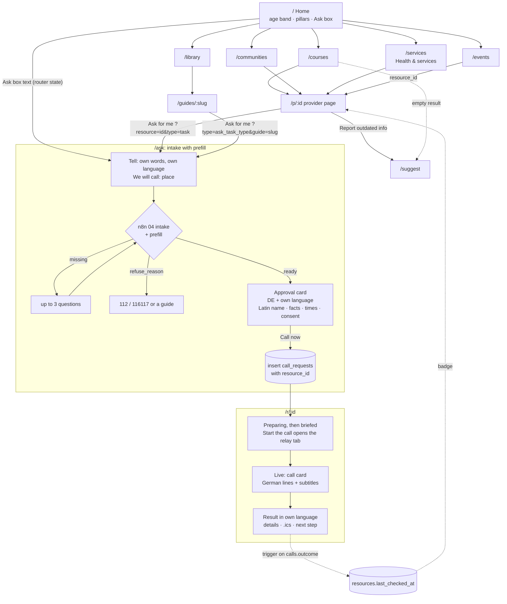

# Frontend and UX Plan v3 (merged): Dresden mit Kind + "Ask for me"

**What this is:** the design and build plan for the Lovable app after the merge ([[DEC-003 Merged concept]]). It **extends** [[Frontend and UX Plan v2]]: the design system "Bilingual paper", the intake, the approval card, the live call and the result screens stay. v3 adds the family hub around them (courses, events, communities, services, library, provider pages, suggestions) and the "Ask for me" entry from every provider and guide. It is a plan: nothing in Lovable is built yet except the P1 shell.

**Why it matters for us:** the only success rule is a working build under its own URL on Sunday 27.09, 14:00. This note gives Lovable one short Knowledge text and small prompts in a safe order, with the exact database values, so we don't waste credits on guessing.

**Related:** [[Merged Concept]] · [[Frontend and UX Plan v2]] · [[Accessibility and RTL Review]] · [[Idea B - Dies-Das-Ana-Nas]] · [[Pitch Kit v2 (merged)]] · [[Task Types - How to extend]] · [[Data Model]] · [[Lovable - Practical Guide]] · [[AI Disclosure]] · [[Data minimisation - no symptoms]] · [[Never store call audio]] · [[Only book inside pre-approved windows]] · [[Read-back before booking]] · Run: [[RUN-022 UI plan v3 merged]] · Defects: [[DEF-045 Plan v2 intake prompts do not match workflow 04]] · [[DEF-046 Non-Latin names reach the German greeting]] · [[DEF-047 Role-play calls mark real providers as checked by phone]]

**How to read it:** A–B framing and routes · C screens · D design system · E accessibility · F data contract (the exact values) · G Lovable build plan (Knowledge + prompts) · H demo and risks.

---

## A. Product framing

**One paragraph.** *Dresden mit Kind* is the place an international parent opens in the first years in Dresden. It answers four questions in the parent's language: what can we do (courses, events), where is our language spoken (bilingual communities), how does the system work here (library of guides), and who do we need (Kita, doctors, offices: Health & services). On every provider page and many guides there is one button: **Ask for me**. The parent writes the question in their own words ("Is there a free spot or a trial lesson for my 4-year-old on Tuesday afternoon?"). Our AI assistant phones the place in German, says in its first sentence that it is an AI calling for the parent, asks, stays inside the times the parent approved, and brings the answer back in the parent's language. The app is the directory; the call is the action; the answer keeps the listing fresh ("Checked by phone on 27 Sep").

**Names:** product **Dresden mit Kind** (always in German, `lang="de"`, in every UI language). Feature **Ask for me** (translated: DE "Für mich anfragen", RU "Спросите за меня", UK "Запитайте за мене", AR "اسألوا نيابةً عني", TR "Benim için sor"; native speakers check these). "HalloTermin" is only the name of the engine inside; it does not appear in the UI.

### The loop: Discover → Understand → Act → Result

| Step | Parent does | Screens | Built from |
|---|---|---|---|
| **Discover** | Picks the child's age, filters by activity and language, opens a provider | `/`, `/courses`, `/events`, `/communities`, `/services`, `/p/:id` | new in v3 (Idea B) |
| **Understand** | Reads a short guide in their language (Kita place, Anmeldung, bank account) | `/library`, `/guides/:slug` | v2 C6, now with `guides.i18n` and categories |
| **Act** | Taps **Ask for me**, writes the question, checks "Here's what I'll say", approves | `/ask` | v2 C2 + D (intake, approval), now with prefill from the provider |
| **Result** | Follows the call with subtitles, gets the answer in their language, adds it to the calendar | `/r/:id` | v2 C3 + C4, plus course and Kita result variants |

### What changed vs v2

| Area | v2 (HalloTermin: "tell us what you need") | v3 (Dresden mit Kind + Ask for me) |
|---|---|---|
| Product | Phone assistant for newcomers; the call is the product | Family hub; the call is the action button on every provider and guide |
| Entry | One free-text box on `/new` | Age band + pillars + directory filters; the free-text box stays ("Ask for me" box on home, `/ask`) |
| Organisation | Combobox search or typed by the user | Prefilled from the provider page (`/ask?resource=<id>&type=<task_type>`); intake only asks what is missing |
| Task types | 8 (doctor, authority, landlord, contract, bank, pharmacy, restaurant, other) | + `course_enquiry`, `kita_enquiry` (free spot, trial lesson, waiting list, Kita place, visit) |
| UI languages | en, ar, tr, uk (one file `ui-strings.json`) | **en, de, ru, uk, ar (RTL), tr**, one strings file per language; content still in 14 codes |
| Language model | One `lang` for everything | `uiLang` (6, sets `<html lang dir>`) is separate from `userLang` (content blocks) — [[Accessibility and RTL Review]] F2 |
| Routes | `/`, `/new`, `/r/:id`, `/find`, `/guides/:slug`, `/demo` | + `/courses`, `/events`, `/communities`, `/services`, `/library`, `/p/:id`, `/ask`, `/suggest`; `/find` → `/services`, `/new` → `/ask` |
| Starting the call | Copy the ID into the relay page by hand | Button **Start the call** opens `${RELAY_URL}/?request=<id>` in a new tab; `/r/:id` shows the live transcript via Realtime |
| Results | booked / completed (pharmacy, bank…) | + "Trial lesson booked", "Kita visit booked", course and Kita answer lists |
| Freshness | — | "Checked by phone on …" badge from `resources.last_checked_at` (outcome only) |
| Community input | — | `/suggest` (insert-only `suggestions`, honeypot, no personal data) |
| Design | Bilingual paper v2 | v2 + family warmth: Fraunces "SOFT" axis, one sand surface, age ruler, event date tiles; kid-app clichés banned |
| Intake contract | P3/P4 used field names that the live workflow does not use | Fixed to the live workflow 04 contract (see F.5 and [[DEF-045 Plan v2 intake prompts do not match workflow 04]]) |

---

## B. Information architecture and routes

| Route | Purpose | Data |
|---|---|---|
| `/` | Home: hero + "Ask for me" box, "How old is your child?" age band, 5 pillars, "Coming up" events, how Ask for me works, trust band | counts from `resources`, next 3 `family_events` |
| `/courses` | Courses & activities: directory with 6 filters | `resources` where `category in (course, playground, family_place)` |
| `/events` | Family events in the next 5 weeks, filters age / language / free | `family_events` |
| `/communities` | Bilingual communities grouped by language | `resources` (`audience` family/both, `category in (community, library)` or matching activities) |
| `/services` | **Health & services**: Kita & school, doctors, pharmacies, offices, banks, advice (the existing 84 newcomer places + family Kitas and schools) | `resources` |
| `/library` | Guides by category, "Ask for me" per guide | `guides` |
| `/guides/:slug` | One guide (v2 C6) with translations and "Ask for me" from `ask_task_type` | `guides` |
| `/p/:id` | Provider page: details, age ruler, languages, badge, upcoming events, **Ask for me** | `resources`, `family_events` |
| `/ask` | Intake (v2 C2/D). Prefill from `?resource=<id>&type=<task_type>`; from a guide `?type=<ask_task_type>&guide=<slug>`; home box text comes in router state, never in the URL | intake webhook (stateless), insert `call_requests` |
| `/r/:id` | Start the call, live call, result (v2 C3/C4) | `call_requests`, `calls`, `transcript_lines`, `events` (Realtime) |
| `/suggest` | Suggest a place / event / correction (`?kind=`, `?resource=`) | insert `suggestions` |
| `/demo` | Redirect to `/r/00000000-0000-0000-0000-000000000001` | — |
| `/find`, `/new` | Redirects to `/services` and `/ask` (old links keep working) | — |
| `*` | Friendly 404 | — |

**Why Kita and school sit in Health & services:** the pillars split into "things you enjoy" (courses, events, communities) and "things you must arrange" (Kita place, doctor, Anmeldung, bank). "Ask for me" matters most in the second group, and parents look for a Kita in the same mood as for a children's doctor. Libraries go to communities (Idea B pillar 3: "info on libraries and schools for international families"). Welcome centres, migration counselling and language cafés (the existing `community` rows with `audience = 'newcomer'`) appear in Health & services under "Advice".

### User flow



**Navigation:** solid header (not sticky, not blurred): wordmark at the start; pillar links "Courses & activities · Events · Communities · Health & services · Library"; at the end an outline button **Ask for me** and the language button. Below 1024px the pillar links go into a Sheet ("Menu"); the language button and "Ask for me" stay visible. No bottom tab bar (not a daily-use app).

---

## C. Screen-by-screen spec

Common to all screens (from v2 C): mobile first (375 → 768 → 1280), one H1, `<main>`, skip link, 3px pine focus ring, 44px targets, logical CSS for RTL, colour never the only signal, Gregorian calendar and Latin digits, German text through `<De>`. Pattern names refer to `component-reference-design` (`components.md`, `layouts.md`, `dashboards.md` §8 filters and §10 states).

### C1. Home `/`

- **Purpose:** in one scroll a parent (and the jury) understands: "I find things for my child here, in my language, and they can call for me."
- **Layout (anti-monotony, every section different):**
  1. **Asymmetric hero** (7/12 text, 5/12 box). H1 "Find it in Dresden. We call for you." Subline: "Courses, events, communities and services for families new to Dresden, in your language. When something needs a phone call in German, our AI assistant makes it for you." End column: the **Ask for me box** (paper-deep call slip): label "What should we ask for you?", 3-row textarea, example "Is there a trial lesson for my 4-year-old on Tuesday afternoon?", one primary "Continue" → `/ask` with the text in router state.
  2. **Age band** (full-bleed, sand): "How old is your child?" + five large links 0–1 · 1–3 · 3–6 · 6–10 · 10+ (paper background, 1px pine outline: pine on sand 6.3:1) → `/courses?age=3-6`. This is the page's signature element: parents think in ages first (Idea B taxonomy).
  3. **Pillars** as a two-column list with lucide icons, one line each, real counts from the database only if > 0 ("{count} places"). Not cards.
  4. **Coming up:** next 3 `family_events` as rows with sand date tiles; "All events". Hidden when there are none.
  5. **How Ask for me works:** horizontal numbered list with a thin connector: Find · Ask · We call · Answer.
  6. **Trust band** (full-bleed paper-deep, `<dl>` two columns): Pretend to be human · Record the call · Talk about your child's health · Agree to something you didn't approve · Register or sign for you.
  7. **Small close:** "Know a place we're missing?" → `/suggest`.
- **States:** counts and events load quietly (no skeleton for counts; hide if the query fails).
- **A11y/RTL:** hero columns swap in RTL by grid order; the age links are real links with `aria-label` "Courses for children 3 to 6 years".

### C2. Directory screens `/courses`, `/communities`, `/services` (one shared component)

- **Purpose:** "What is there for my 4-year-old, in Russian, near Neustadt?"
- **Layout:** H1 + one intro line; the **filter bar** (component-reference `dashboards.md` §8a: horizontal, ≤ 6 filters, applied chips below, "Clear all" at the end); the result count; the list. Results are **list rows**, not a card grid (listings are scanned, compared and shared, like search results).
- **The six filters** (all combinable, all in the URL so a link can go into a parent chat):

| Filter | Control | Values (exact DB values) | Rule |
|---|---|---|---|
| Child's age | always-visible radio chips | All ages · `0-1` · `1-3` · `3-6` · `6-10` · `10+` | row matches if `(age_min_years ?? 0) < band.hi && (age_max_years ?? 18) >= band.lo` for rows with ages; rows without any age (many seeded rows) go into a closed `<details>` at the end: "{count} places don't list ages" |
| Activity | popover, multi | the 16 `activity_categories` values present in the rows | overlap |
| Language of the course | popover, multi | ISO codes present in `languages`, shown as native names | overlap; rows with `languages = null` are hidden while a language is chosen |
| District | popover, multi | distinct `district` (German names, `lang="de"`) | equals |
| Price | popover, multi | `free`, `per_session`, `subscription`, `trial_available` (`unknown` is never an option) | equals |
| Type | popover, multi | `recurring_course`, `workshop`, `one_off`, `community_group`, `place`, `service` | equals |

  URL: `?age=3-6&act=music,dance&lang=ru&district=Neustadt&price=trial_available&format=recurring_course`. Mobile: the age chips stay visible; the other five open in a bottom Sheet with fieldsets and "Show 12 places".
- **List row (`ListingRow`):** name as the link to `/p/:id` (h3); category label + activity icons with labels; **age ruler** + text ("3–6 years", "from 6 months", "Ages not listed"); languages as native names; district; price label; **Checked by phone** badge if present; "Demo listing, not a real business" tag if `subcategory = 'demo'`; action **Ask for me** (→ `/ask?resource=<id>&type=<task>`) when the category has a task type. No phone → muted "No phone number listed", the button still works (the intake asks for the number; we never invent one).
- **Per page:**
  - `/courses` "Courses & activities in Dresden": categories `course`, `playground`, `family_place`; a small segmented control "All · Courses · Places to go".
  - `/communities` "Bilingual communities": resources with `audience in (family, both)` and `category in (community, library)` or activities overlapping `parent_meetup`, `family_cafe`, `library`. A language chip row (UI language first) jumps to **sections per language** (heading: native name + name in the UI language); a row with three languages appears in three sections; "Languages not listed" last. Each section links "Events in Русский" → `/events?lang=ru`. Closing note: "Looking for migration advice or the Welcome Center? See Health & services."
  - `/services` "Health & services": search by name + group segmented control (`?group=`): All · Kita & school (`kita`, `school`) · Doctors (`doctor`, children's doctors first) · Pharmacies · Offices (`auslaenderbehoerde`) · Banks · Advice (`community` with `audience = 'newcomer'`, `other`); district select; subcategory in plain words (v2 C5 list). Note: "Languages, opening hours and phone numbers are not verified." Emergency line visible on this page.
- **States:** 6 skeleton rows (`aria-busy`, neutral grey, no shimmer under reduced motion); **empty:** "Nothing matches all your filters." + one button that removes the last filter ("Try without Русский") + "Show all ages" + "Suggest a place we are missing"; **error:** "We couldn't load the list." + "Try again" (`role="alert"`).
- **A11y:** filter bar `role="toolbar"`; chips are real radios/checkboxes; removable chips have `aria-label="Remove filter Music"`; the count "12 places" is the only live region (`role="status"`, updated 400 ms after the last change); focus never jumps on filter change.

### C3. Provider page `/p/:id`

- **Purpose:** everything about one place on one page, and the step to action.
- **Layout:** PDP-like (component-reference `layouts.md` §21): main column (max 42rem) + a sticky aside from 1024px (22rem) with the **Ask for me** box; on mobile the box follows the summary.
- **Main:** breadcrumb back to the pillar (chevron flips in RTL) · H1 name (`lang="de"`) + category and activity icons · description in the UI language (`i18n[ui].description` → `description_en` → `notes_en`; fallback shows "This text is in English." and `lang="en"`) · **"What they offer"** `<dl>`: Ages (age ruler + text), Activities, Languages, Type, Price, District, Address (`<bdi>`), Opening hours; missing values say "not listed" · **Checked by phone** badge · **Coming up here** (≤ 5 `family_events` with this `resource_id`) · source line "Details from the provider's website, retrieved 26 Sep 2026. Please check before you visit." · "Report outdated information" → `/suggest?kind=correction&resource=<id>` · "Open in OpenStreetMap" text link when `lat/lng` exist (no embedded map, no Google).
- **Ask for me box (paper-deep call slip):** heading "We can call them for you"; text "Our AI assistant phones {place} in German, asks your question and tells you the answer in your language. It says it is an AI."; one primary button by task type: course → "Ask about a free spot or trial lesson" (`course_enquiry`), kita → "Ask about a Kita place" (`kita_enquiry`), doctor → "Ask for an appointment", pharmacy → "Ask the pharmacy", bank → "Ask the bank", auslaenderbehoerde → "Ask the office", school / library / community / family_place / other → "Ask a question" (`other_call`); playground → no box. Under it: phone (`tel:` link, `<bdi dir="ltr">`) and website.
- **Checked by phone badge:** only when `last_checked_at` is set. Pine-tint, phone icon, "Checked by phone on 27 Sep 2026" + one outcome line: `booked` "A slot was booked", `completed` "They answered our questions", `rejected` / `rejected_no_new_patients` "No free place at that time". An info button explains: "Our AI assistant phoned them for a parent. We only show the date and the kind of answer." Never who asked, never what was said. (Until [[DEF-047 Role-play calls mark real providers as checked by phone]] is fixed, test calls against real listings set this badge too; clean up after tests.)
- **States:** skeleton; not found "We can't find this place." + link to `/courses`; error + retry.
- **Optional:** JSON-LD `LocalBusiness` with the fields we have (Idea B asks for schema.org markup).

### C4. Events `/events`

- **Purpose:** "What can we do this weekend?"
- **Data:** `family_events` (never the table `events`, that is the automation log) from the start of today (Europe/Berlin) until +35 days, ordered by `starts_at`.
- **Filters:** child's age chips (same rule as C2), language popover, "Free only" checkbox chip (`price_type = 'free'`). URL `?age=&lang=&free=1`.
- **List grouped by week:** "This week", "Next week", then "Week of 12 Oct". Each event row: **date tile** on sand (weekday, day in display 21 tabular, month; `<time datetime>`), title (translated if `i18n[ui].title`), time range (`formatRange`) or "All day", place + district, age ruler, languages, price ("Free" · `price_text` or "Paid" · "Price not known"), links "Organiser's page" (`url` → `source_url`), "Add to my calendar" (.ics), "More about the place" → `/p/:resource_id`; muted "From the organiser's website, retrieved {date}. Please check before you go."
- **States:** skeleton; empty "No events in the next 5 weeks match your filters." + "Show all events" + "Suggest an event"; error + retry. Past events never show (query from today).

### C5. Library `/library` and guide `/guides/:slug`

- **Library:** sections by `guides.category` in this order: `kita_school` "Kita & school", `documents` "Documents & registration", `health` "Health & insurance", `money` "Money & bank", `everyday` "Everyday life", `null` "More guides"; empty sections hidden. Each guide is a list row: translated title (`i18n[ui].title` → `title_en`), 2-line summary, "Updated {date}", and **Ask for me** (→ `/ask?type=<ask_task_type>&guide=<slug>`) when `ask_task_type` is set.
- **Guide page:** v2 C6 layout. Title, summary and checklist from `i18n[ui]` when present (now all 8 guides in ar, de, ru, tr, uk), else English with "This guide is in English."; `content_md` stays English (`lang="en"`). The "We can call for you" box now comes from `ask_task_type` (no slug list in code): authority_appointment "Ask the office", bank_enquiry "Ask a bank", doctor_appointment "Ask for an appointment" (the guide `kinderarzt-u-untersuchungen`), kita_enquiry "Ask a Kita about a place" (+ "Find a Kita" → `/services?group=kita_school`), course_enquiry "Ask a course", other_call "Ask a question". No box when `ask_task_type` is null.

### C6. Ask for me `/ask` (v2 C2 + D, what changes)

Reuse v2 C2 (Tell box, questions, states) and D2–D5 (task schema, clarifying questions, approval card, data minimisation). Changes:

1. **Prefill.** `?resource=<id>&type=<task_type>` loads the resource (name, phone, category) and builds `prefill = {task_type, organisation: {name, phone, category, resource_id}, goal_hint}`. `?type=` alone (from a guide) sets only the task type. A "We will call" box at the top shows the place and phone ("Choose another place" clears it). Missing phone: "No phone number listed — we will ask you for it."
2. **Task-type copy.** course_enquiry: H1 "Ask about a free spot or a trial lesson", helper "For example: Is there a free spot or a trial lesson for my 4-year-old? Tuesday or Thursday afternoon. We speak Russian or German.", chips "Free spot?", "Trial lesson?", "Waiting list?", "Days that suit us". kita_enquiry: H1 "Ask about a Kita place", chips "Place from a month", "How to get on the waiting list", "Can we visit?".
3. **Intake call** uses the live workflow 04 contract (F.5) and sends `prefill`. After every response the client re-applies the prefill (client wins): task type, organisation fields, `resource_id`; questions about the organisation are dropped when name and phone are known. At the first check (12:40 Berlin time) the live workflow ignored the prefill; since its update at 13:09 it applies the prefill itself (verified 26 Sep: `task_type`, organisation and `resource_id` kept, see the Verification in [[RUN-022 UI plan v3 merged]]). The client re-apply stays as a cheap guard.
4. **Questions for the new types:** child's age (number + years/months), start month (`<input type="month">`), time windows (as v2), preferred language of the course. Facts use the keys the relay reads: `child_age`, `start_month`, `child_birth_month`, `language_preference` (F.6). The app never asks for the child's name: a `missing` item for `child_first_name` (the live intake sometimes returns one) is dropped.
5. **Name in Latin letters.** If the parent's name contains non-Latin letters ("Мария Иванова", "أمينة حداد"), the approval card asks: "Your name in Latin letters, as in your passport" (prefilled by a simple Cyrillic letter map, editable; empty for Arabic). That name goes to `patient_name` and replaces the original inside `opening_de` and facts. Reason: the German voice reads the greeting from `patient_name` — [[DEF-046 Non-Latin names reach the German greeting]]. Since 13:09 (Berlin time) the intake transliterates names itself (live test: "Мария Иванова" → `person.name = "Maria Ivanova"`), so the field is now a guard that appears only when a non-Latin name still comes back.
6. **Approval card additions:** "It will ask" list (course: free spot · trial lesson · waiting list · course times and price · language of the course; Kita: place from {month} · waiting list · visiting the Kita); limits text: "It may book a trial lesson inside these times" / "It may agree to a visit inside these times. It never registers your child." / no windows: "It will not agree to any time. It only asks."; under the facts: "We don't need your child's name. The age is enough."; "never" lines: "Pretend to be you or a human." "Talk about your child's health." "Agree to anything outside your times."; consent label short + described rules list ([[Accessibility and RTL Review]] F17): "Yes, call for me in German" / "It says it is an AI first." "It shares only the facts above." "It agrees only to times inside your times." "No audio. A text transcript is kept."; button "Call now".
7. **Insert** carries `resource_id` (F.6). If `user_language = 'de'`, the approval card shows only the German line.

### C7. Call `/r/:id` (v2 C3, what changes)

- **Start the call panel** (new): while no `calls` row exists and status is `submitted` or `briefed`: heading "Ready to call {place}", text "The call page opens in a new tab. In this demo, the other side speaks there.", primary **Start the call** → `window.open(`${RELAY_URL}/?request=${id}`, "_blank", "noopener")` (the relay page reads `?request=` and fills its ID field; its own origin passes the relay's origin check only when the relay host's https origin is listed in `ALLOWED_ORIGINS`: the default list is `http://127.0.0.1:8787` and `http://localhost:8787` only, see `docs/deploy-relay.md` step 4). While `submitted`: muted "The German call brief is being written (about 10 seconds)." `<details>` "Trouble starting?" → "Use the call page on this laptop" (`http://127.0.0.1:8787/?request=<id>`). Only these two URLs, never a URL from the query string. The panel disappears when the `calls` row arrives.
- **Other side labels:** course_enquiry "Course", kita_enquiry "Kita" (plus the v2 list).
- Everything else as v2 C3 with the a11y fixes (E): quiet log + one announcer, phase line as the only `role="status"`, timer `role="timer"` not live, stepper `aria-current`, amber dot with ring. If `user_language = 'de'` the subtitle line is hidden.
- **Optional (P13):** "Take the call here (demo)" opens the relay WebSocket inside the app. Only with `?demo=1` and a hosted relay. The current `server.js` already accepts every `https://*.lovable.app` and `https://*.lovableproject.com` origin (`ALLOWED_ORIGIN_SUFFIXES` default); once our URL is fixed, put the exact origin in `ALLOWED_ORIGINS` and set `ALLOWED_ORIGIN_SUFFIXES=` empty (relay README).

### C8. Result `/r/:id` (v2 C4, what changes)

- **booked:** heading from `calls.result.booking_kind`: `trial_lesson` "Trial lesson booked", `kita_visit` "Kita visit booked", else "Appointment booked". Date (display 33), place, "Bring with you" (e.g. **Hausschuhe** "indoor shoes"), then the other answers from `calls.result` (the relay stores course/Kita details with the booking), "Add to my calendar" (60 min for trial lessons and visits), "Back to {place}" → `/p/:resource_id`.
- **completed:** heading by `result.result_type`: `course_availability` "What the course said", `kita_availability` "What the Kita said", else "Here is what they said". `summary_user` first (user language, 21px), then a `<dl>`:

| Key | Label | Value |
|---|---|---|
| `free_spot` · `trial_lesson` · `waiting_list` | Free spot · Trial lesson · Waiting list | `true` "Yes" / `false` "No" (icon + text) |
| `trial_slot_text` · `schedule_text` · `price_text` · `language_of_instruction` · `next_steps` | Trial lesson times · Course times · Price · Language of the course · Next steps | text from the German call |
| `places_available` · `waiting_list_possible` · `visit_possible` | Places available · Waiting list possible · Visit possible | Yes / No |
| `from_month` · `how_to_apply` · `visit_text` · `languages` · `next_steps` | From · How to apply · Visit · Languages · Next steps | text |

  Only keys that exist are shown (the relay drops empty values). Text values come from the German call: shown in `<De>` with one muted note "(in German, as they said it)"; the translated meaning is in `summary_user` above.
- **Next step:** kita_enquiry → the guide with `ask_task_type = 'kita_enquiry'` (now `kita-place-dresden`, "How Kita places work in Dresden"); course_enquiry → back to `/courses` with the same age filter.
- **rejected:** "They have no free place at the moment" (doctor: "This practice is not taking new patients") + "Find another place" → the pillar of the resource.
- needs_user / failed / no_answer / voicemail: as v2 C4 (the retry goes to `/ask?resource=…&type=…`).

### C9. Suggest `/suggest`

- **Purpose:** Idea B's "Suggest a place / event" and "Report outdated info", without accounts and without personal data.
- **Form (max 36rem):** "What is it?" radio chips (`place` "A place or course", `event` "An event", `correction` "Something is out of date", `other` "Something else"; preselected from `?kind=`); "About: {resource name}" when `?resource=`; **name** (required, 2–160 chars); **website** (optional, http(s), ≤ 300); **note** (optional, ≤ 500, counter). Above the button: "Please don't write names of children or private people, private phone numbers or email addresses." There is no email or phone field on purpose.
- **Spam protection:** hidden honeypot input `company_fax` (off-screen, `tabIndex=-1`, `autocomplete="off"`, `aria-hidden="true"`, so screen-reader users never meet it) and a 3-second minimum time on the page. Bots get the normal success message but nothing is inserted.
- **Insert:** `supabase.from("suggestions").insert({...})` **without `.select()`** (the browser may insert but not read; a read-back returns 401 `42501`, tested in [[RUN-022 UI plan v3 merged]]).
- **States:** success replaces the form: "Thank you. We will check it."; error keeps the values: "We couldn't send it. Please try again." (`role="alert"`); inline field errors with icon + text.

### C10. Demo `/demo`

Redirect to the finished demo request (unchanged). The seeded Arabic pharmacy result `/r/00000000-0000-0000-0000-000000000002` is the RTL backup (see H).

---

## D. Visual design system v3: "Bilingual paper" + family warmth

### D1. Decision and evidence

**Keep "Bilingual paper" v2** (German = a serif "letter" voice, your language = a clean sans; pine, paper, amber only for live). **Add family warmth** without turning it into a kids' app, because the user is the parent, not the child: parents browse in the evening or at the weekend, calmly, often in a second language.

Skill evidence (26 Sep):
- `ui-ux-pro-max` design system for "family activity directory for international parents, warm calm trustworthy multilingual" (`-p "Dresden mit Kind"`): pattern **Marketplace / Directory** ("search bar is the CTA, reduce friction to search, categories") → **kept**: the age band and the filter bar are the entry, listings are the product. Style **Dark Mode (OLED)** → rejected (night/entertainment style; our users read in a second language on paper-like light surfaces). Colours cyan #0891B2 + health green → rejected (clinical, every health app; white on #0891B2 is only 3.68:1). Typography **Be Vietnam Pro / Noto Sans** → rejected for body (Google Fonts serves only latin, latin-ext and vietnamese for Be Vietnam Pro: no Cyrillic, no Arabic); the Noto family stays for Arabic (v2 E4).
- Extra searches: "Childcare/Daycare" palette soft pink #F472B6 + green → rejected (white on it 2.65:1; the pastel "baby" look talks to children, not parents). Typography "Soft Rounded" (Varela Round / Nunito Sans) and "Playful Creative" (Fredoka / Nunito) → rejected (made for children as users; Fredoka has no Cyrillic). "Bakery/Cafe" warm brown + cream → **supports** a warm sand surface next to our paper.
- `anti-ai-slop-ui-ux`: v2 already passes the 5 axes. New risk for a family directory: the **kid-app cliché** (rounded bubbly fonts, pastel rainbow per category, cartoon children, mascots, stock family photos) and the **listing card grid** (3 identical cards per row). Both banned below.
- `component-reference-design`: horizontal filter bar ≤ 6 filters with removable chips (dashboards §8a/8e), list rows over card grid for scanning (components §5), PDP layout with a sticky aside for the action (layouts §21), empty/error states with one action (dashboards §10), tokens as a scale.

**Where the warmth comes from (each is specific to this product):**
1. **Fraunces "SOFT" axis 50** on headings and the wordmark: rounder terminals, same family, so the "letter" idea stays. German transcript lines keep Fraunces 400 without SOFT (the formal letter voice).
2. **One warm surface, "sand"** (Elbsandstein, the stone of Dresden's old town): only for event date tiles and the home age band.
3. **The age ruler**: a small 0–18 scale with the course's age range filled in pine. Parents see "fits my child" in one glance, in every language, without reading.
4. **Human copy**: "your child", "this week", "Checked by phone"; ages and weekdays instead of abstract categories.

### D2. Tokens (v2 + v3)

| Token | Hex | HSL | Use | Contrast |
|---|---|---|---|---|
| `--background` paper | #F7F4EC | 44 41% 95% | page | — |
| `--card` | #FFFDF8 | 43 100% 99% | lists, cards | ink 15.6, ink-muted 6.1 |
| `--paper-deep` | #EFE9DC | 41 37% 90% | approval slip, **Ask for me box**, trust band | ink 13.1, ink-muted 5.1, pine 6.5 |
| **`--sand`** (new) | #F2E6D3 | 37 54% 89% | event date tiles, home age band only | ink 12.9, ink-muted 5.0, pine 6.3; `--input` on sand only 2.97 → **no form controls on sand** |
| `--foreground` ink | #1C2420 | 149 12% 13% | text | 14.5 on paper |
| `--muted-foreground` | #5B635E | 143 4% 37% | helper, subtitles | 5.6 paper |
| `--primary` pine | #1F5C4A | 162 49% 24% | buttons, links, age ruler fill | white on pine 7.8 |
| `--pine-hover` | #174A3B | 162 53% 19% | hover | — |
| `--accent` pine-tint | #E6EEE9 | 143 19% 92% | selected chips, assistant rows, **checked badge** | pine on it 6.6 |
| `--amber` | #D98E04 | 39 96% 43% | **only** the live dot, always with the ring | — |
| **`--live-ring`** (new, a11y F6) | #8A5A00 | 39 100% 27% | 2px ring around the live dot | 5.4 on paper |
| `--amber-text` / `--amber-tint` | #8A5A00 / #FBF0D9 | — | "needs your answer" (only on `/r/:id`) | 5.2 |
| `--destructive` brick / `--brick-tint` | #A63A2A / #F6E4DF | — | errors, rejected | 5.2 |
| `--border` | #D9D2C3 | 41 22% 81% | decorative lines, age ruler track | pine fill vs track 5.2 |
| `--input` | #8C8577 | 40 8% 51% | **all control outlines** (inputs, chips, checkboxes, segmented) | 3.3 paper, 3.6 card |
| `--ring` | #1F5C4A | — | focus 3px, offset 2px | — |

60-30-10: paper/card 60, ink 30, pine 10; sand ≤ 5%. Amber, brick and amber-tint are states only. Sand and amber-tint look alike (1.09:1), so they never meet: sand is only on discovery screens, amber-tint only on `/r/:id`, and the amber panel always has its icon + heading. Light mode only (v2 decision, unchanged).

### D3. Type, spacing, motion, icons

- **Type:** unchanged scale 14 / 17 / 21 / 26 / 33 / 41 (52 home H1, 36 mobile). Headings Fraunces 600 SOFT 50 (Latin); Source Serif 4 600 for Cyrillic headings (Fraunces has no Cyrillic: its Google Fonts subsets are latin, latin-ext, vietnamese); Noto Naskh Arabic 600 / Noto Sans Arabic for Arabic (18px, line-height 1.8). Body Source Sans 3 400/600 (has Cyrillic). Tabular numbers for dates, times, prices, counts. Load URL tested: `https://fonts.googleapis.com/css2?family=Fraunces:opsz,wght,SOFT@9..144,400..600,0..100&family=Source+Sans+3:wght@400;600&display=swap`.
- **Spacing and radius:** 8px grid; 6 controls and chips / 10 cards and slips / 14 dialogs and sheets; `rounded-full` only for the live dot. Age ruler: 120 × 6px, radius 3.
- **Motion:** 120ms colour, 200ms opacity + 4px translateY (never X, so RTL needs nothing), exits 150ms; only the live dot loops; all off under `prefers-reduced-motion`.
- **Icons:** lucide-react only, stroke 1.75, 16–20px, one colour (ink or pine). Activity icons: music `Music` · dance `Footprints` · sport `Trophy` · yoga `Flower2` · art `Palette` · languages `Languages` · stem `FlaskConical` · swimming `Waves` · theatre `Drama` · nature `Trees` · parent_baby `Baby` · parent_meetup `Users` · library `Library` · school_kita `School` · family_cafe `Coffee` · playground `FerrisWheel`. Pillars: courses `Music`, events `CalendarDays`, communities `Languages`, services `Stethoscope`, library `BookOpen`. Badge `PhoneCall`. If an icon name is missing in the installed lucide version, use `CircleDot`; never an emoji.

### D4. Banned list (v2 G7 + v3 additions)

- Everything in v2 G7 (purple/indigo, gradients, blobs, Inter/Geist, glassmorphism, 3 identical cards, centered dual-CTA hero, pill badges and buttons, `rounded-2xl` everywhere, `border-l-4` cards, emoji, flags, `hover:scale`, scroll fade-ins, animations > 300ms, fake numbers/testimonials/logos, hype words, chat bubbles for the intake, AI sparkle icons, fake waveforms, human faces for the assistant).
- **v3 additions (family directory):** rounded "kids" display fonts (Fredoka, Varela Round, Baloo, Comic-like); pastel pink / baby-blue palettes and a different colour per category (rainbow); cartoon, drawn or AI-generated children, mascots, balloons, stars, confetti; stock family photos; card grids for listings; star ratings or "4.8" scores (we have no reviews; Idea B phase 3); "Top rated", "Most popular", "Trending" labels; icons in coloured rounded squares; map embeds as decoration; a "near you" geolocation prompt; any counter we can't back with the database.

---

## E. Accessibility and RTL: must-fix items built in

All seven must-fix items of [[Accessibility and RTL Review]] (§4) are built in, not left for a later clean-up. Items 1–6 are in the Lovable prompts. Item 7 (and the test-page half of item 4) is about the relay call page `services/voice-relay/public/index.html`, which Lovable does not build. The receptionist uses that page on stage, and "Start the call" now opens it, so it is fixed in G.0 step 5 (Claude Code, zero credits).

| # | Must-fix (review) | How v3 does it | Prompt |
|---|---|---|---|
| 1 | F1 Gregorian calendar, Latin digits, 24 h | `src/lib/format.ts`: locale `${ui}-u-ca-gregory-nu-latn`, `hourCycle: "h23"`, `timeZone: "Europe/Berlin"`, `formatRange`, `Intl.NumberFormat` for EUR. Content languages `fa`/`prs` (`prs` → `fa-AF`) use the same rule wherever a date shows in their language | P1b, P12 |
| 2 | F2 `dir` follows the UI language | `uiLang` (en, de, ru, uk, ar, tr) alone sets `<html lang dir>` (rtl only for ar). `userLang` blocks get `lang` + `dir` from their language. Fonts keyed on `[lang\|=…]` of any element, not `:root` | P1b |
| 3 | F3 + F4 calm live regions | Transcript `role="log" aria-live="off"` + one announcer for complete user-language lines of the other side (agent rows have no live subtitle since migration `20260926210000`, so they are not announced); phase line is the only `role="status"` on the call card; timer `role="timer"` not live; bars `aria-hidden`; stepper `aria-current="step"`. v3 adds only one more live region: the directory result count | P9, P2 |
| 4 | F5 `lang="de"` on German text | `<De>` component for `opening_de`, `text_de`, bring items, German words in chips, the wordmark, place and district names. Relay call page: `lang="de"` on every German line | P1b, P3, P8–P10; G.0 step 5 |
| 5 | F6 amber dot contrast + control outlines | `.live-dot` with `box-shadow: 0 0 0 2px #8A5A00` and the word "Live"; chips/checkboxes/inputs/segmented use `--input` (#8C8577), never `--border`; no controls on sand | P1b, P9, P12 |
| 6 | F7 + F8 Arabic subtitles, explicit `dir` | Arabic text 18px / 1.8, no italics, no letter-spacing, no uppercase; `dir` from the known language, `dir="auto"` only for typed text | P1b, P9 |
| 7 | F11 + F12 + F14 relay call page (the receptionist's page on stage, opened by "Start the call") | Focus moves to "Hang up" when the socket opens and back to "Start call" on clean-up; the status line is `role="status"` and its dot `aria-hidden`; microphone and connection errors use plain words (the same texts as `call.micBlocked`, `call.micNotFound`, `call.relayUnreachable`) instead of the raw `err.message` | G.0 step 5 (not Lovable); the same rules in-app for P13 |
| + | Focus in the app (review F9, F21: nice-to-have, built anyway) | Focus moves once to the first new question legend and to the approval-card heading (no `aria-live` on those); result heading gets focus once when final; emergency panel is `role="alert"` with `tel:` links; after "Start the call" focus stays on the button (it changes its label) | P7–P10 |

**New v3 items:** filter bar `role="toolbar"`, removable chips with translated `aria-label`, no focus jump on filter change; age ruler `aria-hidden` with the text next to it; date tiles as `<time datetime>`; language names always carry `lang` (`<span lang="ru">Русский</span>`); English fallback text carries `lang="en"` inside a Russian page; honeypot hidden from assistive tech; `html { scroll-padding-top: 5rem }` (F10); all interactive rows ≥ 44px (F25); test at 320px and 200% zoom (F28), Turkish and Ukrainian strings are ~30% longer.

---

## F. Data contract for Lovable (exact)

Source of truth: `supabase/migrations/*.sql`, checked against the live project on 26 Sep ([[RUN-022 UI plan v3 merged]]). Lovable **never** creates or changes tables.

### F.1 What the browser may do (RLS, tested)

| Table | Browser (anon) | Notes |
|---|---|---|
| `resources` | SELECT | read-only; filters work via PostgREST (`in`, `cs`, `ov`) |
| `family_events` | SELECT | read-only; **not** `events` |
| `guides` | SELECT | read-only |
| `suggestions` | INSERT only (`status` must be `new`, the default) | no SELECT: insert **without** `.select()` (`Prefer: return=minimal` → 201; `return=representation` → 401 `42501`) |
| `call_requests` | INSERT (`consent_ai_call = true`, `status = 'submitted'`, `call_brief_de` and `goal_de` null) + SELECT | demo mode: anyone with the link can read |
| `calls`, `transcript_lines`, `events` | SELECT + Realtime | written by n8n / relay only |

### F.2 `resources` (read)

`id` uuid · `category` `auslaenderbehoerde|doctor|pharmacy|bank|community|other|course|kita|school|library|playground|family_place` · `subcategory` text (e.g. `kinderarzt`, `welcome_center`; **`demo`** = demo listing, show "Demo listing, not a real business") · `name` · `address` · `district` (Dresden Stadtteil) · `city` · `lat`, `lng` · `phone` (may be null) · `website` · `languages` text[] ISO codes, spoken / of instruction, **nullable** · `opening_hours` · `notes_en` · `source` `brave|firecrawl|manual|web_research|suggestion` · `source_url` · `retrieved_at` · `audience` `family|newcomer|both` · `activity_categories` text[] ⊆ `music, dance, sport, yoga, art, languages, stem, swimming, theatre, nature, parent_baby, parent_meetup, library, school_kita, family_cafe, playground` · `age_min_years`, `age_max_years` numeric 0–18 (null = not listed; 0.5 = 6 months) · `price_type` `free|per_session|subscription|trial_available|unknown` · `format` `recurring_course|workshop|one_off|community_group|place|service` or null · `description_en` ≤ 600 · `i18n` `{"de":{"description":"…"},"ru":{…},"uk":{…},"ar":{…},"tr":{…}}` · `last_checked_at` · `last_check_outcome` `booked|completed|rejected|rejected_no_new_patients` (set only by a trigger).

```ts
// directory (one query per page, filter in the browser; the table is small)
supabase.from("resources")
  .select("id,category,subcategory,name,address,district,phone,website,languages,opening_hours,notes_en,audience,activity_categories,age_min_years,age_max_years,price_type,format,description_en,i18n,lat,lng,source_url,retrieved_at,last_checked_at,last_check_outcome")
  .in("category", PAGE_CATEGORIES[page]).order("name");
// provider page
supabase.from("resources").select("*").eq("id", id).maybeSingle();
```

**Maps (in `src/lib/taxonomy.ts`)**

| Category | Pillar | Ask-for-me task type |
|---|---|---|
| `course` | courses | `course_enquiry` |
| `playground`, `family_place` | courses ("Places to go") | none for playground; `other_call` for family_place |
| `community` (audience family/both), `library` | communities | `other_call` |
| `kita`, `school` | services → Kita & school | `kita_enquiry` / `other_call` |
| `doctor` | services → Doctors | `doctor_appointment` |
| `pharmacy` | services → Pharmacies | `pharmacy_question` |
| `auslaenderbehoerde` | services → Offices | `authority_appointment` |
| `bank` | services → Banks | `bank_enquiry` |
| `community` (audience newcomer), `other` | services → Advice | `other_call` |

Age bands: `0-1` [0, 1) · `1-3` [1, 3) · `3-6` [3, 6) · `6-10` [6, 10) · `10+` [10, 18]. Display: < 1 year in months ("from 6 months"), else "3–6 years", "from 3 years", "up to 10 years".

Price labels: free "Free" · per_session "Pay per session" · subscription "Monthly or term fee" · trial_available "Trial lesson possible" · unknown "Price not listed". Format labels: recurring_course "Weekly course" · workshop "Workshop" · one_off "One-off" · community_group "Group or meetup" · place "Place to visit" · service "Service".

### F.3 `family_events` (read)

`id` · `title` ≤ 160 · `description_en` ≤ 600 · `i18n` (read `i18n[ui].title` / `.description`, fall back to `title` / `description_en`) · `starts_at` timestamptz · `ends_at` null · `all_day` · `place_name` · `address` · `district` · `resource_id` (→ `/p/:id`) · `age_min_years`, `age_max_years` · `languages` text[] (default `{de}`) · `activity_categories` · `price_type` **`free|paid|unknown`** (not the resources list) · `price_text` · `url` · `source` · `source_url` · `retrieved_at`.

```ts
const from = startOfTodayBerlin();                 // ISO string
const to = addDays(from, 35);
supabase.from("family_events").select("*").gte("starts_at", from).lt("starts_at", to).order("starts_at");
```

### F.4 `guides` (read) and `suggestions` (insert)

`guides`: `slug` · `topic` · `title_en` · `summary_en` · `checklist` string[] · `content_md` · `sources` `[{url,title,retrieved_at}]` · `updated_at` · `i18n` `{"ru":{"title","summary","checklist":[…]},…}` (now ar, de, ru, tr, uk) · `category` `documents|health|kita_school|money|everyday` or null · `audience` `family|newcomer|both` · `ask_task_type` (one of the 10 task types or null). Now 8 guides: kita_school ×2 (`kita-place-dresden` → kita_enquiry, `school-enrolment-dresden`), documents ×2, health ×2 (incl. `kinderarzt-u-untersuchungen` → doctor_appointment), money ×2 (incl. `kindergeld`).

```ts
supabase.from("suggestions").insert({
  kind,                      // 'place' | 'event' | 'correction' | 'other'
  name,                      // 2–160 chars
  url: url || null,          // ≤ 300
  note: note || null,        // ≤ 500
  ui_lang: uiLang,           // en|de|ru|uk|ar|tr (DB allows 14 codes)
  resource_id: resourceId || null,
});                          // NO .select(): the browser cannot read suggestions
```

### F.5 Intake webhook (n8n workflow 04), exact

`POST ${INTAKE_URL}` (default `https://arahmandeaxo.app.n8n.cloud/webhook/task-intake`), `Content-Type: application/json`. The workflow accepts only these origins: `*.lovable.app`, `*.lovableproject.com`, `localhost:8787`, `127.0.0.1:8787`. Nothing is stored; executions are not saved.

Request:

```json
{
  "text": "Моей дочери 4 года. Есть ли свободное место или пробное занятие? Вторник или четверг после обеда.",
  "ui_lang": "ru",
  "draft": null,
  "answers": null,
  "round": 1,
  "prefill": {
    "task_type": "course_enquiry",
    "organisation": { "name": "…", "phone": "+49 351 …", "category": "course", "resource_id": "<uuid>" },
    "goal_hint": "free spot or trial lesson"
  }
}
```

Rounds 2+: `"text": ""`, `"draft": <last draft>`, `"answers": [{"field": "time_windows", "answer": "…"}]` (send the key **`answer`**; since 13:09 the server also reads `value` as a fallback), `"round": 2`, same `prefill`. Limits: text ≤ 600 chars, draft ≤ 5,000 chars of JSON, prefill ≤ 1,500 chars of JSON, ≤ 10 answers (each cut to 200 chars), round ≤ 5. `text` may be empty in round 1 only when `prefill` is set.

Response 200 (`TaskDraft`):

```ts
type TaskDraft = {
  task_type: TaskType; user_language: string;            // prefill.task_type wins; user_language detected from the text
  person: { name: string };                              // the parent; the intake transliterates to Latin, but keep the P8 guard
  organisation: { name: string; phone: string; category: string; resource_id: string | null };   // prefill values win
  resource_id: string | null;                            // same value, also at the top level
  goal_user: string; goal_de: string;
  time_windows: { date: string; from: string; to: string }[];
  constraints: { budget_max_eur?: number; party_size?: number; deadline?: string; notes_de?: string };
  allowed_facts: { key: string; label: string; value: string }[];
  reason_category: string | null; is_new_patient: boolean | null; has_referral: boolean | null;   // top level, doctor only
  insurance_type: "gkv" | "pkv" | "other" | null; insurance_name: string | null;
  opening_de: string; opening_user: string;
  sensitive_removed: boolean;
  refuse_reason: null | "emergency" | "not_by_phone" | "unsafe";
  missing: { field: string; question_user: string; options: string[] }[];   // model questions, max 3; options are plain strings
  essentials_missing: string[];   // e.g. "organisation.phone", "person.name", "goal_user", "time_windows", "fact:child_age", "fact:child_age|child_birth", "fact:start_month"
  ready: boolean;                 // true when essentials_missing is empty and there is no refuse_reason
};
```

`missing[].field` uses the essential's name (`person.name`, `organisation.phone`, `child_age`, `start_month`, `time_windows`, …). **`essentials_missing` is not copied into `missing`:** when the model forgets a question, `missing` can be empty while `ready` is `false`. The app then asks the essentials itself (P8 step 1). Essentials: course_enquiry `organisation.phone`, `person.name`, `fact:child_age`, `goal_user`; kita_enquiry `organisation.phone`, `person.name`, `fact:child_age|child_birth`, `fact:start_month`; time windows are optional for both.

Errors: 403/400/413/429 `{"error": "origin_not_allowed" | "text_required" | "text_too_long" | "draft_invalid" | "draft_too_large" | "prefill_invalid" | "prefill_too_large" | "answers_invalid" | "too_many_rounds"}`; 502 `{"error": "intake_failed", "fallback": true}` → show "Fill in the details myself". Timeout in the app: 20 s (measured for one Russian request: 11 s at 12:40, 7 s at 13:20).

**Client rule (prefill wins):** after each response: `draft.task_type = prefill.task_type ?? draft.task_type`; copy every non-empty `prefill.organisation` field over `draft.organisation`; keep `resource_id`; drop `missing` items whose `field` starts with `organisation` when name and phone are known; drop `missing` items for `child_first_name` / `child_name` (never ask for the child's name). The live server does the first four itself since 13:09; the client keeps them as a guard.

### F.6 `call_requests` insert (course and Kita example)

```ts
const id = crypto.randomUUID();
await supabase.from("call_requests").insert({
  id,
  task_type: "course_enquiry",                 // or "kita_enquiry" (+ the 8 v2 types)
  user_language: d.user_language,              // "ru"
  patient_name: latinName,                     // the parent, Latin letters: "Maria Ivanova"
  user_email: email || null,
  practice_name: d.organisation.name,
  practice_phone: d.organisation.phone,        // required (NOT NULL)
  organisation_category: d.organisation.category || null,
  resource_id: prefill?.organisation?.resource_id ?? d.organisation.resource_id ?? null,
  goal_user: d.goal_user.slice(0, 200),
  reason_category: d.reason_category ?? null,  // doctor_appointment requires one of first_visit|checkup|acute|follow_up|specialist|other
  insurance_type: d.insurance_type ?? null, insurance_name: d.insurance_name ?? null,
  has_referral: d.has_referral ?? false, is_new_patient: d.is_new_patient ?? true,
  time_windows: [{ date: "2026-09-29", from: "15:00", to: "18:00" }, { date: "2026-10-01", from: "15:00", to: "18:00" }],
  constraints: d.constraints ?? {},
  allowed_facts: [
    { key: "child_age", label: "Alter des Kindes", value: "4 Jahre" },
    { key: "language_preference", label: "Wunschsprache", value: "Russisch oder Deutsch" }
  ],
  consent_ai_call: true
});   // never send status, goal_de, call_brief_de, created_at
```

**Fact keys the relay reads** (`services/voice-relay/task-templates.js`): child age `child_age` (also `age`, `alter`) · start month `start_month` (`"2027-02"` or "Februar 2027"; the intake turns `2027-02` into "Februar 2027") · birth month `child_birth_month` · preferred course language `language_preference`. The intake may also write `preferred_days` (e.g. "dienstags oder donnerstags ab 13:00") and `child_first_name` (only if the parent wrote it; the app never asks for it). The relay passes every fact to the agent as FAKTEN; only the four keys above change the greeting. Never health, allergies, development. Labels are short German labels (the intake writes them). The whole `allowed_facts` array must stay under 4,000 bytes and `constraints` under 2,000 (check constraints).

`call_requests.status`: `submitted` → `briefed` (n8n 01, ~10 s) → `calling` → `booked | completed | needs_user | rejected | failed`. `user_language` allows `en, ar, tr, uk, ru, fa, prs, hi, es, fr, pl, vi, zh, de`.

### F.7 Call, transcript and result

- **Start:** `window.open(`${RELAY_URL}/?request=${id}`, "_blank", "noopener")`. The relay page reads `?request=`, connects to its own `/call` WebSocket and plays the agent. For Sunday: `RELAY_URL` = the hosted relay's **https://** origin (see `docs/deploy-relay.md`) or `http://127.0.0.1:8787` on the presenter laptop. Two conditions: (1) the hosted relay's own origin must be in its `ALLOWED_ORIGINS` (the default list is localhost only, so the relay page gets 403 on `/call` otherwise); (2) `VITE_RELAY_URL` is the page origin, not a `wss://` URL. `docs/deploy-relay.md` shows `VITE_RELAY_URL=wss://…` for an old intake-microphone idea, so `src/config.ts` normalises `wss://` → `https://` (P1b step 9).
- **Realtime** (publication has `call_requests`, `calls`, `transcript_lines`, `events`): `call_requests` `id=eq.<id>`; `calls` `request_id=eq.<id>`; `transcript_lines` `call_id=eq.<callId>` INSERT **and** UPDATE (`text_user` arrives later); `events` `request_id=eq.<id>`. Refetch once on `SUBSCRIBED`; remove channels on unmount.
- **calls:** `outcome` `booked|completed|needs_user|rejected|rejected_no_new_patients|no_answer|voicemail|failed` · `booked_slot` (UTC) · `bring_items` text[] · `bring_items_user` jsonb (German word → meaning) · `summary_en` · `summary_user` · `result` jsonb:
  - booked: `{result_type: "booking", booking_kind: "trial_lesson" | "kita_visit", date, time, …details}`
  - completed course: `{result_type: "course_availability", free_spot?, trial_lesson?, trial_slot_text?, waiting_list?, schedule_text?, price_text?, language_of_instruction?, next_steps?}`
  - completed Kita: `{result_type: "kita_availability", places_available?, from_month?, waiting_list_possible?, how_to_apply?, visit_possible?, visit_text?, languages?, next_steps?}`
- **transcript_lines:** `id` (order), `call_id`, `created_at`, `speaker` `agent|practice|system`, `text_de`, `text_user` (later, by UPDATE), `text_en`. **Live subtitles only for the other side:** since migration `20260926210000_credits_translate_practice_only.sql` (n8n credits) the trigger sends only `practice` lines to n8n 05. `agent` lines get no live `text_user`; the parent already approved what the assistant says. The migration plans a batch translation of agent lines in n8n 06 when the call ends, but the workflow 06 export does not do it yet. So an agent row may never get a subtitle, and the UI must not show "Translating…" or "Subtitle not available" under agent rows (P9 step 4).
- **events:** `id` bigint (order), `created_at`, `request_id`, `source`, `type`, `payload`. Types seen live: `request_submitted`, `n8n_notified`, `brief_created`, `call_started`, `booking_confirmed`, `result_recorded`, `needs_user`, `call_ended`, `result_translated`, `email_sent`, `turn_latency` (a latency metric per turn: hide it).
- **One request, several calls:** every start on the relay page inserts a new `calls` row for the same request, so a request can have an old finished call plus a newer unfinished one (live now on the demo request `…0001`, see H). The app shows the latest call that is still running (`ended_at` null) or has an `outcome`; calls that ended without an outcome (aborted tests) are skipped; if nothing qualifies, the latest call (P9).
- **Badge:** when `calls.outcome` becomes `booked|completed|rejected|rejected_no_new_patients` and the request has `resource_id`, a trigger sets `resources.last_checked_at = now()` and `last_check_outcome`. The app only reads it (the provider page refetches on open; no Realtime on `resources`).

---

## G. Lovable build plan v3

### G.0 Before the prompts (zero credits, Claude Code)

1. **Connect Lovable GitHub sync** (Lovable → GitHub → Connect). Link the new repo in `README.md`. Without it, every string and RTL fix costs credits.
2. **Strings files.** Claude Code writes `src/i18n/strings/{en,de,ru,uk,ar,tr}.json` in the Lovable repo and pushes. Source of truth stays in our repo: `docs/i18n/ui-strings.json`. **Done 26 Sep** (Verification in [[RUN-022 UI plan v3 merged]]): 6 languages, 27 screens, 788 keys per language, every `t("…")` key of the prompts present in all 6. The split command is in `docs/i18n/README.md` ("Per-language files"). The file has keys the prompts use for edge cases: `taxonomy.age_<band>` (Arabic writes "3-6" with a hyphen, because an en dash is shown reversed in RTL), `directory.fromOneYear` / `upToOneYear`, `directory.agesMissing`, `filters.triggerCount`, `filters.countEvents(One)`, `subcategories.*`, `districts.*`. Native speakers (Anastasia's communities) still review ru, uk, ar ([[DEC-003 Merged concept]]).
3. **Env / config:** `src/config.ts` holds `INTAKE_URL` and `RELAY_URL` with public defaults (P1b creates it). Set `VITE_RELAY_URL` to the relay's **https://** origin when the host is known (a `wss://` value from `docs/deploy-relay.md` is converted). On the relay host, add that same https origin to `ALLOWED_ORIGINS`, otherwise its own page gets 403. These are public URLs, not secrets.
4. **Data:** seeded while this plan was written (checked again 26 Sep, 13:20): 56 family places (28 courses, 5 Kitas, 3 schools, 4 libraries, 6 communities, 4 playgrounds, 6 family places; all with `i18n` in ar, de, ru, tr, uk; 25 of them without an age range; 45 with a phone), 20 family events (27 Sep – 31 Oct, languages de, es, fr; price free 16 / paid 4), 8 guides with `i18n` in ar, de, ru, tr, uk. The demo listing "Olgas Musikstudio" does not exist yet (see H). The prompts also work on empty tables (empty states).
5. **Relay call page, accessibility must-fix 7 (+ the test-page half of 4)** in `services/voice-relay/public/index.html` (Claude Code, zero credits; the relay owner commits): `<li>` German lines get `lang="de"` (F5); after `ws.onopen` focus "Hang up", in `cleanup()` return focus to "Start call" (F11); `#status` gets `role="status"` and the dot `aria-hidden="true"` (F12); map `NotAllowedError` / `NotFoundError` / socket closed before open to the three plain messages of [[Accessibility and RTL Review]] F14 instead of `'Could not start: ' + err.message` (F14); `#lines` loses `aria-live="polite"` and gets a real heading + `aria-labelledby` (F3, F26). Check: keyboard-only start and hang-up, NVDA reads German lines with a German voice.

**Strings file shape** (per language; this is the spec that step 2 implemented, kept for reference): `{ "<screen>": { "<key>": "text" } }`, placeholders `{name}` identical in all languages, German words stay German. Reuse the v2 screens (`common`, `intake`, `approval`, `call`, `result`, `guides`, `errors`, `taskTypes`, `otherSide`, `reasonCategories`, `germanTerms`, `languages`, `languageNames`) with these changes: `common.appName` = "Dresden mit Kind"; replace "HalloTermin" in every value (consent text: "the Dresden mit Kind AI assistant"); `find` → rename screen to `services`; add `course_enquiry` / `kita_enquiry` to `taskTypes` ("Ask a course about a place" / "Ask a Kita about a place") and `otherSide` ("Course" / "Kita"); `germanTerms` + `Hausschuhe` "indoor shoes", `Sportsachen` "sports clothes", `Probestunde` "trial lesson", `Warteliste` "waiting list", `Betreuungsplatz` "childcare place", `Kita-Portal` "the city's online Kita portal". New screens and new keys (EN source; the `call` and `result` keys below are **added** to the existing v2 screens of the same name, the other screens are new):

```json
{
  "nav": { "courses": "Courses & activities", "events": "Events", "communities": "Communities", "services": "Health & services", "library": "Library", "ask": "Ask for me", "menu": "Menu", "language": "Interface language" },
  "home": { "title": "Find it in Dresden. We call for you.", "subtitle": "Courses, events, communities and services for families new to Dresden, in your language. When something needs a phone call in German, our AI assistant makes it for you.", "askLabel": "What should we ask for you?", "askExample": "For example: Is there a trial lesson for my 4-year-old on Tuesday afternoon?", "ageQuestion": "How old is your child?", "ageLinkLabel": "Courses for children {band} years", "pillarsTitle": "What you find here", "pillarCourses": "Music, sport, art and languages for children", "pillarEvents": "What's on in the next weeks", "pillarCommunities": "Groups and libraries in your language", "pillarServices": "Kita, doctors, pharmacies, offices", "pillarLibrary": "Short guides with sources", "placesCount": "{count} places", "comingUp": "Coming up", "allEvents": "All events", "howTitle": "How Ask for me works", "stepFind": "Find", "stepFindText": "a course, a Kita or a doctor", "stepAsk": "Ask", "stepAskText": "write your question in your language", "stepCall": "We call", "stepCallText": "in German; it says it is an AI", "stepAnswer": "Answer", "stepAnswerText": "in your language, with a calendar file", "trustTitle": "What the assistant never does", "trustHuman": "Pretend to be human", "trustHumanText": "It says it is an AI in the first sentence.", "trustRecord": "Record the call", "trustRecordText": "Text only, no audio.", "trustHealth": "Talk about your child's health", "trustHealthText": "Only the age is shared.", "trustLimits": "Agree to something you didn't approve", "trustLimitsText": "Anything outside your times comes back to you.", "trustSign": "Register or sign for you", "trustSignText": "It asks. You decide.", "missingTitle": "Know a place we're missing?", "missingLink": "Suggest a place" },
  "filters": { "label": "Filter the list", "age": "Child's age", "ageAll": "All ages", "activity": "Activity", "language": "Language of the course", "district": "District", "price": "Price", "format": "Type", "freeOnly": "Free only", "clearAll": "Clear all filters", "remove": "Remove filter {name}", "open": "Filters", "show": "Show {count} places", "count": "{count} places", "countOne": "1 place" },
  "directory": { "coursesTitle": "Courses & activities in Dresden", "coursesIntro": "Music, sport, art, languages and more for children. Filter by age and language.", "viewAll": "All", "viewCourses": "Courses", "viewPlaces": "Places to go", "communitiesTitle": "Bilingual communities", "communitiesIntro": "Groups, libraries and meetups where your language is spoken.", "langNotListed": "Languages not listed", "eventsInLanguage": "Events in {language}", "adviceNote": "Looking for migration advice or the Welcome Center? See Health & services.", "servicesTitle": "Health & services", "servicesIntro": "Kita and school, doctors, pharmacies, offices, banks and advice in Dresden.", "groupAll": "All", "groupKita": "Kita & school", "groupDoctors": "Doctors", "groupPharmacies": "Pharmacies", "groupOffices": "Offices", "groupBanks": "Banks", "groupAdvice": "Advice", "search": "Search by name", "notVerified": "Languages, opening hours and phone numbers are not verified.", "empty": "Nothing matches all your filters.", "emptyTryWithout": "Try without {name}", "emptyAllAges": "Show all ages", "suggest": "Suggest a place we are missing", "error": "We couldn't load the list.", "noPhone": "No phone number listed", "askForMe": "Ask for me", "demoListing": "Demo listing, not a real business", "agesNotListed": "Ages not listed", "years": "{min}–{max} years", "fromYears": "from {min} years", "upToYears": "up to {max} years", "fromMonths": "from {min} months", "notListed": "not listed", "inEnglish": "This text is in English.", "source": "Details from the provider's website, retrieved {date}. Please check before you visit.", "checkedOn": "Checked by phone on {date}", "checked_booked": "A slot was booked", "checked_completed": "They answered our questions", "checked_rejected": "No free place at that time", "checkedInfo": "Our AI assistant phoned them for a parent. We only show the date and the kind of answer." },
  "provider": { "offer": "What they offer", "ages": "Ages", "activities": "Activities", "languages": "Languages", "type": "Type", "price": "Price", "district": "District", "address": "Address", "hours": "Opening hours", "contact": "Contact", "map": "Open in OpenStreetMap", "askTitle": "We can call them for you", "askText": "Our AI assistant phones {place} in German, asks your question and tells you the answer in your language. It says it is an AI.", "ask_course_enquiry": "Ask about a free spot or trial lesson", "ask_kita_enquiry": "Ask about a Kita place", "ask_doctor_appointment": "Ask for an appointment", "ask_pharmacy_question": "Ask the pharmacy", "ask_bank_enquiry": "Ask the bank", "ask_authority_appointment": "Ask the office", "ask_other_call": "Ask a question", "noPhoneAsk": "We have no phone number for this place yet. You can add it on the next page.", "upcoming": "Coming up here", "report": "Report outdated information", "notFound": "We can't find this place." },
  "events": { "title": "Family events in the next 5 weeks", "intro": "Concerts, festivals, meetups and markets for families in Dresden. From organisers' websites.", "thisWeek": "This week", "nextWeek": "Next week", "weekOf": "Week of {date}", "allDay": "All day", "free": "Free", "paid": "Paid", "priceUnknown": "Price not known", "organiser": "Organiser's page", "calendar": "Add to my calendar", "place": "More about the place", "verify": "From the organiser's website, retrieved {date}. Please check before you go.", "empty": "No events in the next 5 weeks match your filters.", "showAll": "Show all events", "suggest": "Suggest an event" },
  "library": { "title": "Library", "intro": "Short guides for your first months in Dresden, with sources.", "cat_kita_school": "Kita & school", "cat_documents": "Documents & registration", "cat_health": "Health & insurance", "cat_money": "Money & bank", "cat_everyday": "Everyday life", "cat_other": "More guides", "updated": "Updated {date}", "askTitle": "We can call for you", "findKita": "Find a Kita" },
  "ask": { "weWillCall": "We will call", "noPhone": "No phone number listed. We will ask you for it.", "changePlace": "Choose another place", "title_course_enquiry": "Ask about a free spot or a trial lesson", "title_kita_enquiry": "Ask about a Kita place", "title_default": "What should we ask for you?", "example_course_enquiry": "For example: Is there a free spot or a trial lesson for my 4-year-old? Tuesday or Thursday afternoon. We speak Russian or German.", "example_kita_enquiry": "For example: Do you have a place from February for my 2-year-old? How do we get on the waiting list? Can we visit?", "chipFreeSpot": "Free spot?", "chipTrial": "Trial lesson?", "chipWaiting": "Waiting list?", "chipDays": "Days that suit us", "chipFromMonth": "Place from a month", "chipKitaWaiting": "How to get on the waiting list", "chipVisit": "Can we visit?", "latinName": "Your name in Latin letters, as in your passport", "latinNameHelp": "The assistant says your name in German. Please check the spelling.", "childAge": "Your child's age", "startMonth": "From which month?", "courseLanguage": "Preferred language of the course", "willAsk": "It will ask", "willAsk_course_enquiry": "free spot · trial lesson · waiting list · course times and price · language of the course", "willAsk_kita_enquiry": "a place from {month} · the waiting list · visiting the Kita", "mayAgree_course_enquiry": "It may book a trial lesson inside these times.", "mayAgree_kita_enquiry": "It may agree to a visit inside these times. It never registers your child.", "noWindows": "It will not agree to any time. It only asks.", "noChildName": "We don't need your child's name. The age is enough.", "neverHealthChild": "Talk about your child's health.", "consentLabel": "Yes, call for me in German", "consentAi": "It says it is an AI first.", "consentFacts": "It shares only the facts above.", "consentTimes": "It agrees only to times inside your times.", "consentAudio": "No audio. A text transcript is kept.", "callNow": "Call now" },
  "call": { "readyTitle": "Ready to call {place}", "readyText": "The call page opens in a new tab. In this demo, the other side speaks there.", "start": "Start the call", "started": "The call page is open in another tab", "briefing": "The German call brief is being written (about 10 seconds).", "trouble": "Trouble starting?", "local": "Use the call page on this laptop" },
  "result": { "trialBooked": "Trial lesson booked", "kitaVisitBooked": "Kita visit booked", "courseTitle": "What the course said", "kitaTitle": "What the Kita said", "noPlace": "They have no free place at the moment", "inGerman": "(in German, as they said it)", "backTo": "Back to {place}", "kitaGuide": "How Kita places work in Dresden", "key_free_spot": "Free spot", "key_trial_lesson": "Trial lesson", "key_trial_slot_text": "Trial lesson times", "key_waiting_list": "Waiting list", "key_schedule_text": "Course times", "key_price_text": "Price", "key_language_of_instruction": "Language of the course", "key_places_available": "Places available", "key_from_month": "From", "key_waiting_list_possible": "Waiting list possible", "key_how_to_apply": "How to apply", "key_visit_possible": "Visit possible", "key_visit_text": "Visit", "key_languages": "Languages", "key_next_steps": "Next steps" },
  "suggest": { "title": "Suggest a place or event", "intro": "Know a course, group or event for families that is missing, or is something out of date? Tell us. We check every suggestion before it goes online.", "kind": "What is it?", "kind_place": "A place or course", "kind_event": "An event", "kind_correction": "Something is out of date", "kind_other": "Something else", "about": "About: {name}", "name": "Name of the place or event", "url": "Website", "note": "Anything we should know?", "privacy": "Please don't write names of children or private people, private phone numbers or email addresses.", "send": "Send suggestion", "sending": "Sending…", "thanks": "Thank you. We will check it.", "error": "We couldn't send it. Please try again.", "nameError": "Please write a name (2 to 160 characters).", "urlError": "Please start the address with https://", "honeypot": "Leave this field empty" },
  "taxonomy": { "activity_music": "Music", "activity_dance": "Dance", "activity_sport": "Sport & movement", "activity_yoga": "Yoga", "activity_art": "Art & crafts", "activity_languages": "Languages", "activity_stem": "Science & technology", "activity_swimming": "Swimming", "activity_theatre": "Theatre", "activity_nature": "Nature & outdoors", "activity_parent_baby": "Parent and baby", "activity_parent_meetup": "Parent meetups", "activity_library": "Libraries", "activity_school_kita": "School & Kita info", "activity_family_cafe": "Family cafés", "activity_playground": "Playgrounds", "cat_course": "Course", "cat_kita": "Kita", "cat_school": "School", "cat_library": "Library", "cat_playground": "Playground", "cat_family_place": "Family place", "cat_community": "Community", "cat_doctor": "Doctor", "cat_pharmacy": "Pharmacy", "cat_bank": "Bank", "cat_auslaenderbehoerde": "Ausländerbehörde (immigration office)", "cat_other": "Other", "price_free": "Free", "price_per_session": "Pay per session", "price_subscription": "Monthly or term fee", "price_trial_available": "Trial lesson possible", "price_unknown": "Price not listed", "format_recurring_course": "Weekly course", "format_workshop": "Workshop", "format_one_off": "One-off", "format_community_group": "Group or meetup", "format_place": "Place to visit", "format_service": "Service" }
}
```

### G.1 Knowledge v3 (paste into Project settings → Knowledge; replaces v2; 9,476 characters, under the 9,500 budget)

```text
PRODUCT
Dresden mit Kind: the family hub for international parents in their first years in Dresden. Pillars: Courses & activities, Events, Bilingual communities, Health & services (Kita & school, doctors, pharmacies, Ausländerbehörde, banks, advice), Library (guides). Feature "Ask for me": from a provider or guide page the parent asks our AI assistant to phone the place in German (free spot, trial lesson, Kita place, appointment). It says it is an AI in its first sentence, calls for the parent, and the answer comes back in the parent's language.
Loop: Discover -> Understand -> Act -> Result. Users: parents with little German, mostly on phones (Maria: Russian, child 4; Ahmed: Arabic, kids 5-12).

LANGUAGES
UI languages: en, de, ru, uk, ar (RTL), tr. Strings in src/i18n/strings/<lang>.json, shape {"<screen>":{"<key>":"text"}}; t("screen.key", vars) = strings[ui][screen][key] ?? strings.en[screen][key]; replace {name} placeholders; never show raw keys.
Keep two ideas apart: uiLang (one of the 6; sets <html lang dir>, rtl only for ar) and userLang (language of a request or text; en ar tr uk ru fa prs hi es fr pl vi zh de). Content blocks get lang={code} and dir from the language (rtl for ar, fa, prs). dir="auto" only for text the user typed.
German text (opening_de, text_de, bring items, words like Probestunde) always through the <De> component: <span lang="de" dir="ltr" class="de">.
Content translations: resources.i18n[ui].description ?? description_en; family_events.i18n[ui].title / .description ?? title / description_en; guides.i18n[ui].title / summary / checklist ?? title_en / summary_en / checklist. On fallback show a muted "This text is in English." and mark the text lang="en".
Dates: Intl locale `${ui}-u-ca-gregory-nu-latn`, hourCycle "h23", timeZone "Europe/Berlin". Latin digits everywhere. Language names in their own script via Intl.DisplayNames([code],{type:"language"}), wrapped in lang={code}. No flags.

ARCHITECTURE (do not change)
- Backend = our own Supabase project (ref ycyrtlzympxzlfcocazh), already connected. Never enable Lovable Cloud. Schema lives in SQL migrations in another repo: NEVER create/alter/drop tables, columns, policies, triggers, functions or buckets, never propose a migration. If something is missing, say so in chat and stop.
- Only the anon key via import { supabase } from "@/integrations/supabase/client". No secrets in code.
- The browser only: READS resources, family_events, guides; INSERTS suggestions (never .select() after it); POSTs to INTAKE_URL (stateless intake); INSERTS one call_requests row; READS + Realtime call_requests, calls, transcript_lines, events; opens ${RELAY_URL}/?request=<id> in a new tab to start a call. INTAKE_URL and RELAY_URL (the relay's https origin) come from src/config.ts (import.meta.env.VITE_INTAKE_URL / VITE_RELAY_URL with public defaults; public URLs, not secrets). No Edge Functions, no auth, no other webhooks.

HARD RULES
- Never store the parent's free text (React state only, cleared after insert). Never put personal data in URLs; pass text between pages in router state.
- Child data: age (or birth month) and start month only. Never ask about or show health, allergies or development. If sensitive_removed=true show "We left out health details. They are not needed for this call."
- The assistant always says it is an AI and calls for the parent. No audio is recorded or played. It only agrees to times inside the parent's windows. It never registers, signs or pays.
- Listings come from public websites: show the source line and "Please check before you visit." Never invent phones, prices or dates; show "not listed".
- "Checked by phone on <date>" uses only resources.last_checked_at + last_check_outcome.

DATA CONTRACT (exact lowercase values)
resources (read): id, category auslaenderbehoerde|doctor|pharmacy|bank|community|other|course|kita|school|library|playground|family_place, subcategory ('demo' = demo listing: tag "Demo listing, not a real business"), name, address, district, phone, website, languages text[] (ISO, spoken/of instruction, may be null), opening_hours, notes_en, audience family|newcomer|both, activity_categories text[] music|dance|sport|yoga|art|languages|stem|swimming|theatre|nature|parent_baby|parent_meetup|library|school_kita|family_cafe|playground, age_min_years, age_max_years (0-18, null = not listed), price_type free|per_session|subscription|trial_available|unknown, format recurring_course|workshop|one_off|community_group|place|service|null, description_en, i18n, lat, lng, source, source_url, retrieved_at, last_checked_at, last_check_outcome booked|completed|rejected|rejected_no_new_patients.
family_events (read; NOT "events"): id, title, description_en, i18n, starts_at, ends_at, all_day, place_name, address, district, resource_id, age_min_years, age_max_years, languages, activity_categories, price_type free|paid|unknown, price_text, url, source_url, retrieved_at.
guides (read): slug, title_en, summary_en, checklist string[], content_md, sources [{url,title,retrieved_at}], updated_at, i18n, category documents|health|kita_school|money|everyday|null, ask_task_type.
suggestions (insert only): kind place|event|correction|other, name (2-160 chars), url (<=300) null, note (<=500) null, ui_lang, resource_id null.
call_requests (insert with consent_ai_call=true; never send status, goal_de, call_brief_de): id (crypto.randomUUID()), task_type doctor_appointment|authority_appointment|landlord_request|contract_question|bank_enquiry|pharmacy_question|restaurant_booking|other_call|course_enquiry|kita_enquiry, user_language, patient_name (the parent, Latin letters), user_email null, practice_name, practice_phone, organisation_category, resource_id, goal_user (<=200), reason_category (doctor only), insurance_type gkv|pkv|other|null, insurance_name, has_referral false, is_new_patient true, time_windows [{"date":"2026-09-29","from":"15:00","to":"18:00"}], constraints {}, allowed_facts [{key,label,value}] as real JSON. status submitted|briefed|calling|booked|completed|needs_user|rejected|failed.
calls (read): request_id, created_at, started_at, ended_at, outcome booked|completed|needs_user|rejected|rejected_no_new_patients|no_answer|voicemail|failed, booked_slot, bring_items, bring_items_user, result jsonb, summary_en, summary_user.
transcript_lines (read, Realtime INSERT + UPDATE): id, call_id, created_at, speaker agent|practice|system, text_de, text_user (arrives later; live only for practice lines), text_en.
events (read): id, created_at, request_id, type, payload.

ROUTES
/ · /courses · /events · /communities · /services · /library · /guides/:slug · /p/:id · /ask (?resource=&type=&guide=) · /r/:id · /suggest (?kind=&resource=) · /demo -> /r/00000000-0000-0000-0000-000000000001 · /find -> /services · /new -> /ask · * 404

DESIGN SYSTEM "Bilingual paper v3"
Colours (shadcn HSL tokens): paper #F7F4EC bg; card #FFFDF8; paper-deep #EFE9DC (approval slip, Ask-for-me box, one full-bleed band); sand #F2E6D3 (event date tiles and the home age band only, never under inputs); ink #1C2420; ink-muted #5B635E; pine #1F5C4A primary (hover #174A3B, white text); pine-tint #E6EEE9 (selected, assistant lines, checked badge); amber #D98E04 only for the live dot, with a 2px #8A5A00 ring and the word "Live"; amber-text #8A5A00 on amber-tint #FBF0D9 = needs your answer; brick #A63A2A on brick-tint #F6E4DF = errors; border #D9D2C3 decorative only; control outlines #8C8577; focus ring pine 3px, offset 2px.
Fonts: headings + wordmark Fraunces 600 with "SOFT" 50 (Google Fonts Fraunces:opsz,wght,SOFT@9..144,400..600,0..100); German text Fraunces 400. Body/UI Source Sans 3 400/600. Cyrillic headings Source Serif 4 600. Arabic: Noto Naskh Arabic 600 + Noto Sans Arabic 400/600, 18px, line-height 1.8, no italics or letter-spacing. Fonts keyed on [lang|=..] of any element.
Scale 14/17/21/26/33/41 (52 home H1, 36 mobile). Body 1.6, measure 65ch, tabular numbers.
Radius 6 controls / 10 cards / 14 dialogs; rounded-full only for the live dot. Flat, 1px borders; one soft shadow only on a successful result card.
Age ruler: 0-18 track (#D9D2C3, 6px, radius 3), range filled pine, aria-hidden, always next to the text "3-6 years".
lucide-react only, 16-20px, stroke 1.75, one colour. Touch targets 44px.
Motion: 120ms colour, 200ms opacity + 4px translateY; only the live dot loops; all off under prefers-reduced-motion.
RTL: logical classes only (ms/me/ps/pe/start/end/text-start); flip arrows and chevrons (rtl:-scale-x-100); never flip phone, check, clock, logos, numbers, German text; phone numbers in <bdi dir="ltr">.
Voice: plain B1, short sentences, calm, specific buttons, no exclamation marks; explain a German word once in brackets.

BANS
No purple/violet/indigo, gradients, blobs, glow. No Inter/Geist, no rounded kids fonts (Fredoka, Varela Round). No pastel pink/baby-blue palette, no rainbow category colours. No glassmorphism, blur, shadow-lg. No card grids for listings (list rows), no 3 identical cards in a row. No centered hero with two equal buttons. No pill badges or buttons, no uppercase eyebrows, no rounded-2xl everywhere, no border-l-4 cards. No emoji, no flags, no stock photos, no drawn or AI children, no mascots. No hover:scale, scroll fade-ins, transition-all, animations >300ms. No fake numbers, ratings, stars, testimonials, logos. No hype words (seamless, unlock, effortless, get started, learn more). No sticky CTA bar, floating nav, cookie banner or dark mode.
```

### G.2 Build prompts (P1b, then P2–P12; P13 optional)

> Send each in **Agent mode** exactly as written, one at a time. Check the preview, then publish (free). One follow-up fix at most; after that fix it in the repo with Claude Code. P1b–P6 need no call flow; P7–P10 need the intake and relay; order P2 → P3 first, because the demo path is courses → provider → ask → call → result.

#### P1b: Rename the shell, pillar navigation, 6 UI languages, RTL, strings, format helpers (no DB)

```text
Turn the existing shell "HalloTermin Paper" into "Dresden mit Kind". Follow Knowledge (LANGUAGES, DESIGN SYSTEM, RTL, BANS). No database code in this step. Keep /r/:id and /demo working.

1. Brand: wordmark "Dresden mit Kind" (lang="de") in Fraunces 600 with font-variation-settings "SOFT" 50, "Dresden" in ink and "mit Kind" in pine, linking to /. Replace every visible "HalloTermin" with "Dresden mit Kind". The calling feature is called "Ask for me". document.title pattern "<page> · Dresden mit Kind".
2. Fonts (index.html): https://fonts.googleapis.com/css2?family=Fraunces:opsz,wght,SOFT@9..144,400..600,0..100&family=Source+Sans+3:wght@400;600&display=swap. Headings Fraunces 600 "SOFT" 50; class .de = Fraunces 400. Inject extra fonts once when first needed: Cyrillic headings -> Source Serif 4 600; Arabic -> Noto Naskh Arabic 600 + Noto Sans Arabic 400;600. CSS keyed on any element, not only :root: [lang|="ar"],[lang|="fa"] { font-family: "Noto Sans Arabic", sans-serif; font-size: 1.0625em; line-height: 1.8; letter-spacing: 0; font-style: normal } and their headings "Noto Naskh Arabic"; headings inside [lang|="ru"], [lang|="uk"] use "Source Serif 4".
3. Tokens: add --sand 37 54% 89%, --paper-deep 41 37% 90% (if missing), --live-ring 39 100% 27%; expose sand, paper-deep, live-ring in tailwind.config. All inputs, checkboxes, chips and segmented controls use the --input colour for their outline, never --border.
4. i18n: create src/i18n/index.tsx with a LanguageProvider (uiLang, setUiLang) and useT(). UI languages: en English, de Deutsch, ru Русский, uk Українська, ar العربية, tr Türkçe. Strings are in src/i18n/strings/<lang>.json with the shape {"<screen>":{"<key>":"text"}}. If these files already exist (pushed from GitHub), use them and do not rewrite them. Otherwise create en.json with the keys this prompt needs and copy it to the other five files. Import en.json statically; load the others with dynamic import() when chosen. t("screen.key", vars) = strings[ui]?.[screen]?.[key] ?? en[screen]?.[key] ?? "" with {name} placeholders replaced; never render the raw key. Save the choice in localStorage "dmk_ui_lang" (try/catch). First visit: first match of navigator.languages among the 6, else en.
5. On change: document.documentElement.lang = uiLang and dir = "rtl" only for ar (else "ltr"). Create two helpers: <De>{text}</De> renders <span lang="de" dir="ltr" className="de">, and <UserText lang={code}> renders its children with lang={code === "prs" ? "fa-AF" : code} and dir="rtl" for ar, fa, prs, else "ltr".
6. Header (solid paper, 1px bottom border, not sticky, not blurred): wordmark at the start; pillar links t("nav.courses") -> /courses, t("nav.events") -> /events, t("nav.communities") -> /communities, t("nav.services") -> /services, t("nav.library") -> /library; at the end an outline button t("nav.ask") -> /ask and the language button (lucide "Languages" icon + the current language's native name inside <span lang=code>). The language button opens a shadcn DropdownMenu with the 6 languages: native name (with lang) + the name in the current UI language in muted text; a check icon on the current one; no flags. Below 1024px the pillar links move into a Sheet opened by t("nav.menu"); the language button and "Ask for me" stay visible. Current page link: pine text + 2px underline + aria-current="page".
7. Routes (placeholder pages with one H1 each for now): /courses, /events, /communities, /services, /library, /guides/:slug, /p/:id, /ask, /suggest; keep /r/:id and /demo (-> /r/00000000-0000-0000-0000-000000000001); /find redirects to /services, /new redirects to /ask; * 404 "This page doesn't exist." + "Go to the start page".
8. src/lib/format.ts: loc(lang) = `${lang === "prs" ? "fa-AF" : lang}-u-ca-gregory-nu-latn` (works for the 6 UI languages and for content languages such as fa and prs, which would otherwise get the Persian calendar); formatDate(iso, ui), formatDateTime(iso, ui) (weekday, day, month, time), formatTime, formatRange(startIso, endIso, ui) via Intl.DateTimeFormat#formatRange, all with hourCycle "h23" and timeZone "Europe/Berlin"; formatPrice(eur, ui) via Intl.NumberFormat currency EUR; startOfTodayBerlin() returns an ISO string.
9. src/config.ts: export const INTAKE_URL = import.meta.env.VITE_INTAKE_URL ?? "https://arahmandeaxo.app.n8n.cloud/webhook/task-intake"; const relayRaw = (import.meta.env.VITE_RELAY_URL ?? "").trim().replace(/\/+$/, ""); export const RELAY_URL = relayRaw.replace(/^wss:/, "https:").replace(/^ws:/, "http:") (the relay page origin, e.g. https://voice-relay-xxxx.onrender.com; a wss:// value is converted); export const RELAY_WS_URL = RELAY_URL.replace(/^http/, "ws"); export const RELAY_URL_LOCAL = "http://127.0.0.1:8787". Public URLs, not secrets.
10. Replace physical Tailwind classes (ml-, mr-, pl-, pr-, left-, right-, text-left, text-right) with logical ones (ms-, me-, ps-, pe-, start-, end-, text-start, text-end). Arrow and chevron icons get "rtl:-scale-x-100".
11. Footer, minimal, muted: "Dresden mit Kind is a demo built at Weekender Build Dresden, September 2026. Our AI assistant always says it is an AI." / "Listings come from public websites. Please check before you visit." / "Not for emergencies: call 112. Out-of-hours doctor: 116117." No other links.
Do not build page content yet.
```

**Check it worked:** the wordmark reads "Dresden mit Kind" with softer serif ends; the five pillar links and "Ask for me" are in the header. Switch to العربية: the layout mirrors, digits stay 0–9. Switch to Русский: layout stays left-to-right and headings render in a serif (Source Serif 4), not a fallback. Reload keeps the language. `/find` lands on `/services`, `/new` on `/ask`, `/demo` on the demo call. No flags, no purple.

#### P2: Directory building blocks + `/courses`

```text
Build the shared directory pieces and the /courses page. Read-only from resources. Do NOT create or change tables. All text via t() (screens "directory", "filters", "taxonomy").

A. src/lib/taxonomy.ts with the exact DB values:
- AGE_BANDS = [{id:"0-1",lo:0,hi:1},{id:"1-3",lo:1,hi:3},{id:"3-6",lo:3,hi:6},{id:"6-10",lo:6,hi:10},{id:"10+",lo:10,hi:18.01}]; matchesAge(r,b) = (r.age_min_years ?? 0) < b.hi && (r.age_max_years ?? 18) >= b.lo; hasAges(r) = r.age_min_years != null || r.age_max_years != null.
- ACTIVITY_ICON (lucide): music Music, dance Footprints, sport Trophy, yoga Flower2, art Palette, languages Languages, stem FlaskConical, swimming Waves, theatre Drama, nature Trees, parent_baby Baby, parent_meetup Users, library Library, school_kita School, family_cafe Coffee, playground FerrisWheel (fallback CircleDot).
- PRICE_FILTER = ["free","per_session","subscription","trial_available"]; FORMATS = ["recurring_course","workshop","one_off","community_group","place","service"].
- TASK_FOR_CATEGORY = {course:"course_enquiry", kita:"kita_enquiry", doctor:"doctor_appointment", pharmacy:"pharmacy_question", bank:"bank_enquiry", auslaenderbehoerde:"authority_appointment", school:"other_call", library:"other_call", community:"other_call", family_place:"other_call", other:"other_call", playground:null}.
- PAGE_CATEGORIES = {courses:["course","playground","family_place"], communities:["community","library"], services:["kita","school","doctor","pharmacy","auslaenderbehoerde","bank","community","other"]}.
B. Components in src/components/directory/:
- AgeRuler({min,max}): a 120x6px track for 0-18 (colour #D9D2C3, radius 3) with the range filled in pine using logical insets (fills from the start side, so it mirrors in RTL); aria-hidden. Next to it the text: t("directory.years",{min,max}) "3–6 years", t("directory.fromYears") "from 3 years", t("directory.upToYears") "up to 10 years" (for exactly 1 use t("directory.fromOneYear") / t("directory.upToOneYear")), under 1 year in months t("directory.fromMonths") ("from 6 months"), or t("directory.agesNotListed").
- LangList({codes}): native names via new Intl.DisplayNames([code],{type:"language"}).of(code), each in <span lang={code}>, joined with " · "; empty or null -> t("directory.langNotListed").
- CheckedBadge({at, outcome}): render only if at. Pine-tint background, pine text, lucide PhoneCall icon, t("directory.checkedOn",{date}) + one line by outcome (booked -> checked_booked, completed -> checked_completed, rejected or rejected_no_new_patients -> checked_rejected). A small info button opens a Popover with t("directory.checkedInfo").
- SourceLine({url, retrievedAt}): muted text t("directory.source",{date}) with the host name of url as a link (new tab, rel noopener).
- ListingRow(r): an <li> in a list with 1px dividers (no card grid). Contents: name as an <h3> link to /p/<id> (lang="de"); category label + activity icons with labels; AgeRuler; LangList; district as <De>{district}</De> (in ru, uk and ar add the muted script name t(`districts.${district}`) when it differs; unknown district: the DB value); price label (taxonomy.price_<price_type>); CheckedBadge; if r.subcategory === "demo" a tag t("directory.demoListing"). Action: if TASK_FOR_CATEGORY[r.category] is not null, a text button t("directory.askForMe") -> /ask?resource=<id>&type=<task>. If r.phone is empty, a muted line t("directory.noPhone") (the button still works; never invent a number).
C. FilterBar (role="toolbar", aria-label t("filters.label")):
1. Child's age: always-visible radio group styled as 6px-radius chips with the --input outline: t("filters.ageAll"), then t(`taxonomy.age_${band.id}`) for 0-1, 1-3, 3-6, 6-10, 10+ (Arabic uses a hyphen there, because an en dash between digits is shown reversed in RTL).
2. Popover multi-selects (Radix Popover + checkboxes): Activity (only values present in the loaded rows), Language (codes present in languages arrays, native names with lang), District (distinct, sorted, lang="de"), Price (PRICE_FILTER), Type (FORMATS present). Each trigger shows the count with t("filters.triggerCount",{name,count}), e.g. "Activity (2)".
3. Applied filters as removable chips under the bar (button aria-label t("filters.remove",{name})) and a "Clear all filters" text link at the end of that row.
4. Below 768px the age chips stay visible and the other filters open in a bottom Sheet with fieldsets and a primary button t("filters.show",{count}).
5. All filters live in the URL query via useSearchParams: ?age=3-6&act=music,dance&lang=ru&district=Neustadt&price=trial_available&format=recurring_course.
6. The result count t("filters.count",{count}) (t("filters.countOne") for 1) sits in a role="status" element, updated 400 ms after the last change. Never move focus when filters change.
D. /courses: H1 t("directory.coursesTitle"), intro t("directory.coursesIntro"). One query:
supabase.from("resources").select("id,category,subcategory,name,address,district,phone,website,languages,opening_hours,notes_en,audience,activity_categories,age_min_years,age_max_years,price_type,format,description_en,i18n,lat,lng,source_url,retrieved_at,last_checked_at,last_check_outcome").in("category", PAGE_CATEGORIES.courses).order("name")
Filter in the browser: age (matchesAge for rows with ages; rows where hasAges is false are NOT mixed in: when an age band is chosen, put them in a closed <details> at the end of the list with the summary t("directory.agesMissing",{count})), activity (overlap), language (overlap; rows with null languages hidden while a language is chosen), district, price, format. A small segmented control: All · Courses (category course) · Places to go (playground, family_place).
States: 6 skeleton rows (aria-busy, animate-pulse off under reduced motion); empty: t("directory.empty") + a button that removes the most recent filter (t("directory.emptyTryWithout",{name})) + "Show all ages" + link t("directory.suggest") -> /suggest?kind=place; error: role="alert" t("directory.error") + "Try again".
document.title "Courses & activities · Dresden mit Kind".
```

**Check it worked:** `/courses?age=3-6&act=music` filters the list and survives a reload; removing a chip updates "N places" without moving focus; at 375px the age chips stay visible and "Filters" opens a sheet; in العربية the rows mirror and the age ruler fills from the right. If the family seed is not in the database yet, the empty state shows (correct).

#### P3: Provider page `/p/:id` with "Ask for me"

```text
Build /p/:id. Read-only (resources, family_events). No table changes. Reuse AgeRuler, LangList, CheckedBadge, SourceLine, TASK_FOR_CATEGORY from P2.
Data: supabase.from("resources").select("*").eq("id", id).maybeSingle(); upcoming: supabase.from("family_events").select("id,title,i18n,starts_at,ends_at,all_day,price_type,price_text").eq("resource_id", id).gte("starts_at", startOfTodayBerlin()).order("starts_at").limit(5).
Layout: desktop two columns (main max 42rem, aside 22rem, sticky from 1024px with top 1rem); mobile one column with the aside right after the description.
Main:
1. Breadcrumb back to the pillar by category (course/playground/family_place -> /courses; community/library -> /communities; others -> /services) with a chevron that flips in RTL.
2. H1 name (lang="de"), category label + activity icons; demo tag if subcategory === "demo".
3. Description: i18n[uiLang]?.description ?? description_en ?? notes_en. If this falls back to English in a non-English UI, show a muted t("directory.inEnglish") and set lang="en" on the paragraph.
4. t("provider.offer") as a <dl>: Ages (AgeRuler + text), Activities, Languages (LangList), Type, Price, District, Address (<bdi>), Opening hours. Missing values show t("directory.notListed"); never invent.
5. CheckedBadge.
6. t("provider.upcoming"): up to 5 events as compact rows (sand date tile with weekday/day/month in <time dateTime>, title, time) linking to /events#<id>. Hide if none.
7. SourceLine; link t("provider.report") -> /suggest?kind=correction&resource=<id> (hidden for demo listings); if lat and lng: text link t("provider.map") -> https://www.openstreetmap.org/?mlat=<lat>&mlon=<lng>#map=17/<lat>/<lng> (no embedded map).
Aside (paper-deep background, radius 10, 1px border, no shadow), only if TASK_FOR_CATEGORY[category] is not null: heading t("provider.askTitle"); text t("provider.askText",{place:name}); primary button t(`provider.ask_${task}`) -> /ask?resource=<id>&type=<task>; if phone is empty, muted t("provider.noPhoneAsk") above the button. Under it "Contact": phone as a tel: link inside <bdi dir="ltr">, website link (new tab, rel noopener).
Optional: a JSON-LD <script type="application/ld+json"> LocalBusiness with only the fields we have (name, address, telephone, url).
States: skeleton; not found t("provider.notFound") + link to /courses; error + retry.
document.title "<name> · Dresden mit Kind".
```

**Check it worked:** open a course from `/courses`: the page shows ages as ruler + text, languages as native names, the source line, and the paper-deep box "We can call them for you" with "Ask about a free spot or trial lesson" linking to `/ask?resource=<id>&type=course_enquiry`. A doctor from `/services` shows "Ask for an appointment". A place without a phone shows the note but keeps the button.

#### P4: Events `/events`

```text
Build /events. Read-only from the table family_events (NOT "events"). No table changes. Reuse the age chips, language popover, AgeRuler and LangList.
Data: const from = startOfTodayBerlin(); const to = from + 35 days. supabase.from("family_events").select("id,title,description_en,i18n,starts_at,ends_at,all_day,place_name,address,district,resource_id,age_min_years,age_max_years,languages,activity_categories,price_type,price_text,url,source_url,retrieved_at").gte("starts_at", from).lt("starts_at", to).order("starts_at").
H1 t("events.title"); intro t("events.intro").
Filters: age chips (same matchesAge rule), Language popover (codes present), a checkbox chip t("filters.freeOnly") meaning price_type === "free". URL query ?age=&lang=&free=1. Result count t("filters.countEvents",{count}) (t("filters.countEventsOne") for 1) in role="status".
List grouped by week: t("events.thisWeek"), t("events.nextWeek"), then t("events.weekOf",{date}) with the Monday date. Each event is an <li id={id}>:
- a date tile on sand (radius 6, 56px wide): weekday short, day number (display 21, tabular), month short, wrapped in <time dateTime={starts_at}>;
- title: i18n[uiLang]?.title ?? title (English/German fallback keeps its own lang attribute); time range with formatRange or t("events.allDay"); place_name + district; AgeRuler + text; LangList; price: free -> t("events.free"), paid -> price_text or t("events.paid"), unknown -> t("events.priceUnknown");
- links: t("events.organiser") -> url ?? source_url (new tab), t("events.calendar") -> .ics built in the browser (all_day -> DATE values), t("events.place") -> /p/<resource_id> if set;
- muted line t("events.verify",{date: retrieved_at}).
States: skeleton; empty t("events.empty") + t("events.showAll") + link t("events.suggest") -> /suggest?kind=event; error + retry.
document.title "Events · Dresden mit Kind".
```

**Check it worked:** only events from today to +5 weeks appear, grouped by week; "Free only" and a language filter narrow the list and stay in the URL; dates show Latin digits and 24-hour times in Arabic and Russian; the .ics opens in the phone calendar at the right Berlin time.

#### P5: `/communities` (by language) and `/services` (Health & services)

```text
Build /communities and /services with the P2 components (ListingRow, FilterBar parts, states). Read-only. No table changes.
/communities: H1 t("directory.communitiesTitle"), intro t("directory.communitiesIntro"). Data: supabase.from("resources").select(<same columns as P2>).in("audience", ["family","both"]).order("name"), then keep rows with category "community" or "library", or whose activity_categories include parent_meetup, family_cafe or library.
- A row of language chips for every language code present (native names with lang), the UI language first; a chip scrolls to its section.
- One section per language: heading = native name (lang) + the name in the UI language (muted); rows = ListingRow; a row with several languages appears in each of its sections; rows without languages go to a last section t("directory.langNotListed").
- Each section ends with a link t("directory.eventsInLanguage",{language}) -> /events?lang=<code>.
- At the end: t("directory.adviceNote") linking to /services?group=advice.
/services: H1 t("directory.servicesTitle"), intro t("directory.servicesIntro"). Data: resources with category in PAGE_CATEGORIES.services; then drop rows with category "community" and audience "family" (those belong to /communities).
- Search input (label t("directory.search")), a segmented control (Radix ToggleGroup, single, ?group=): All · Kita & school (kita, school) · Doctors (doctor; subcategory kinderarzt first, labelled "Children's doctor (Kinderarzt)") · Pharmacies (pharmacy) · Offices (auslaenderbehoerde) · Banks (bank) · Advice (community with audience "newcomer", and other). A district select.
- Rows = ListingRow, plus the subcategory in plain words from t(`subcategories.${subcategory}`) (e.g. hausarzt "Family doctor (Hausarzt)", kinderarzt "Children's doctor (Kinderarzt)", welcome_center "Welcome centre", migrant_counselling "Migration counselling"; 53 values in all 6 languages); if the key is missing, underscores to spaces.
- Under the list: t("directory.notVerified"). On this page also show "Not for emergencies: call 112. Out-of-hours doctor: 116117." with tel: links.
- /find?category=<c> redirects to /services?group=<matching group>.
States as in P2.
```

**Check it worked:** `/services` lists the 84 newcomer places plus the seeded Kitas and schools (92 rows on 26 Sep: 84 + 5 Kitas + 3 schools; the 6 family communities stay on `/communities`); "Doctors" shows children's doctors first; "Advice" shows welcome centres and counselling; the Ask-for-me buttons open `/ask` with the right `type`. `/communities` shows one section per language plus "Languages not listed"; in Russian UI the Русский section comes first.

#### P6: `/library` and `/guides/:slug`

```text
Build /library and update /guides/:slug. Read-only from guides. No table changes.
/library: H1 t("library.title"), intro t("library.intro"). Data: supabase.from("guides").select("slug,title_en,summary_en,i18n,category,audience,ask_task_type,updated_at").order("title_en").
Sections by category in this order: kita_school, documents, health, money, everyday, then null as t("library.cat_other"); hide empty sections. Each guide is a list row (no cards): title = i18n[uiLang]?.title ?? title_en (fallback marked lang="en") as the link to /guides/<slug>; summary (i18n[uiLang]?.summary ?? summary_en) clamped to 2 lines; t("library.updated",{date}); if ask_task_type, a text button t("directory.askForMe") -> /ask?type=<ask_task_type>&guide=<slug>.
/guides/:slug: keep the existing layout (title, summary, checklist, content, sources). Use i18n[uiLang] for title, summary and checklist when present, else English with a muted t("directory.inEnglish"). content_md stays as it is (react-markdown, no raw HTML) with lang="en" when the UI is not English. Checklist ticks in localStorage "dmk_guide_<slug>" (try/catch). Sources with retrieved dates + "Rules change. Check the official page before you go."
The box t("library.askTitle") (paper-deep, radius 10) now uses ask_task_type instead of a slug list: button label t(`provider.ask_${ask_task_type}`) || t("provider.ask_other_call") -> /ask?type=<ask_task_type>&guide=<slug>; for kita_enquiry also t("library.findKita") -> /services?group=kita_school. No box when ask_task_type is null.
```

**Check it worked:** `/library` shows the 8 guides, "Kita & school" first; in Русский and العربية titles, summaries and checklists come from `guides.i18n` (content_md stays English with the notice); "Ask for me" on the Kita guide opens `/ask?type=kita_enquiry&guide=kita-place-dresden`, on the bank guide `/ask?type=bank_enquiry&guide=bank-account-documents`.

#### P7: `/ask` step 1 — prefill + Tell + intake call (replaces v2 P3)

```text
Build step 1 of /ask. No database writes in this step. Follow Knowledge HARD RULES (never store the free text; no personal data in URLs).
1. Prefill: read ?resource=<uuid>&type=<task_type>&guide=<slug>. Accept only these task types: doctor_appointment, authority_appointment, landlord_request, contract_question, bank_enquiry, pharmacy_question, restaurant_booking, other_call, course_enquiry, kita_enquiry. Ignore resource unless it is a UUID (/^[0-9a-f]{8}-[0-9a-f]{4}-[0-9a-f]{4}-[0-9a-f]{4}-[0-9a-f]{12}$/i; anything else makes PostgREST answer 400). If resource is set: supabase.from("resources").select("id,name,phone,category,subcategory").eq("id", resource).maybeSingle() and build prefill = { task_type: type ?? TASK_FOR_CATEGORY[category] ?? "other_call", organisation: { name, phone: phone ?? "", category, resource_id: id }, goal_hint: <short English hint by task type, e.g. "free spot or trial lesson"> }. If only type is set: prefill = { task_type: type, goal_hint }. Else prefill = null.
2. If prefill has an organisation, show a "We will call" box at the top (paper-deep, radius 10): t("ask.weWillCall"), place name (21px, lang="de"), phone in <bdi dir="ltr"> or t("ask.noPhone"), and a text button t("ask.changePlace") that clears prefill.organisation.
3. H1: t(`ask.title_${task_type}`) for course_enquiry and kita_enquiry, else t("ask.title_default"). Helper with the matching example (t("ask.example_course_enquiry") / t("ask.example_kita_enquiry")) or the old example.
4. Tell box: labelled textarea (4 rows, maxLength 600, counter "{count} / {max}", dir="auto"). If the page was opened with router state { text } (from the home box), put that text in. Chips that append a sentence in the UI language: course_enquiry -> t("ask.chipFreeSpot"), t("ask.chipTrial"), t("ask.chipWaiting"), t("ask.chipDays"); kita_enquiry -> t("ask.chipFromMonth"), t("ask.chipKitaWaiting"), t("ask.chipVisit"); other types -> the old 6 example chips.
5. Continue: if empty, inline error "Please write what you need, in a sentence or two." Else POST INTAKE_URL (src/config.ts) with header Content-Type: application/json and exactly this body:
   { "text": <text>, "ui_lang": <uiLang>, "draft": null, "answers": null, "round": 1, "prefill": <prefill> }
   20 s timeout (AbortController). While waiting: spinner + "Reading your request…"; after 6 s a muted "This can take up to 20 seconds."
6. Type the 200 response as TaskDraft in src/types/task.ts: { task_type, user_language, person: {name}, organisation: {name, phone, category, resource_id: string | null}, resource_id: string | null, goal_user, goal_de, time_windows: [{date, from, to}], constraints: {budget_max_eur?, party_size?, deadline?, notes_de?}, allowed_facts: [{key, label, value}], reason_category, is_new_patient, has_referral, insurance_type, insurance_name, opening_de, opening_user, sensitive_removed, refuse_reason: null | "emergency" | "not_by_phone" | "unsafe", missing: [{field, question_user, options: string[]}], essentials_missing: string[], ready }. Doctor fields are at the top level (no "doctor" object, no person.dob). Error bodies: {error} with 400/403/413/429 (origin_not_allowed, text_required, text_too_long, draft_invalid, draft_too_large, prefill_invalid, prefill_too_large, answers_invalid, too_many_rounds), and 502 {error:"intake_failed", fallback:true}.
7. After every response apply the prefill again (the client wins): if prefill.task_type, set draft.task_type to it; copy every non-empty prefill.organisation field (name, phone, category, resource_id) over draft.organisation; if organisation name and phone are now known, remove missing items whose field starts with "organisation"; always remove missing items whose field is child_first_name or child_name (we never ask for the child's name). The server does the same since 13:09; keep this as a guard.
8. Keep { draft, prefill, round } in an IntakeProvider (React context) mirrored to sessionStorage "dmk_draft" (try/catch) for refresh. Never send the free text anywhere else and never write it to Supabase.
9. Fallback when the request fails, times out or returns 502: brick-tint panel "We couldn't read your request just now." with "Try again" and "Fill in the details myself". The second creates a draft from the prefill with missing = the essentials for the task type: course_enquiry -> organisation.phone (if empty), person.name, child_age, time_windows (optional); kita_enquiry -> organisation.phone (if empty), person.name, child_age, start_month; doctor_appointment -> organisation, person.name, reason_category, is_new_patient, insurance_type, time_windows; others -> organisation, person.name, goal_user.
10. refuse_reason: "emergency" -> a role="alert" panel "This sounds urgent. Please call 112 now. For a doctor outside opening hours, call 116117." with tel: links (numbers in <bdi dir="ltr">), focus its heading, no Continue; "not_by_phone" -> "We can't do this by phone." + link to /library; "unsafe" -> "We can't help with this request."
11. If sensitive_removed: a muted line with a shield icon "We left out health details. They are not needed for this call."
When a draft without refuse_reason arrives, render <section id="clarify"> with goal_user in <UserText lang={draft.user_language}> (the next prompt builds the rest). All strings via t().
```

**Check it worked:** from a course page, "Ask for me" opens `/ask` with "We will call: <name>". Type the Russian demo sentence → DevTools Network shows exactly **one** POST to n8n whose body has `"ui_lang":"ru"` and a `prefill` object, and no Supabase write. The goal sentence appears in Russian and the place stays the provider even if the server draft comes back without it. With `VITE_INTAKE_URL` pointing to a wrong URL, "Fill in the details myself" works.

#### P8: `/ask` step 2 — questions, Latin name, approval card, consent, insert (replaces v2 P4)

```text
Continue /ask after a draft exists. Do NOT create or change tables.
1. Questions: for draft.missing (show max 3) render a <fieldset>. If draft.missing is empty but draft.ready is false, ask the draft.essentials_missing items instead, with these legends: "organisation.phone" -> t("intake.orgPhoneLabel"); "person.name" -> t("intake.personQuestion"); "goal_user" -> t("intake.qGoal"); "time_windows" -> t("intake.timeQuestion"); "reason_category" -> t("intake.qReason") with the reasonCategories options; "is_new_patient" -> t("intake.qNewPatient"); "insurance_type" -> t("intake.qInsurance"); "constraints.party_size" -> t("intake.qPartySize"); "fact:child_age" or "fact:child_age|child_birth" -> t("ask.childAge"); "fact:start_month" -> t("ask.startMonth"); "fact:address" -> t("intake.qAddress"); "fact:medicine" -> t("intake.qMedicine"); "fact:contract_type" -> t("intake.qContractType"); send them back with the same field names. If draft.ready is true and draft.missing is empty, go straight to the approval card. For draft.missing items the legend is question_user inside <UserText lang={draft.user_language}>. If options has items: radio chips (44px, radius 6, --input outline). Else a control by field: "organisation.phone" or "phone" -> tel input (strip spaces / - ( ); valid if ^(\+49|0)\d{6,14}$); "time_windows" -> 1–3 rows of date (today to +60 days) + from/to time (step 900) with "Add another time"; a field matching /(^|[._:])(child_)?age($|[_|])/ (child_age, age, fact:child_age; never a plain includes("age"), because "language_preference" contains "age") -> number 0–18 + unit select (t("ask.unitYears") / t("ask.unitMonths")); a field ending in "child_birth_month" or "start_month" (also "fact:start_month") -> <input type="month">; "person.name" -> text; others -> text (max 80).
   Continue POSTs to INTAKE_URL: { "text": "", "ui_lang": uiLang, "draft": draft, "answers": [{ "field": f, "answer": value }], "round": round + 1, "prefill": prefill } (the key is "answer"), replaces the draft and re-applies the prefill exactly as in step 1. If the webhook fails, merge the answers locally: time windows -> draft.time_windows; age -> allowed_facts {key:"child_age", label:"Alter des Kindes", value:"4 Jahre"}; start month -> {key:"start_month", label:"Wunschmonat", value:"2027-02"}; course language -> {key:"language_preference", label:"Wunschsprache", value}; phone -> draft.organisation.phone; name -> draft.person.name; then remove them from missing. After round 3 go to the approval card anyway. Validate inline (zod): aria-invalid + aria-describedby error text with an icon; focus the first invalid field.
2. Name in Latin letters: if draft.person.name contains letters that are not Latin script (use /\p{L}/u and /\p{Script=Latin}/u), show a required text field t("ask.latinName") with help t("ask.latinNameHelp"). Prefill it with a simple Cyrillic-to-Latin letter map (for example Мария Иванова -> Mariya Ivanova); leave it empty for other scripts. Use this value as patient_name, and replace the original name inside opening_de and inside every allowed_facts value before showing the card. latinName = this field when it is shown, else draft.person.name (the live intake already transliterates, e.g. "Maria Ivanova", so the field is a guard).
3. Approval card "Here's what I'll say" (paper-deep, radius 10, 1px border, no shadow), in this order:
   a) opening_de in <De> (Fraunces), and under it opening_user in <UserText lang={draft.user_language}> (muted). If user_language is "de", show only the German line.
   b) "The goal": goal_user + place name + phone (<bdi dir="ltr">).
   c) For course_enquiry and kita_enquiry: t("ask.willAsk") + t(`ask.willAsk_${task_type}`,{month}).
   d) "Your times": each window with formatRange; "It will read the time back before it agrees."; then t(`ask.mayAgree_${task_type}`) for course/kita; if there are no windows: t("ask.noWindows").
   e) "What it may tell them": allowed_facts as checkboxes in 44px rows, all ticked; unticked facts are removed before insert. For course/kita add a muted line t("ask.noChildName").
   f) "What it will never do", 3 muted lines with icons (shield-check, lock, calendar-x): "Pretend to be you or a human." / t("ask.neverHealthChild") (doctor tasks: "Talk about health details.") / "Agree to anything outside your times."
   g) Optional email "Send the result to my email too".
   h) Consent: <input type="checkbox" id="consent" aria-describedby="consent-rules"> with label t("ask.consentLabel") and a list id="consent-rules": t("ask.consentAi"), t("ask.consentFacts"), t("ask.consentTimes"), t("ask.consentAudio"). The whole row is clickable, min-height 44px.
   i) Primary t("ask.callNow"); text button "Change something" (turns the card into an editable form of the same fields).
4. Insert on "Call now" (spinner "Starting your call…"):
   const id = crypto.randomUUID();
   const { error } = await supabase.from("call_requests").insert({ id, task_type: d.task_type, user_language: d.user_language, patient_name: latinName, user_email: email || null, practice_name: d.organisation.name, practice_phone: d.organisation.phone, organisation_category: d.organisation.category || null, resource_id: prefill?.organisation?.resource_id ?? d.organisation.resource_id ?? null, goal_user: d.goal_user.slice(0, 200), reason_category: d.reason_category ?? null, insurance_type: d.insurance_type ?? null, insurance_name: d.insurance_name ?? null, has_referral: d.has_referral ?? false, is_new_patient: d.is_new_patient ?? true, time_windows: d.time_windows, constraints: d.constraints ?? {}, allowed_facts: checkedFacts, consent_ai_call: true });
   Never send status, goal_de, call_brief_de or created_at; send arrays and objects as real JSON, never JSON.stringify. On success clear the draft (context + sessionStorage) and navigate(`/r/${id}`). On error a brick panel "We couldn't start the call. Your answers are still here. Please try again." with the error code in small muted text.
5. Focus: after each question round move focus once to the first new legend (tabIndex -1); no aria-live on the questions area. When the approval card appears, move focus to its heading.
```

**Check it worked:** run the course flow with a test number: the German opening line shows the parent's name in Latin letters (the intake transliterates it; if a Cyrillic name still comes back, the Latin-name field appears and fixes the line); no question asks for the child's name. You land on `/r/<uuid>`; the Supabase row has `task_type = course_enquiry`, the provider's `resource_id`, `allowed_facts` as a JSON array with `child_age`, and no free text anywhere. Unticking a fact removes it from the row.

#### P9: `/r/:id` live call — Start the call, stepper, call card, transcript (updates v2 P5)

```text
Update /r/:id (live state). Read-only. Do NOT create or change tables. All strings via t(); dates via src/lib/format.ts.
Data: call_requests by id (maybeSingle); all calls rows for the request (order created_at desc) and pick ONE: the newest call that is still running (ended_at is null) or has an outcome; skip calls that ended without an outcome (aborted tests on the relay page); if none qualifies, the newest call. transcript_lines for that call ordered by id; events ordered by id. Realtime: one channel per table (filters id=eq.<id>, request_id=eq.<id>, call_id=eq.<callId>), INSERT and UPDATE on transcript_lines (text_user arrives later by UPDATE), refetch once on SUBSCRIBED, remove channels on unmount. Every visible state comes from database rows only.
1. Start the call: while no calls row exists and status is "submitted" or "briefed", show a paper-deep panel: heading t("call.readyTitle",{place: practice_name}); text t("call.readyText"); primary button t("call.start") that runs window.open(`${RELAY_URL}/?request=${id}`, "_blank", "noopener"). While status is "submitted" add a muted line t("call.briefing"). After the click the button label becomes t("call.started") (it stays clickable, focus stays on it). Under it a <details> t("call.trouble") with a link t("call.local") -> `${RELAY_URL_LOCAL}/?request=${id}` (new tab). If RELAY_URL is empty, show only the local link. Use only these two base URLs, never one from the query string. Hide the panel as soon as a calls row exists.
2. Start column: stepper <ol> "Request received" (submitted), "Call prepared" (briefed), "On the phone" (calling), "Result" (final) with aria-current="step" on the current step and no aria-live. The step is "Result" when the picked call has an outcome, even if call_requests.status still says "calling". Only "On the phone" shows the live dot: amber #D98E04 with box-shadow 0 0 0 2px #8A5A00 and the word "Live". Below: "Your task" <dl> (task type label, place + phone in <bdi dir="ltr">, goal_user, your times, facts it may share).
3. Call card: place name (display 26), phone, timer mm:ss from calls.started_at in <span role="timer" dir="ltr" class="tabular-nums"> (not a live region), and ONE role="status" phase line: "Preparing…" (no call) / "Dialling…" (call, no lines) / "Connected" (lines) / "Call ended, m:ss" (ended_at). Who is speaking: "Assistant" (bot icon) and the other side from t(`otherSide.${task_type}`) (course_enquiry "Course", kita_enquiry "Kita"); the side of the latest line shows 3 small pine bars for 3 s (aria-hidden); under prefers-reduced-motion show the word "speaking" instead. Trust line with shield-check: if any agent text_de contains "KI" -> "The assistant said it is an AI at the start of the call." else "The assistant will say it is an AI in its first sentence."
4. Transcript "The call": <ol role="log" aria-live="off" aria-labelledby="call-h">, script rows (no bubbles). Speaker label at the start side (above the text on mobile). text_de in <De> (Fraunces 19). Under it text_user in <UserText lang={user_language}> (16px muted; Arabic 18px, line-height 1.8, no italics). If text_user is null on a practice (other side) row: t("call.translating") (not italic), after 8 s t("call.subtitleUnavailable"). Agent rows get no live subtitle (only the other side is translated live; the parent approved the assistant's lines): show no placeholder under them, and show text_user if it arrives later. If user_language is "de", hide the subtitle line. Toggle "Show English too" (off by default) adds text_en. Agent rows on pine-tint, radius 6. Remove stage directions in brackets, e.g. "(Anruf beendet)". Time HH:mm:ss at the end side. Auto-scroll only when the reader is near the bottom, else a "New lines below" button.
   Announcer: ONE visually hidden <div aria-live="polite" aria-atomic="true" lang={user_language}> that says "<speaker>: <text_user or 'Subtitle not available'>" only when a practice (other side) row is complete (never for agent rows, never for subtitles that arrive after the call ended); if a new row completes within 1.5 s, replace the text instead of queueing. A checkbox "Read new lines aloud" (on by default) turns it off.
5. Under the transcript: lock icon + "Text only. No audio is recorded." and a closed <details> "Behind the scenes" with the events timeline (request_submitted t("call.evRequestSubmitted"), n8n_notified t("call.evN8nNotified"), brief_created t("call.evBriefCreated"), call_started t("call.evCallStarted"), booking_confirmed t("call.evBookingConfirmed"), call_ended t("call.evCallEnded"), email_sent t("call.evEmailSent"); skip turn_latency (a technical metric per turn); other types: underscores to spaces).
States: skeleton; not found "We can't find this call." + link to /ask; Realtime lost -> a thin amber-text bar "Live updates paused. Reconnecting…" that clears on SUBSCRIBED.
document.title "Live call · Dresden mit Kind".
```

**Check it worked:** on a fresh request the panel "Ready to call …" appears; "Start the call" opens the relay page in a new tab with the request ID already filled in. Then run the SQL test script (G.4): the phase changes to "Connected", lines appear with "Translating…" and then the Russian subtitle. A screen reader announces each finished line once, in Russian, and not the timer. Refresh keeps the right step.

#### P10: `/r/:id` result variants incl. course and Kita + calendar file (updates v2 P6)

```text
On /r/:id add the result state. When status is booked, completed, needs_user, rejected or failed (or the call picked in P9 has an outcome), show the result card at the top of the main column and collapse the call card to one line "Call ended, m:ss · Show the full call". Use summary_user if present, else summary_en (in <UserText lang={user_language}>). Read-only.
1. booked: the only card with the soft shadow (0 1px 2px rgb(28 36 32/.06), 0 4px 12px rgb(28 36 32/.06)). Heading by calls.result?.booking_kind: "trial_lesson" -> t("result.trialBooked"), "kita_visit" -> t("result.kitaVisitBooked"), else "Appointment booked". Big line booked_slot via formatDateTime (display 33). Place + phone. "Bring with you": each bring_items entry with a check icon, the German word in <De> and the meaning from bring_items_user?.[word] ?? t(`germanTerms.${word}`) (Hausschuhe "indoor shoes", Sportsachen "sports clothes", Versichertenkarte "health insurance card", Impfpass "vaccination record", Überweisung "referral letter"). Then the details list (3). Primary "Add to my calendar"; text link t("result.backTo",{place}) -> /p/<resource_id> if resource_id, else "Start another request" -> /ask.
2. completed: heading by calls.result?.result_type: "course_availability" -> t("result.courseTitle"), "kita_availability" -> t("result.kitaTitle"), else "Here is what they said". The summary first (21px), then the details list (3).
3. Details list: a <dl> from calls.result without the keys result_type, booking_kind, date, time, doctor, party_size. Label t(`result.key_${key}`) or, if missing, the key with underscores as spaces. true -> check icon + "Yes", false -> x icon + "No". Text values come from the German call: show them in <De> and add once under the list a muted t("result.inGerman"). Only keys that exist are shown.
4. needs_user: amber-tint panel, amber-text heading "They asked something only you can answer", the question (summary), primary "Answer and call again" -> /ask?resource=<resource_id>&type=<task_type> (or /ask?type=<task_type> without resource).
5. rejected / rejected_no_new_patients: brick-tint; heading t("result.noPlace") (doctor_appointment: "This practice is not taking new patients"); primary "Find another place" -> /courses for course_enquiry, /services?group=kita_school for kita_enquiry, else /services.
6. failed / no_answer / voicemail: brick-tint; "Nobody answered." / "We reached the voicemail. We did not leave a message." / "The call didn't go through."; "Try again" -> /ask?resource=…&type=…; "Find another place". Never show calls.error.
7. Next step below the card: kita_enquiry -> the guide with ask_task_type "kita_enquiry" (supabase.from("guides").select("slug,title_en,summary_en,i18n").eq("ask_task_type","kita_enquiry").limit(1)), shown as title + 2-line summary + "Open the guide"; course_enquiry -> "More courses for this age" -> /courses?age=<band from the child_age fact if present>; bank_enquiry -> guide bank-account-documents; authority_appointment -> guide anmeldung-dresden.
8. Calendar file built in the browser (dresden-mit-kind-<task_type>.ics): VCALENDAR/VEVENT with UID <id>@dresden-mit-kind, DTSTAMP now (UTC), DTSTART booked_slot (UTC), DTEND +60 min for trial_lesson and kita_visit, else +30 min, SUMMARY "<heading> – <practice_name>", LOCATION practice_name, DESCRIPTION "Bring: … Phone: … Booked by the Dresden mit Kind AI assistant." CRLF line endings; escape , ; \ and newlines.
When the status becomes final, move focus once to the result heading (no aria-live on the card).
```

**Check it worked:** `/r/0000…0001` still shows the booked card at 08:15 Berlin time (on 26 Sep this request also had an aborted relay test call and `status = calling`; the P9 pick rule skips that call, see H for the data reset). In the SQL editor set a test call to `outcome='booked'`, `result='{"result_type":"booking","booking_kind":"trial_lesson","date":"2026-10-01","time":"16:30","free_spot":true,"language_of_instruction":"Russisch und Deutsch"}'` → the card reads "Trial lesson booked", Thursday 1 Oct, 16:30, with "Free spot: Yes" and the German text marked "(in German, as they said it)". A `completed` call with `result_type: kita_availability` shows "What the Kita said".

#### P11: Home `/`, `/suggest`, `/demo`

```text
Build the home page and /suggest. Follow BANS strictly; every home section uses a different layout; vary section padding. All strings via t() (screens "home", "suggest").
Home:
1. Hero, asymmetric split (start 7/12, end 5/12; stacked on mobile, text first). H1 t("home.title") in display 52px (36px mobile), Fraunces "SOFT" 50. Subline t("home.subtitle") (21px, max 34rem). End column: the Ask-for-me box (paper-deep, radius 10, 1px border): label t("home.askLabel"), textarea (3 rows, dir="auto", maxLength 600), helper t("home.askExample"), primary button "Continue" -> navigate("/ask", { state: { text } }). Never put the text in the URL.
2. Age band, full-bleed on sand: heading t("home.ageQuestion") and 5 large links (min 48px high, radius 6, paper background, 1px pine outline because the grey input outline is too weak on sand) 0–1, 1–3, 3–6, 6–10, 10+ -> /courses?age=<band>, aria-label t("home.ageLinkLabel",{band}).
3. t("home.pillarsTitle"): a two-column list (one column on mobile) of the 5 pillars with lucide icons (Music, CalendarDays, Languages, Stethoscope, BookOpen), the pillar name as a link and one line (pillarCourses, pillarEvents, pillarCommunities, pillarServices, pillarLibrary). Show t("home.placesCount",{count}) only for Courses (resources in PAGE_CATEGORIES.courses) and Health & services (PAGE_CATEGORIES.services), and only if the head count query returns > 0: supabase.from("resources").select("id", { count: "exact", head: true }).in("category", PAGE_CATEGORIES.courses). No counts for the other pillars. No cards.
4. t("home.comingUp"): the next 3 family_events from today (sand date tile + title + place), link t("home.allEvents") -> /events. Hide the whole section if there are none or the query fails.
5. t("home.howTitle"): a horizontal ordered list with a thin connector line (vertical on mobile, logical insets so it mirrors), 4 steps: stepFind/stepFindText, stepAsk/stepAskText, stepCall/stepCallText, stepAnswer/stepAnswerText.
6. A full-bleed paper-deep band t("home.trustTitle") as a two-column <dl>: trustHuman/trustHumanText, trustRecord/trustRecordText, trustHealth/trustHealthText, trustLimits/trustLimitsText, trustSign/trustSignText.
7. A small start-aligned close: t("home.missingTitle") + text link t("home.missingLink") -> /suggest.
/suggest: H1 t("suggest.title"), intro t("suggest.intro"). Form max 36rem:
- kind: radio chips place / event / correction / other (labels suggest.kind_*), preselected from ?kind=;
- if ?resource=<id>: load the name (resources, maybeSingle) and show t("suggest.about",{name});
- name: required, 2–160 characters, label t("suggest.name");
- url: optional, label t("suggest.url"), must start with https:// or http://, max 300;
- note: optional textarea, max 500, counter, label t("suggest.note");
- above the button a muted line t("suggest.privacy");
- honeypot: an input name="company_fax" positioned off-screen, tabIndex -1, autoComplete "off", aria-hidden="true", label t("suggest.honeypot"). If it has a value, or the form is sent less than 3 seconds after the page loaded, show the success message but insert nothing.
Insert: const { error } = await supabase.from("suggestions").insert({ kind, name, url: url || null, note: note || null, ui_lang: uiLang, resource_id: resourceId || null }); Do NOT add .select() (the browser is not allowed to read this table). Success: replace the form with t("suggest.thanks") and links back to / and /courses. Error: role="alert" t("suggest.error"), keep the values. Field errors inline with icon + text (aria-invalid, aria-describedby).
/demo stays a redirect to /r/00000000-0000-0000-0000-000000000001.
document.title home: "Dresden mit Kind · courses, events and help for families in Dresden".
```

**Check it worked:** at 375px no horizontal scroll; exactly one filled button per section; no card grid; the age links open `/courses?age=…`; the home box text arrives in `/ask` without appearing in the URL. On `/suggest`, a real submit shows "Thank you" and the Network tab shows a POST to `suggestions` with status 201 (no body read); a submit within 3 seconds or with the honeypot filled shows "Thank you" with no request.

#### P12: Polish, accessibility and RTL audit

```text
Polish pass across all pages. No new features, no schema changes.
1. Keyboard: skip link first; logical tab order; visible 3px pine focus ring everywhere; dialogs, sheets and popovers trap focus and return it on close; html { scroll-padding-top: 5rem }.
2. Semantics: one H1 per page, heading order, <main>/<nav>/<footer>; every input labelled; icon-only buttons have translated aria-labels; decorative icons aria-hidden.
3. Languages: <html lang dir> follow the UI language only (rtl only for ar); every German string uses <De>; language names carry lang; content in another language uses <UserText>; English fallbacks carry lang="en".
4. Dates, times, prices only through src/lib/format.ts (Gregorian calendar, Latin digits, 24 h, Europe/Berlin). Search for toLocaleString, toLocaleDateString, toLocaleTimeString and raw Date output and replace them.
5. Live regions: only the directory/events result count (role="status"), the call phase line (role="status") and the transcript announcer. Remove every other aria-live. The stepper uses aria-current; the timer is role="timer" without aria-live.
6. Contrast: body text only ink or ink-muted; nothing on amber except ink; the live dot keeps its #8A5A00 ring; inputs, chips, checkboxes and segmented controls use the #8C8577 outline; no form controls on sand.
7. RTL audit in ar: replace any ml-, mr-, pl-, pr-, left-, right-, text-left, text-right, space-x- without rtl handling; arrows and chevrons flip; the age ruler and the "How it works" connector mirror; phone, check, clock, lock and shield icons do not flip; phone numbers in <bdi dir="ltr">.
8. Arabic text: 18px, line-height 1.8, no italics, no letter-spacing, no uppercase on any user-language text.
9. Touch targets at least 44px: chips, filter triggers, removable-chip buttons, "change" links, <summary>, language menu items.
10. Motion: transitions 200 ms or less, no transition-all, no hover:scale; everything off under prefers-reduced-motion, including scrollIntoView and dialog/sheet animations.
11. Responsive at 320, 375, 768 and 1280: no horizontal scroll; filters in a sheet on mobile; /r/:id stacks with the call card first; Turkish and Ukrainian labels wrap instead of overflowing.
12. Copy: no "Get started", "Learn more", exclamation marks, emoji or lorem ipsum; never show raw keys.
13. Favicon: SVG with a pine "D" in Fraunces on paper. Per-route titles.
Report a short list of what you changed.
```

**Check it worked:** Lighthouse Accessibility ≥ 95 on `/`, `/courses`, `/p/<id>`, `/ask` and `/r/0000…0002` in English **and** Arabic. Tab from the header to "Call now" on `/ask` without a mouse. NVDA reads "Русский" with a Russian voice in the language menu and German lines with a German voice.

#### P13 (optional, only with ≥ 20 credits left): take the call inside the app (demo)

```text
On /r/:id add a secondary text button "Take the call here (demo)" next to "Start the call", shown only when the URL has ?demo=1 and RELAY_WS_URL from src/config.ts is not empty (P1b derives it from RELAY_URL: https -> wss). On click: ask for microphone permission, open new WebSocket(`${RELAY_WS_URL}/call?request=${id}`), and use the helper src/lib/relayCall.ts (already in the repo, copied from the relay page) to stream 16 kHz mono microphone audio and play the agent audio. Show a "Hang up" button; after the socket opens move focus to it, after it closes move focus back. Errors: NotAllowedError -> "The microphone is blocked. Click the lock icon in the address bar, allow the microphone, then try again."; NotFoundError -> "No microphone found. Plug one in or use headphones with a mic."; socket closed before open -> "Could not reach the call service." Never store audio.
```

Before P13: Claude Code copies the call logic of `services/voice-relay/public/index.html` + `mic-worklet.js` into the Lovable repo (`src/lib/relayCall.ts`, `public/mic-worklet.js`), The current relay `server.js` already accepts `https://*.lovable.app` and `https://*.lovableproject.com` (`ALLOWED_ORIGIN_SUFFIXES` default); once our URL is fixed, put the exact origin in `ALLOWED_ORIGINS` and set `ALLOWED_ORIGIN_SUFFIXES=` empty, so other Lovable apps cannot use our Deepgram quota (`docs/deploy-relay.md` still says suffixes are unsupported; the code is newer). **Check it worked:** with `?demo=1`, the call runs in the same tab and the transcript appears as with the relay tab.

### G.3 Credit-saving tips

1. **Strings, translations and RTL class renames in the repo, not in Lovable** (after GitHub sync). Zero credits.
2. **Test with SQL, not prompts** (G.4). Use "Fill in the details myself" while the intake is not ready.
3. **Chat mode for questions, Agent mode only to build.** One prompt = one step; two strikes → fix in the repo.
4. **Visual Edits** for text and colour tweaks; **Restore from History** instead of "undo that".
5. **Publish after every checked prompt** (free), so the live URL is never stale.
6. **Budget:** P1b–P12 ≈ 30–50 credits with one fix each; keep ≥ 30 for Sunday morning; skip P13 unless everything else is done.

### G.4 Free test script: simulate a course call (Supabase SQL editor)

The dashboard SQL editor handles Russian text. From Claude Code, run it from a UTF-8 file (`npx supabase db query --linked -f <file>`), never inline.

```sql
-- after P8: your new course_enquiry request id = <ID>
update call_requests set status='briefed', goal_de='Nach einem freien Platz oder einer Probestunde für ein vierjähriges Kind fragen.' where id='<ID>';
insert into calls (request_id, provider, started_at, disclosure_variant) values ('<ID>','mock',now(),'warm_default') returning id;
update call_requests set status='calling' where id='<ID>';
insert into transcript_lines (call_id, speaker, text_de) values ('<CALL_ID>','practice','Olgas Musikstudio, guten Tag?');
insert into transcript_lines (call_id, speaker, text_de) values ('<CALL_ID>','agent','Guten Tag! Hier ist die KI-Assistentin von Maria Ivanova. Ich rufe für Maria Ivanova an und wollte fragen, ob es in Ihrem Kurs für Vierjährige noch einen Platz oder eine Probestunde gibt.');
update transcript_lines set text_user='Здравствуйте! Это ИИ-ассистент Марии Ивановой. Я звоню от её имени и хочу спросить, есть ли в вашем курсе для четырёхлетних детей свободное место или пробное занятие.' where call_id='<CALL_ID>' and speaker='agent';
update calls set ended_at=now(), outcome='booked', booked_slot='2026-10-01 16:30+02', bring_items=array['Hausschuhe'],
  result='{"result_type":"booking","booking_kind":"trial_lesson","date":"2026-10-01","time":"16:30","free_spot":true,"language_of_instruction":"Russisch und Deutsch"}',
  summary_user='Пробное занятие записано: четверг, 1 октября, 16:30. Возьмите сменную обувь. Курс на русском и немецком языках.' where id='<CALL_ID>';
update call_requests set status='booked' where id='<ID>';
-- NOTE: if the request has a resource_id, the trigger now marks that resource "checked by phone".
-- On a real listing reset it afterwards (test clean-up only):
-- update resources set last_checked_at=null, last_check_outcome=null where id='<RESOURCE_ID>';
```

---

## H. Demo storyboard (3 minutes) and Sunday risks

The run-sheet, roles and receptionist card are in [[Pitch Kit v2 (merged)]] §3 (Abdul presents, Anastasia plays "Olgas Musikstudio" in German on the relay page, approved windows Tue 29.09 and Thu 01.10 afternoon). This table adds **what must be on screen**, so the UI supports every beat.

| Time | Beat | Screen and UI element | Must work |
|---|---|---|---|
| 0:00–0:15 | Problem | Home in **Русский**: wordmark "Dresden mit Kind" (German), Russian headline, age band | P1b, P11, ru strings |
| 0:15–0:35 | **Discover** | Tap **3–6** → `/courses?age=3-6`; add Activity "Музыка", Language "Русский", District "Neustadt" (chips appear, count updates) → open the provider: description in Russian, age ruler 3–6, languages "Русский · Deutsch", price "Пробное занятие возможно", Ask-for-me box | P2, P3, seeded listing with `i18n.ru` |
| 0:35–0:55 | **Ask for me + check** | `/ask`: "We will call: Olgas Musikstudio"; Maria's Russian sentence; the intake returns her name in Latin letters, "Maria Ivanova" (the Latin-name field appears only if it does not); approval card: German opening with "KI-Assistentin von Maria Ivanova" + Russian below ("ИИ-ассистентка"), facts such as "Alter des Kindes: 4 Jahre", the preferred days and the preferred language (the intake writes the German labels, they vary a little), windows Tue 29.09 and Thu 01.10, 13:00–17:00 (the intake maps "после обеда" / afternoon to 13:00–17:00; live test 26 Sep), "It may book a trial lesson inside these times", consent → **Call now** | P7, P8, intake with prefill |
| 0:55–1:05 | Brief | `/r/:id` "Ready to call Olgas Musikstudio" → status "Call prepared" (~10 s) → **Start the call** opens the relay tab (ID already filled) → Start call there → back to the app tab | P9, relay hosted or local |
| 1:05–2:15 | **Call** | Call card timer, speaking bars, German lines; the receptionist's lines get Russian subtitles live (the assistant's lines were approved on the card and are not translated live, to save n8n credits); the agent refuses Saturday, accepts Thursday 16:30 (inside 13:00–17:00) after read-back | P9, n8n 05 translation |
| 2:15–2:35 | **Result** | Result card in Russian: "Пробное занятие записано", Thursday 1 Oct 16:30, bring **Hausschuhe** (сменная обувь), "Free spot: Да", **Add to my calendar**; back on the provider page the badge "Проверено по телефону …" (only because this is the demo listing, see DEF-047) | P10, P3 |
| 2:35–3:00 | Agent office + ask | as in the Pitch Kit | — |

**RTL moment (optional, 5 s):** switch to العربية on the home page to show the mirror, then back to Русский. The Arabic pharmacy result `/r/00000000-0000-0000-0000-000000000002` is the RTL proof if asked.

**Demo listing rule:** "Olgas Musikstudio" is demo data (Pitch Kit v2). If it is added to `resources`, it must carry `subcategory = 'demo'` and a fictional phone in the seed's `+49 351 0000000` pattern, so the UI shows "Demo listing, not a real business" everywhere; never role-play a real Dresden provider on stage and never present invented answers as theirs.

**Backup path (decide at Pod #04, never debug on stage):**
1. Intake slow or down → "Fill in the details myself" (P7 step 9) with the same Russian content.
2. Relay host down → "Trouble starting?" → local relay on the presenter laptop (`http://127.0.0.1:8787/?request=<id>`).
3. Live voice fails → run G.4 on the same request (the live screen fills from SQL), then the backup video.
4. App down → backup video, then n8n canvas and Supabase rows.

### Risks for Sunday

| Risk | Likelihood | Mitigation |
|---|---|---|
| Demo listing "Olgas Musikstudio" not in `resources` yet (56 real family places and 20 events were seeded during this run; age 3–6 + music + Русский already finds one real music school) | Medium | Add it with `subcategory = 'demo'`, a fictional phone and `i18n.ru` before the rehearsal, or run the Discover beat on a real course and stop before the call (never role-play a real provider); recheck counts Sunday 10:00 |
| Russian/German UI strings don't exist yet | Done 26 Sep | `docs/i18n/ui-strings.json` has all 6 languages (788 keys each); split into the Lovable repo (G.0 step 2); native-speaker check for ru, uk, ar still open |
| Intake ignores `prefill` (seen at 12:40: `other_call`, empty organisation) | Fixed live at 13:09, verified 13:20 | Live workflow 04 keeps `task_type`, organisation and `resource_id` from prefill; the client re-apply (P7 step 7) stays as a guard; fallback form |
| Parent's name in Cyrillic/Arabic reaches the German greeting ([[DEF-046 Non-Latin names reach the German greeting]]) | Low since 13:09 | The intake transliterates ("Maria Ivanova", verified once); the Latin-name field on the approval card (P8 step 2) catches the rest; relay fallback still proposed in the defect |
| Russian `opening_user` says "КИ-ассистентка" (German "KI" copied; Russian is "ИИ") | Low since 13:09 | The intake prompt and a server-side replacement write ИИ / ШІ / AI / yapay zekâ (verified "ИИ-ассистентка"); native check of the approval card before the demo |
| The intake asks "What is your daughter's name?" (`missing` field `child_first_name`, seen 13:20 although `ready = true`) | Medium | P7/P8 drop that question (we never ask for a child's name); proposed for the n8n owner: filter `child_first_name` out of `missing` in "Validate + Clean Draft" |
| `/demo` request `…0001` is stuck: `status = calling` and a second, aborted call (`b5c7dc08…`, provider `deepgram-browser`, 26 Sep 08:38 UTC, no outcome). The relay page and `server.js` default to this ID, so every test without an ID writes onto the demo | High until reset | P9 pick rule skips aborted calls. Owner resets the data before the rehearsal (not run by this review): `delete from calls where request_id = '00000000-0000-0000-0000-000000000001' and outcome is null and ended_at is not null;` then `update call_requests set status = 'booked' where id = '00000000-0000-0000-0000-000000000001';`. Always test with your own request ID |
| Test calls against real listings set "Checked by phone" ([[DEF-047 Role-play calls mark real providers as checked by phone]]) | High while testing | Trigger fix proposed; until then reset `last_checked_at` after tests; demo only on the demo listing |
| v2 prompts reused by mistake → answers dropped, doctor insert 23514 ([[DEF-045 Plan v2 intake prompts do not match workflow 04]]) | Medium | Use P7/P8 of this note only; v2 P3/P4 are replaced |
| Relay not hosted, cold start on a free host, or its own origin missing in `ALLOWED_ORIGINS` (default is localhost only, so the hosted relay page gets 403 on `/call`) | Medium | Add the relay's own https origin to `ALLOWED_ORIGINS`; `VITE_RELAY_URL` = that https origin (`src/config.ts` converts a `wss://` value from `docs/deploy-relay.md`); warm-up request at 12:30; local fallback link |
| Only 23 of the 84 newcomer places and 45 of the 56 family places have a phone number | Known | "No phone number listed" + intake asks for the number; never invent |
| 25 of the 56 family places have no age range (26 Sep, 13:20), so the age filter hides many rows | Known | They sit in the closed "{count} places don't list ages" group; the Discover beat uses a listing with ages |
| Guide bodies (`content_md`) are English only; titles, summaries, checklists are in 5 languages | Known | "This guide is in English." notice on the body only |
| Popup blocker stops the relay tab | Low | `window.open` only inside the click handler; "Trouble starting?" link as fallback |
| RTL and Lovable physical classes | Medium | P12 audit + repo search-and-replace |
| Subtitle lag > 3 s | Medium | German stays readable; announcer only speaks complete lines |
| Assistant lines have no live subtitle (migration `20260926210000`: only the other side is translated live; the batch translation of agent lines in n8n 06 is announced but not in the export) | Known | P9 shows no placeholder under agent rows and does not announce them; the approval card already showed the opening in the user's language |
| Credits run out | Low–Medium | ≥ 30 reserve; text and RTL fixes in the repo; skip P13 |
| Demo-mode RLS: anyone can read all requests | Known | Fake data only on Sunday; owner-scoped policies are a Monday-morning item |
