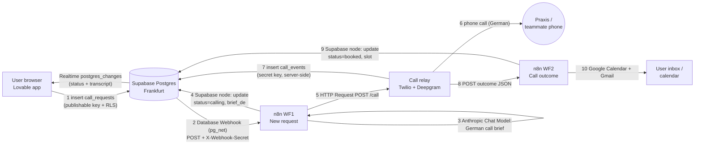

# Stack Overview: Lovable + Supabase + n8n (+ Claude, optional Vercel)

**Definition:** The event stack has four parts, and each one has a single job. Lovable builds and hosts the web app. Supabase holds the data and pushes live updates. n8n runs the multi-step business process. Claude does the "AI function" (inside n8n, and as a coding assistant for us).

**Why it matters for us:** Deliverables 1 (live URL) and 2 (an n8n workflow that moves data) both depend on these parts fitting together cleanly. Most hackathon time gets lost at the seams: webhooks, keys, RLS and CORS. This note is the map. The details are in [[Lovable - Practical Guide]], [[Supabase - Practical Guide]], [[n8n - Practical Guide]] and [[Integration Patterns]]. The backend choice is in [[DEC-002 Backend and integration pattern (proposed)]].

## Who does what

| Layer | Tool | Owns | Does NOT own |
|---|---|---|---|
| Frontend + hosting | **Lovable** (Pro) | React UI, forms, live views; publishes to `https://<name>.lovable.app` ([docs](https://docs.lovable.dev/features/publish)) | Long-running processes, secret keys, telephony |
| Data + live updates | **Supabase** (own project, Frankfurt), proposed in DEC-002 | Tables, RLS, Realtime (`postgres_changes`), Database Webhooks (pg_net), optional Edge Functions | Business logic with many steps |
| Orchestration | **n8n Cloud** (Pro trial) | Webhook triggers, the LLM step (Claude), calendar and email, status updates written back to Supabase | Audio/WebSockets (a poor fit, see the idea doc), UI |
| AI | **Claude** | Inside n8n: the *Anthropic Chat Model* node builds the German call brief and summaries. Outside: Claude Code builds and edits n8n workflows through n8n's MCP server | n/a |
| Call relay (HalloTermin only) | Small Node server (Docker) | Twilio ↔ Deepgram Voice Agent WebSocket bridge; writes transcript lines to Supabase; posts the outcome to n8n | n/a |
| Optional | **Vercel** | Only as a fallback host or for a tiny API (see [[Integration Patterns#Vercel]]) | Not needed for the core build |

## Data flow (HalloTermin worked example)

**Reading the diagram:** the browser only ever talks to Supabase. Everything with a secret (n8n credentials, Twilio and Deepgram keys, the Supabase secret key) lives server-side in n8n or the relay. The UI updates itself through Realtime subscriptions on `call_requests` (status) and `call_events` (transcript lines).

## Generic version (for a merged idea)

Swap the HalloTermin parts and keep the skeleton:
1. The UI writes a **request row** (`status = 'new'`).
2. A DB webhook hands it to **n8n WF1**, which does the enrichment, AI and external action, and writes `status` back.
3. An external callback (or the end of WF1) hands off to **n8n WF2**, which handles notifications and the final status.
4. The UI **subscribes** to the row and shows progress live.

This shape covers most "form → AI → external action → confirmation" apps.

## Related
- [[Idea A - HalloTermin (Abdul)]] · [[Merged Concept]]
- [[Rules/n8n - use production webhook URLs]] · [[Rules/Never put service keys in frontend]] · [[Rules/Decide Lovable backend before first prompt]] · [[Rules/RLS - test inserts as anon]]
