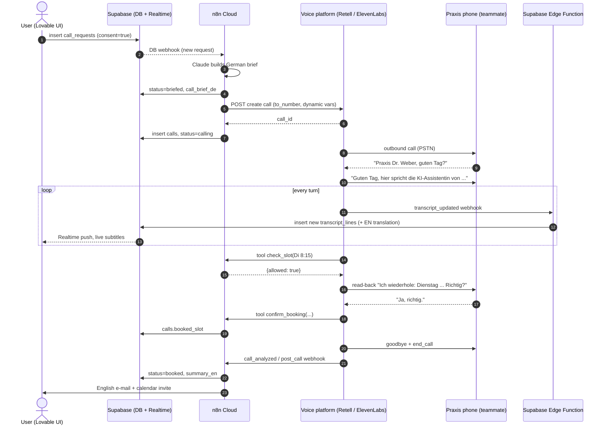

# Voice Pipeline - Architecture

**Definition:** how one HalloTermin call flows from "user presses *Call now*" to "English confirmation in the inbox", and which component owns each step.
**Why it matters for us:** the call is the riskiest part of the build. Keeping it behind a small, fixed interface (1 trigger + 2 webhooks) means we can swap the voice platform — or merge with [[Idea B - (Teammate)]] — without touching the UI or data model.
**Related:** [[Voice Platform Comparison]] · [[DEC-001 Voice platform (proposed)]] · [[Relay Hosting Options]] · [[Telephony Constraints (Twilio Trial, Numbers)]] · [[Voice Risks and Mitigations]] · [[Data Model]] · [[Stack Overview - Lovable n8n Supabase]] · [[AI Disclosure]]

## The interface every option must satisfy (keep this modular)

| # | Contract | Direction | Owner |
|---|---|---|---|
| 1 | `startCall(request_id)` → returns `provider_call_id` | n8n → voice platform (REST) | n8n HTTP Request node |
| 2 | `toolCall(name, args)` → JSON answer, mid-call | voice platform → n8n webhook (sync) | n8n "Webhook" + "Respond to Webhook" |
| 3 | `transcriptTurn(call_id, speaker, text)` | voice platform → Supabase Edge Function → `transcript_lines` | Edge Function (Lovable can generate it) |
| 4 | `callEnded(call_id, outcome, slot, transcript)` | voice platform → n8n webhook | n8n |

If a platform can't do #3 live (see ElevenLabs note below), the UI shows status steps from #2/#4 instead of a word-by-word transcript.

## Step by step (recommended path: managed platform, see [[DEC-001 Voice platform (proposed)]])

1. **Form (Lovable)** inserts a row in `call_requests` (consent checkbox required, [[AI discloses itself in first sentence]]).
2. **n8n** is triggered (Supabase DB webhook or a direct POST from Lovable). It builds a German call brief with Claude (name, DOB, insurance, referral yes/no, new patient, allowed time windows as German text, e.g. *"Dienstag 8–12 Uhr oder Donnerstag ab 14 Uhr"*) and saves it in `call_requests.call_brief_de`. Status → `briefed`.
3. **n8n starts the call** (HTTP Request node):
   - Retell: `POST https://api.retellai.com/v2/create-phone-call`, header `Authorization: Bearer $RETELL_API_KEY`, body `{"from_number":"+1…","to_number":"+49…","override_agent_id":"agent_…","retell_llm_dynamic_variables":{"patient_name":"Priya Sharma","brief_de":"…","windows_de":"…"},"metadata":{"request_id":"<uuid>"}}` → response has `call_id` ([docs](https://docs.retellai.com/api-references/create-phone-call)).
   - ElevenLabs (alternative): `POST https://api.elevenlabs.io/v1/convai/twilio/outbound-call`, header `xi-api-key`, body `{"agent_id":"…","agent_phone_number_id":"…","to_number":"+49…","conversation_initiation_client_data":{"dynamic_variables":{…}}}` → `conversation_id`, `callSid` ([docs](https://elevenlabs.io/docs/agents-platform/api-reference/twilio/outbound-call)).
   - n8n inserts a `calls` row (`provider`, provider call id). Status → `calling`.
4. **Phone rings** (teammate's phone plays "Praxis Dr. Weber"). The agent opens with the disclosure sentence from [[Moment of Truth - First 15 Seconds]] and asks consent to take notes.
5. **During the call** the agent calls tools (each is an n8n webhook that answers in < 2 s):
   - `check_slot(datetime)` → `{ "allowed": true/false, "reason": "…" }` — enforces [[Only book inside pre-approved windows]] in code, not just in the prompt.
   - `confirm_booking(datetime, doctor, bring_items)` → only after read-back ([[Read-back before booking]]); writes `calls.booked_slot`.
   - `needs_user(question_en)` → sets status `needs_user` (UI shows the question); agent says it will call back.
   - platform built-ins: `end_call`, DTMF / keypad, voicemail detection.
6. **Live transcript:** Retell `transcript_updated` webhook (fires on every turn, carries the full transcript so far) → Supabase Edge Function inserts only the *new* utterances into `transcript_lines` (and optionally an English translation via Claude) → UI subscribed to Supabase Realtime (`transcript_lines`, filter `call_id=eq.<id>`) updates.
7. **Call ends:** `call_analyzed` (Retell) or `post_call_transcription` (ElevenLabs) webhook → n8n: parse structured outcome, set status `booked | rejected | needs_user | failed`, write `summary_en`, send English e-mail + calendar invite (.ics / Google Calendar).
8. **No audio is stored**: platform recording off, Twilio recording off ([[Never store call audio]]).



## What the DIY path looks like instead (Deepgram + Twilio)

Per the [Deepgram Twilio guide](https://developers.deepgram.com/docs/twilio-and-deepgram-voice-agent) and the [outbound reference](https://www.twilio.com/en-us/blog/partners/integrations/building-an-outbound-voice-agent-with-twilio-and-deepgram), steps 3–6 are replaced by **our own relay server**:

- `POST /make-call` → Twilio REST `calls.create(to, from, url=/twiml)`; `/twiml` returns `<Connect><Stream url="wss://HOST/media"/></Connect>`.
- `/media` websocket accepts Twilio's base64 mulaw 8 kHz frames, opens `wss://api.eu.deepgram.com/v1/agent/converse` (EU endpoint, [Deepgram](https://deepgram.com/learn/deepgram-eu-endpoint-now-generally-available)), sends a `Settings` message, relays audio both ways, sends Twilio `clear` on `UserStartedSpeaking` (barge-in), and handles `FunctionCallRequest` events.
- Transcript events (`ConversationText`) are pushed to Supabase by the relay.
- Needs a public host that holds websockets → [[Relay Hosting Options]]. Repos: [deepgram-devs/deepgram-voice-agent-outbound-telephony](https://github.com/deepgram-devs/deepgram-voice-agent-outbound-telephony) (Python/Starlette, outbound, AMD, `update_lead` function), [deepgram-devs/twilio-voice-agent](https://github.com/deepgram-devs/twilio-voice-agent) (FastAPI, inbound bridge).

German `Settings` sketch (keys from [configure-voice-agent](https://developers.deepgram.com/docs/configure-voice-agent); German model names from the idea doc — **verify Friday night**):

```json
{
  "type": "Settings",
  "mip_opt_out": true,
  "audio": {
    "input":  { "encoding": "mulaw", "sample_rate": 8000 },
    "output": { "encoding": "mulaw", "sample_rate": 8000, "container": "none" }
  },
  "agent": {
    "listen": { "provider": { "type": "deepgram", "version": "v2", "model": "flux-general-multi", "language_hints": ["de"], "keyterms": ["Überweisung", "Versichertenkarte", "Neupatientin"] } },
    "think":  { "provider": { "type": "anthropic", "model": "<current Claude model id>", "temperature": 0.3 },
                "prompt": "<German system prompt + brief>",
                "functions": [
                  { "name": "confirm_booking", "description": "Nach Rückbestätigung buchen", "defer_until_eot": true,
                    "parameters": { "type": "object", "properties": { "datetime": { "type": "string" } }, "required": ["datetime"] },
                    "endpoint": { "url": "https://<n8n>/webhook/confirm-booking", "headers": { "authorization": "Bearer <secret>" } } }
                ] },
    "speak":  { "provider": { "type": "deepgram", "version": "v1", "model": "aura-2-viktoria-de" } },
    "greeting": "Guten Tag, hier spricht die KI-Assistentin von Frau Priya Sharma. ..."
  }
}
```

Fallback STT if `flux-general-multi` misbehaves: `{"type":"deepgram","version":"v1","model":"nova-3","language":"de"}` (unverified exact model string for German Nova-3 in the agent). Note: functions with an `endpoint` are called server-side by Deepgram (per the settings schema; untested by us); without one, the relay receives `FunctionCallRequest` and must answer.
